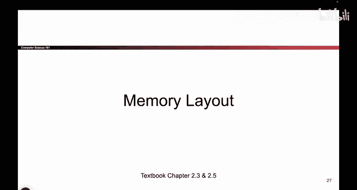
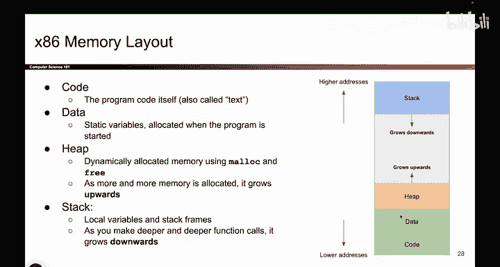
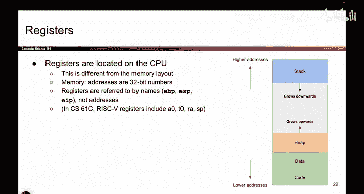

# UCB《计算机安全｜CS 161. Computer Security 2025》中英字幕 - P18：-MemSafety1, Video 4- Memory Layout.zh_en - GPT中英字幕课程资源 - BV1VhEhzMEPL

Okay。So the next thing we have to talk about is now that we know what memory looks like and how you store things in memory。

 we should think about what things actually have to get stored in memory。 What does memory look like。

 what are the things that we have to put in there。 So maybe you've seen this diagram before maybe you've learned to fear it from C6 do and C This diagram tells us what data。

 I have to put in memory as I'm running my program。

 So one thing I have to put in memory is the code itself。

 Do you remember from before when we said the asmbler。

 it spits out a bunch of ones and zeros that represents the code I'm trying to run those ones and zeros have to live in memory somewhere。

 So somewhere in memory， I have a bunch of ones and zeros that says this code needs to add one to X。

 and this code needs to multiply y by two。 that stuff goes down here in the code section。

 That's the actual text of the program that you wrote。 Also。

 you might have some static variables that stayed the same through the whole program。

 Those will go here in the data section。 And then we have these two section。

Of memory， which are going to grow， depending on how much space the user needs。

 So if the user user ever calls something like Malic or free。

 they're asking for dynamically allocated memory， which is a fancy way of saying they want memory。

 they're gonna manage it themselves。 So if the users as Malic。

 you're gonna give them data on the heap。 And as the user calls Malik more and more and more because they want more data。

 you're gonna start using higher and higher addresses on the he。

 which is why people say the he grows up。 as you need more， the heap gives you higher addresses。😊。

And on the other side， we have the stack。 This is where you store local variables。

 like you create a function and you define some local variables in the function。

 The stack is where you're gonna put those local variables。 And when you call a function。

 the stack makes extra space so that you can store those variables and when you're done and the function returns。

 the stack wipes that space away or deletes it for a future functions to use。

 And we say that the stack grows downwards， which means if you call deeper and deeper function costs。

 like you do a really deep recursion， the stack is gonna give you more and more space at lower addresses。

 So that's kind of what memory looks like。 And the four things that we have to put in memory。😊。

So one question for you then is maybe you heard of something called the register from C S6 UN and C or something。

 C S6 UN andC， they had risk  five， and these were the names of the registers。

 So one question you might have is where are the registers on this picture。D see them。

I don't see them because they're not there。 The registers are actually on the CPU。

 They're in a totally different part of hardware。 So this part of hardware， this is memory。

 all the memory bytes that you place in here， they have a unique address。

 And if you want the registers， they are nowhere on this picture。 you can squint all you want。

 they are not there。 if you want registers， you have to go to the CPU。

 which is somewhere totally different。 And if you want to identify certain registers。

 registers don't have address。 You can't say give me the register at address 5， that makes no sense。

 registers are referred to by names。 So in 601 C， the names we gave to registers were like a 0 or S in x86。

 which is what we're using。 the registers also have names。 but the names look a little bit different。

 they look like this， you'll have something called EVP or EP。

 So the point of this slide is if you want to store data in memory。

 it has a unique address and you say at that address。 That's where my memory lives。 But if。

Want to store data in a register。 The registers have names。 So if you put something in a register。

 you say， I want the data at register EP。 and I can grab that data。

 So registers are not on this picture， but they're also something we can use to store data。

