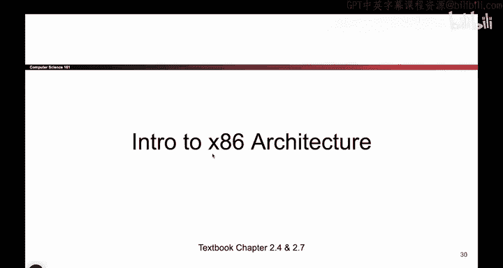
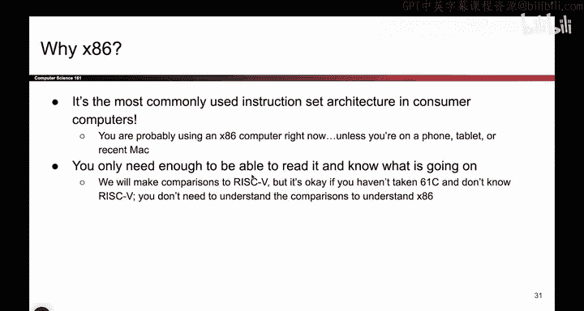
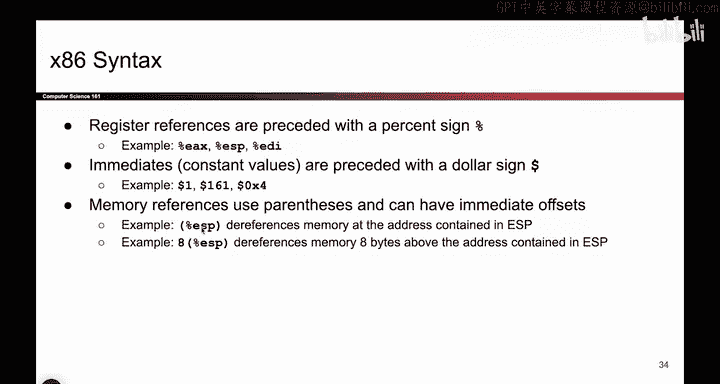
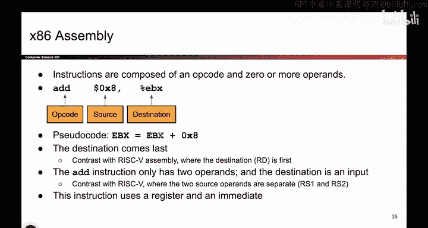

# UCB《计算机安全｜CS 161. Computer Security 2025》中英字幕 - P19：-MemSafety1, Video 5- Intro to x86.zh_en - GPT中英字幕课程资源 - BV1VhEhzMEPL

Okay。So now that we have all the pieces of how memory works and what we put in memory。

 we can start thinking about X 86 and you might not have seen X 86 before。

 So we'll walk you through it。 So X 86 is pretty much the most commonly used assembly language。

 So risk5 is great。 C61 C used it， but it's not super common in the real world。

 X86 is much more common。 almost all of our computers are running X 86。

 except maybe newer max have switched。 But the important thing is X86 is the assembly language that we are using。

 this is not an X86 class。 So we're not gonna test you on X 86 syntax。

 But if we give you a little piece of X 86 code should be able to at least read it and roughly understand what's going on。

 So we're going to try to get you to the level at least where you can read X 86 and kind of understand what's going on。

😊。

So X 86 is little Indian。 We talked about this earlier。 when you have a chunk of 4 Bs。

 you read it from the highest memory address， the lowest memory address。

 riskk5 was actually the same。 But one thing that's different between x 86 and risk 5 is if you take an X86 instruction like an add instruction or something。

 and you convert it into ones in zeros。 the resulting machine code is actually variable length。

 Some instructions are 1 B。 Some instructions translate to 16 B of data。

 And this is different from risk5， where every single instruction that you translated came out to exactly 4 B。

 So this is different between X 86 and risk 5。 So the instructions can come at variable length。

 that's something you'll encounter in your projects。 So I'm calling it out now。😊。

Okay。As mentioned before， X 86 has a bunch of registers。 They are not in memory。

 They are a totally separate place where you can store data and registers are identified by names。

 And here are some of the names， and we'll talk about them in more detail。

 One that I'll call out right away is EIP。 That's a fancy name for the instruction pointer register。

 That tells me what instruction I'm currently executing。 And we'll see that later as well。

Okay。The syntax。 So again， its not an X 86 syntax class。 So you don't have to memorize this。

 But when you see registers， they put a percent sign in front of it。 Why I don't really know。

 but that's what they decided to do。 When they write immediate。

 those are constant values in the instructions。 We stick a dollar sign in front。 Why I don't know。

 but that's not 1 hundred61， It's 161， the number。 And if you ever want to dereence memory。

 use parentheses。 So when you say parentheses， EP， you're really saying E SD is a register。

 If you open up the register。 it holds an address。 please go to that address and tell me what's there。

 So that's what the parentheses are， they say， go to that address and tell me what's there。

Okay。When I write instructions， they look like this。 So first， I write down what the instruction is。

 Do I want to add， Do I want to subtract， Do I want to multiply something else。

 And then I write the source。 So this is where I'm trying to add from and the destination is where I want to add2。

 So again， don't really care about the very specific syntax。

 But what this is saying is I want to add 8 to the value in E B X。

 So I'll pull out the value in E B X add8 to it。 and then sort the result back into the E B X register。

Here's another example。 So what does this one say， We see the parentheses。

 which means I actually have to go to the address in E S I， the fore front。 again。

 kind of a syntax quirk。 But basically， this says E S I holds an address。

 I'm gonna take that address。 add for to it。 That's still an address。 And the parentheses say。

 I want to go to that address。 Like go into memory， fetch the thing at that address。

 pull it out and then compute compute an Xor with the value at that address and the value in E A X。

 And there's no parentheses here。 So I don't have to dereence。 But I do have to dereence this one。

 So go to E S I get the data and then exor with the value in E A X and store it in E A X。

 That's what these parentheses are telling me。

