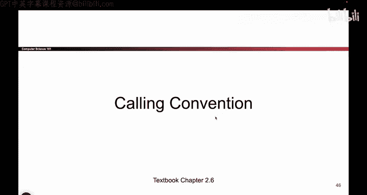

# UCB《计算机安全｜CS 161. Computer Security 2025》中英字幕 - P21：-MemSafety1, Video 7- Calling Convention.zh_en - GPT中英字幕课程资源 - BV1VhEhzMEPL

O。So now we're going to get into the meat of today。 This is the fun part。

 So now we're going to actually see what。😊，X 86 does when it calls a function。

 So I hope you're excited。 This is the fun part。 So let's say I have some code that's like main。

 and it calls a function called fo。 So when I call fo， what do I have to do， I need to go to fo。

 I need to run whatever fo says to do。 So Fo has some code， I have to run that code。

 And at the very end of the function。 It says return。

 which means I have to go back to main and finish up whatever main is doing。

 So the rest of today is dedicated to answering this question， if I am in main， and I call fo。

 How does this function call execute an X 86。 How do I go to fo。

 execute all these instructions and go back to main when I'm done。

 This is what all of today is going to be about。😊。

So sometimes people call this calling convention。 I'm not going to read all this stuff out because we're gonna to see it in the demo。

 But the important thing is we need to design this in a way that everyone knows about。

 So everyone's gonna to use the same rules to call functions。 And by doing so。

 we're gonna make sure that we never lose data that we never overwrite data that other functions are depending on So we're going to design this in a way such that if everyone follows the rules。

 We're not going to lose data when we call a function and the function returns。

 everything is going to be left back where it's supposed to be。 So it's kind of like， you know。

 if I don't know。 if your parents go out and you want to like steal something from the cookie jar。

 you can do that。 you just have to put everything back where it used to be so that when your parents come home。

 they don't notice that anything is wrong。 It's kind of the analogy。Okay。

So this is kind of what it looks like。 So before the function calls is happens。

 You're going to be in main。 So here you are。 you're running main。 Everything is good。

 You have the EBP pointing at the top of the main frame。

 you have EP pointing at the bottom of the main frame and your EIP。 That's the instruction pointer。

 that's pointing at the code of the callar function， which is main。 So remember。

 the E IP tells you which instruction is currently executing。 It holds an address。

 If you go to that address， you'll find an ad instruction or a multiply instruction that's currently executing。

 And right now， it's pointing at the instruction of main。But now you want to call foo。

 So what are you going to do when you call fo， a bunch of things have to happen。

 One thing that has to happen is you have to make a new stack frame。

 This is the space that fo is able to use to store local variables， do computations。

 whatever fo wants to do， it has to do down here。 And when I make a new stack frame。

 EP now has to point at the top of the new stack frame， EP at the bottom of the new stack frame。

 This is a new space for food to use。 And also the E IP。

 the instruction pointer used to be pointing at instructions in the color that was main now we have to switch it so that it now point at the instructions in food。

 because I'm now executing instructions in food。 So when we call a function。

 These two pointers have to drop down to make a new stack frame and E IP has to move to call or to point at the functions in the instructions in。

 EIP points at the instructions in。 That's what I said。😊，Okay。And finally， when food returns。

 we need to put everything back where it used to be。

 We can't leave a gigantic mess for Maine to clean up。

 Food is going to be responsible and clean everything up so that when we go back to Maine。

 everything is as we left it。 So when we are done， when food returns。

 we should put E VP back where it used to be EP goes back where it used to be EIP points back at the code in Maine。

 So everything is back where it used to be and main can continue like nothing happened。

 So when food is done， we need to restore the stack。

 so that everyone goes back to their old positions and main is able to continue running。

 So that's our goal。 We're gonna call a function， shift all these registers。

 And then when we're done， we're gonna put the original values back in the registers。😊。

