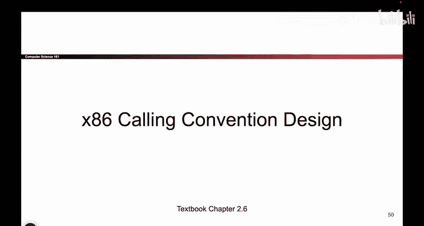
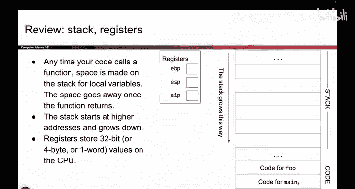
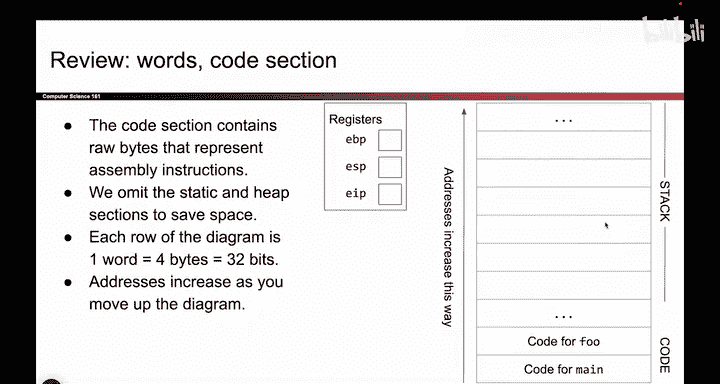
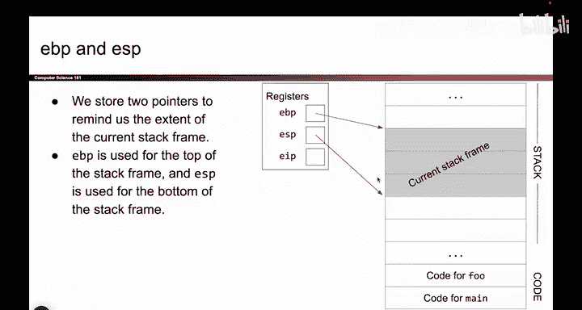
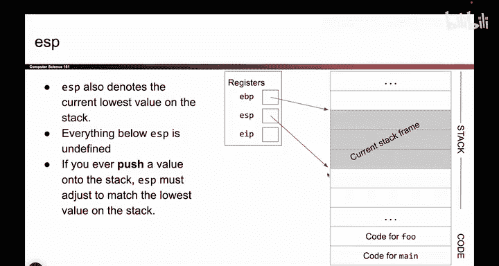
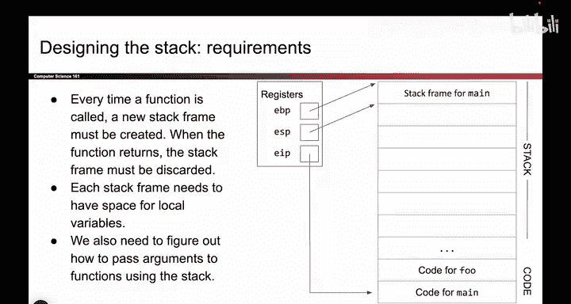
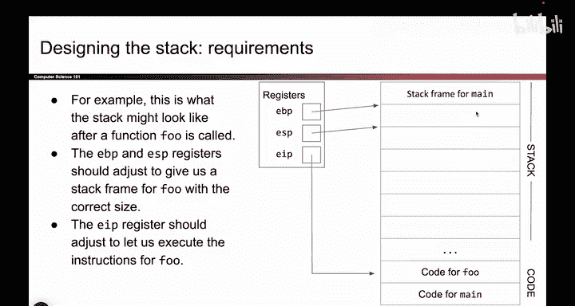
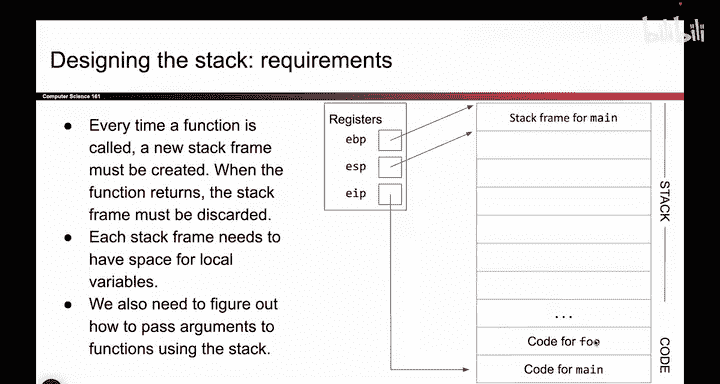
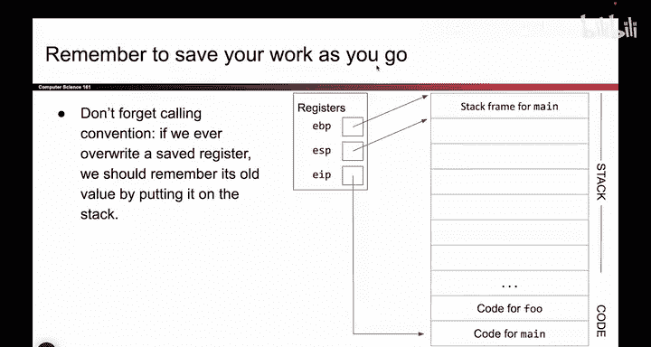

# UCB《计算机安全｜CS 161. Computer Security 2025》中英字幕 - P22：-MemSafety1, Video 8- Calling Convention Design.zh_en - GPT中英字幕课程资源 - BV1VhEhzMEPL

O。So now we're going to design the thing we just said。 So to draw the picture one more time。

 There are three registers we care about。 The stack grows down， which means if you need more space。

 we're going to allocate space lower down in the stack。 And as mentioned before。

 down here in the code section。 we have the code for F and the code for main。

 So this is all the same picture as before。

So here we go。 And just to give you a couple more reminders。

 addresses increase from the bottom of the diagram to the top of the diagram。

 These are all things you've seen before。 Each row represents four bys。

 also something you've seen before。 So just orienting you in this diagram。

O。So as we saw before。When we are running Maine。Main has a stack frame。

 The EP points at the top of the stack frame。 The EP points at the bottom of the stack frame。

 There is our stack frame。 EBP says here's the top。 EP says here's the bottom。

 these two boxes store addresses。 But I drew them as arrows， but they are really addresses。

 So this is main stack frame。 And also， as we mentioned from before。

 E IP is going to point at the code in main。 So there it is E IP。

 the instruction pointer points at the code in main。 This is an address。 If you go to that address。

 you'll find the instructions for main。

One thing I should call out that I haven't done so yet is ESP kind of has a second purpose。

 So you can think of ESP is doing two jobs at once。 It's multitasking。

 So in addition to remembering the bottom of the current stack frame。

 It's also the bottom of the entire stack。 And that's something you can go home and think about the bottom of the current stack frame is also the bottom of the stack。

 there's nothing below this in the stack。 So ESP is also saying this is the bottom of the entire stack。

 Everything below this is undefined。 It's total garbage。

 I have no idea what the values down here are， they don't matter to me。

 So what this means is as we saw from before， if you ever push a value onto the stack。

 you also need to decrement EP force it to point lower on the stack so that you remember the thing that you pushed。

 and that's something we'll see。 If you don't move EP down， you're writing into the abyss。

 There's nothing there。 It's undefined。 So if you write it there。 the program will not remember it。

 you have to move EP down to remember that value。

Okay， great。 So this is what the stack looks like when we're running Ma， everything is good。

 EBP points at the top， EP at the bottom， EIP points at the code。Now， what we have to do is。

 as we said from earlier。 Okay， so here's main again。 Okay。

 so I guess I shifted the shifted the diagram around a little bit。 Sorry about that。 Okay。

 so here's main E VP points at the top。 EP points at the bottom。 EIP points at the code from main。

 And when we call a function， This is what has to happen。 Are you ready， This is before。😊。

Wsh this after。 Okay， so what happens after is EBP and EP need to move down to create a new stack frame。

 And this is going to be fo stack frame。 And then EIP is going to point at the code for food。

 So this is before stack frame for main code for main。 This is after EBP， EP。

 They shift down EIP points of the code for food。 So we need to change all the registers so that things look right。

 And remember， when we're done， we have to put everything back where it used to be。 So here's fo。

 when we're done， we return， everything's back where it used to be。 That's our goal。

 That's what we have to design。😊。

Okay， so the key thing。 if you fall asleep for the rest of today。

 the thing that you really have to know is that when you change the value of a register。

 you should always save your work as you go。 So say I want to change EBP because I want to point somewhere further down。

 it's not okay to go to EBP and delete the value that used to be there and overwrite it with the new value because if you do that。

 you're losing work， you can't go back。 So any time you overwrite a register。

 you're going to put its old value somewhere。 You're gonna to write down what value used to be there。

 so that when you're done， you can put that old value back。 It's like saving your work。

 So when I want to change something， I write down the old value and then when I'm done。

 I take the old value and put it back。 This is how we ensure that when we return the original all the registers are back in the right place。

 So that's our goal。So if you don't listen to me for the rest of today。

 just remember that everything we're doing is in the goal of saving your work as you go。

 That's the really important thing that we have to see。 So we got to save our work as we go。

 cannot say it enough times。

