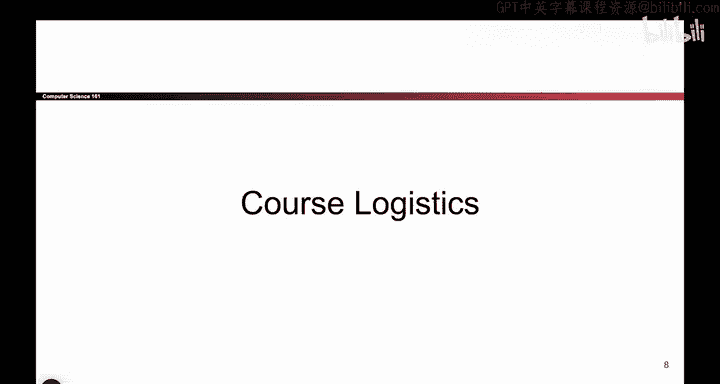
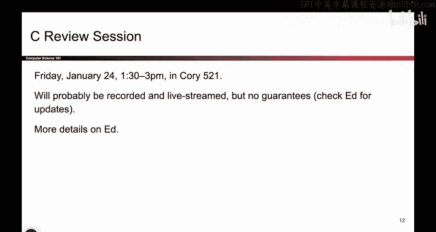
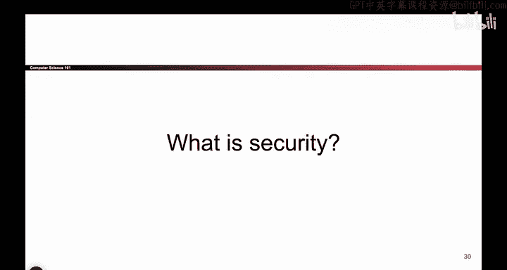

# UCB《计算机安全｜CS 161. Computer Security 2025》中英字幕 - P2：-Intro1, Video 2- Course Logistics.zh_en - GPT中英字幕课程资源 - BV1VhEhzMEPL

Okay， logistics， so I'm actually not going to read all the logistics out loud because there's already a policies page and an FAQs page that you can read on your own time。

 So instead of reading that out loud to you， I will leave it to you to read those carefully but just to give you a couple of very quick reminders that are directly from these pages if you're currently not added to the class。

 give us a couple of days we will probably add you automatically so you don't have to email us。

 you don't have to ask us， we'll take care of before you within a couple of days。

 if you have a pending concurrent enrollment application or if you're just enrolled。

Discussions and office hours。 they start next week， not this week。 We don't take attendance。

 go to whatever section you want exam dates。 they're already on the website。

 The alternate exam date is also on the website。 It's in person only right after the main exam。

 if you have a documented conflict， overleeping， not a documented conflict。

 but if you have another exam， that's documented。And stress management。

 we do acknowledge this class can get a little heavy sometimes。

 especially around the middle when we talk about Project 2。

 So we just want to stress your wellbeing is more important than this class。

 Please don't go pull multiple al nighters for this class。 We're here to help。

 We have a link to a form to request extensions。 And if you're registered with the disabled students program。

 please send us your letter of accommodations。 so we can help you out。 So we're here to help。O。

Here's all of our staff， are any of them actually here and want to say hi？No， okay。

 I'll go yell at them later。 So， well， that's our staff。 They're wonderful。

 They basically run the entire class。 I couldn't do this without them。 So there they are。

 you see them。 Go say hi。😊，See a review session this will happen this Friday。

 I'm pretty sure this is the time， but if it's wrong we'll tell you on Ed but I'm 90% sure this is the right time if you go to this location at this time someone will tell you all about C so if you feel pretty shaky on your C fundamentals you can go there。

So those are the logistics that I care about。Any questions on them and remember all the details are on the website if you have more questions。

Okay，One final thing about lectures。 if you ever see the screen flash blue like it is now。

 it basically means we have a flight where we're going to tell you a bit of a story to set the stage for something that we want to show you。

 And when we tell you the story， I don't care if you actually know the contents of the story So I'm not going to test you on something like in 1985。

 what was the morals worm， I don't care， but I do care about a specific takeaway。

 like the moral of the story， So whenever you see these blue slides。

 it means I don't care about the exact story， but I do care about the takeaway。So now， you know。Okay。

 that's it for the first half， any thoughts on how the course runs， what you will hopefully learn？

