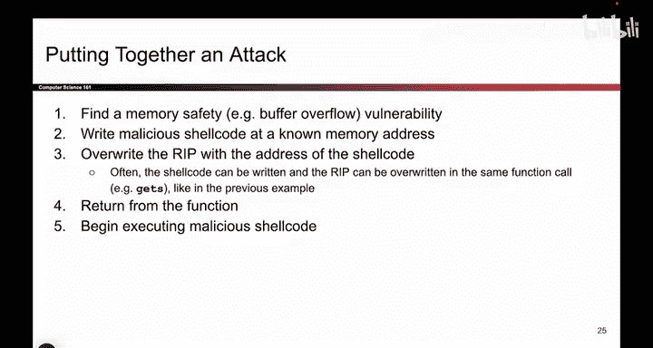
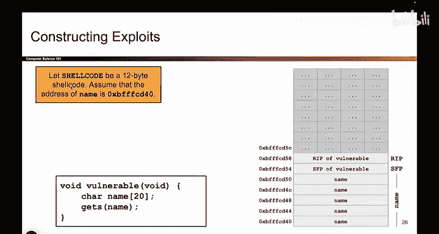
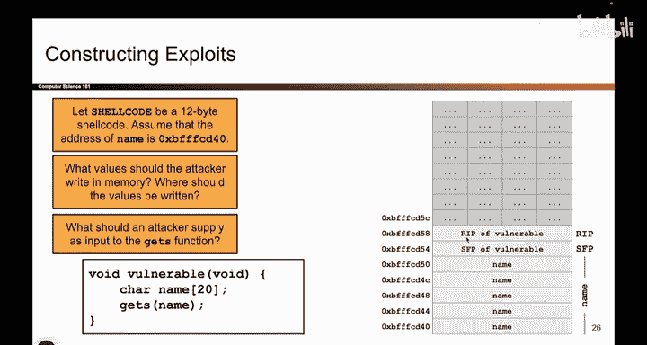

# UCB《计算机安全｜CS 161. Computer Security 2025》中英字幕 - P31：-MemSafety2, Video 6- Writing Shellcode.zh_en - GPT中英字幕课程资源 - BV1VhEhzMEPL

So that's great。 We executed instructions at deadadbe。 But now you're gonna to say， okay。

 that's great。 But it's not going to always be the case that someone magically puts bad instructions at deadadbe。

 I don't know about you。 But when I'm writing a piece of C code。

 I don't stick a piece of nowwarere in there and say， I'm going to leave this here for the attacker。

 We don't do that。 So how is the attacker going to execute instructions that they want to execute。

 if they aren't already in memory。 So in this case。

 we were nice to you and we said we preloaded some bad instructions in deadadbe。

 But that's not always true。 So what if the attacker wants to execute instructions that don't live in memory。

 What do they do now。😊，So one thing we could do is， well， okay there's a note about nullbittes。

 I forgot that was there， but there it is。But something we could do is if we don't have the malicious instructions already in memory。

 we can put them there ourselves。 What does getas do。

 Getdes says go into memory and write whatever the hell you want。

 So instead of just writing A's and addresses。 We can also write the actual instructions。 So。

 for example， the attacker could say， I want to execute these malicious X 86 instructions。

 So the attacker will pull out their asmbler， convert these instructions into ones and zeros。

 These are ones and zeros。 I can write them into memory。 They correspond to ones and zeros。

 their bytes。 So instead of just writing a's and addresses。

 the attacker can write actual instructions into memory that they wrote themselves。

 And then they can cause the program to execute these instructions。 go through this address。

 execute these instructions that I wrote into memory。

 And these instructions can do whatever you want。 They can delete all the files。

 They can run another program。 They can。😊，Send spam emails， whatever they want。

 But a really common thing that attackers will do with this malicious program is they'll spawn a shell。

 And what that means is it opens up a terminal and lets the attacker type whatever they want。

 So you can imagine， let's say that vulnerable code was running on a top secret server somewhere。

 And I inputted an attack。 And when I input the attack， the attack opens a terminal。

 And now I have a terminal on that top secret machine。 So I can type whatever instructions I want。

 And that compromised machine will execute them。 So this code can really be any arbitrary code that the attacker wants to execute。

 But a common thing that attackers want to do is they want to open the terminal because that gives them full control over that computer to do whatever it is they want。

 And people sometimes call a shell code because it is code that spawns a shell。😊，Shell code。 Okay。

 it's very creative name。 So that's what it looks like to write malicious code。

 So the punchline of this slide is if the attacker or if the person who wrote the program doesn't magically give you some malicious code that you can execute。

 you can also input malicious code yourself。 So this is what we're going to try。😊，Coming up next。

Unless you have questions before then。Okay， so we now know that we can write malicious code ourselves。

 put it in the program and cause the program to execute that malicious code。

 So let's see what that looks like and try to put together the whole attack。

 So here's what we're going to do。 First， we're gonna find the vulnerability。

 We're gonna try and find where in the program the attacker can write out of bounds。

 We are going to write the show code into memory， the show code wasn't there。

 we are going to write it there ourselves。 And then we're going overwrite the RP。

 that's the address that tells us where to go after the function returns。

 It currently holds the address of some nice function， we're gonna replace it with an address。

 the address of what the address of the shell code we just wrote。 So in other words。

 we're telling the program。 when you return， go to this address。 And what did I put at that address。

 I put the show code that I just wrote。 So that's what we're going to do。

 We're gonna do all this in a single step。 and when the function returns。 It's going to say。

 I'm done， Where do I go， I look at the RP value that holds an address。😊。

I go to that address and at that address， oops， I found shell code。

 and I start executing mallitious shell code and the attack works。

 So if that's what I'm going to try to do。 I'm going to write some shell code and then force the R IP to point at that shell code。

 So when the function returns， I go execute that shell code so。

Here's what it looks like。 This is the same stack as before。 The same code from before。

 The only new thing is I have annotated the diagram to tell you the addresses in memory。 So。

 for example， the SFP of vulnerable， that's some value living in memory。 It lives at address。 B， F。

 F， F， D 5，4。 That's what the picture says。 or name， name starts at address。 B， F， F F， D 4，0。

 That's all the diagram is telling you。😊，So let's say you have some 12 byte shell code。

 Someone has told you I want to execute the shell code。 It doesn't already live in memory。

 So you got to put it there yourself。 And the question for you is。

 what do you want to write into memory So I want to get shell code into memory。

 I want to change that R IP。 Where do I put all these different things that I want to put into memory so that they all line up properly and when this function returns It's going to go and execute shell code。

So if you're on the video， take a minute and think about it， pause the video， if you're in person。

 take a couple seconds。How do I put all the pieces together？Okay。

I'm just gonna spoil this one because we're almost out of time。 So here's here's what I want to do。

 This RP value。 I wanted to point at shell code。 Where is shell code that depends on where I put it。

 So this actually lots of different solutions but one that I can think of is I'm gonna start by writing the shell code into memory The shell code is 12 by。

 So it takes up three of these rows，4 bytes each。 there is shell code It now lives in memory。

 It wasn't there。 I wrote it now it's there。 These are ones and zeros that correspond to malicious instructions。

 Now what comes next。 remember， the get as function writes consecutively。

 the getas function doesn't let you say， okay， I'll take a break and start writing up here again。

 The getas function assumes every character that you provide。

 It writes it to higher and higher addresses with no breaks。

 So if I'm here and I finish writing 12 bys of shell code I can't just drop the address right here because this is not where the RP is I want to overwrite the RP with an address。

 So I need to start。😊。

Garbage bites like the letter A。 So garbage garbage garbage。

 I'll write a lot of garbage bites here happens to be 12 to overflow these three lines in the stack diagram。

 And now the next thing that I write is going to clobber out the R IP。 So now I can write an address。

What address should I write， remember， I want the shell code to execute。

 So I'm gonna write the address of shell code。 I put shell code down here。

 The place where I put it happens to have address B F FFCD4，0。

 So what am I going to write into memory in little Indiandn form。 I'm gonna write B， FFFCD 4，0。

 So what I had to do is I had to line up everything nicely in the stack。

 And now if I execute this code。 What's going to happen。 Well。

 what's gonna happen is the program is going say I'm done time to return。

 I'm going to take this address in the R IP， go to that address， start executing instructions。

 and the show code gets executed And the attacker has succeeded in getting shell code to run。

 So that's your very first memory safety exploit with shell code。😊。

