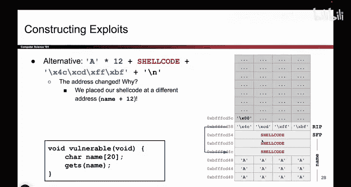

# UCB《计算机安全｜CS 161. Computer Security 2025》中英字幕 - P32：-MemSafety2, Video 7- An Alternate Exploit Structure.zh_en - GPT中英字幕课程资源 - BV1VhEhzMEPL

Okay， so。In the last video， last time we showed you the very first memory safety exploit that you saw and remember the idea was we wanted to overwrite the RIP。

 the return instruction pointer， because this address。Hold some data。 and at that data。

 you have an address and this address says when the function returns。

 go to this address and start executing the code at that address。

 So if we can overwrite what this address contains we can force the program to jump somewhere else when when the function returns and go execute some malicious code specifically some show code that we wrote into the program ourselves。

 And the tricky thing about coming up with these exploits is。

 you have to do a little bit of what I think of as juggling。

 There's all these different moving parts。 and you have to get all of them in exactly the right place so that this exploit works as intended。

 So， for example， because I chose to put the show code down here at the very start of the name character right。

 which is this part of memory， That means that the show code starts appearing an address B F FFF。C。

 D 4，0。 So B F， F， F， D 4，0。 That's the address where show code starts。

 And because I put the show code down here， it means that this address up here has to be the address。

 B， F， F， F，D 4，0， because that's the address where I put the show code。And similarly。

 another thing I have to juggle is， well， remember the getas function。

 it takes your input from the user and it just writes it into memory at successfullyively higher addresses。

 So once I finished writing my shell code， which we assumed was 12 bytes。

 The next thing that we would overwrite if we continue to input data is not the RP。

 It's still some part of the name character array So I also had to write some garbage bys。

 specifically 12 of them to overwrite the remainder of name and also this saved EVP value。

 which I didn't really care about so that the next thing that I overwrite would be the RP and at the RP I write the address of the shell code。

 So it took a little bit of juggling to figure out who do I put the shell code And what address do I put here。

 and how many padding bytes do I use But by putting all the pieces together we were able to formulate this particular exploit。

But it turns out this is actually not the only way I could set up the stack and place things in memory to cause shell code to execute。

 So let me give you another example of an exploit that might work。

 And maybe this is the one that you came up with。 So maybe you thought actually， you know what。

 instead of putting the show code at the very start of name。

 I'm actually going to start by writing the garbage padding bytes。 So I'm gonna write 12 a's。

 And remember those could be B's or C's or X's doesn't really matter。

 but I'm going to start by writing those 12 garbage bys。

 And then I'm going write the 12 bys of shell code。 And this is also totally fine。

 It still achieves my goal of writing show code into memory。

 So these 12 bys correspond to some machine instructions。 Remember that's X 86 instructions。

 translated into machine code that lives in memory。 I wrote it into memory。

 And because I put the show code in a different place。 The address that I overwrite the RP with。

 remember this used to hold an address。 I'm changing it to hold the different address。😊。

This address also has to change。 Why is that， Because the show code no longer lives down here at address B FFFCD40。

 If I look at the picture。The shell code now lives at address B FFFCD 4 C。

 That's a different memory address。 So notice that when I write the R IP or when I overrite what used to be at the R IP。

 I am now writing the address， B FFFCD4 C。 It's a different address。

 And the reason is just because I put the shell code in a different place。

 But if you stare at this for a bit， you'll see that this exploit would have also worked just fine。

