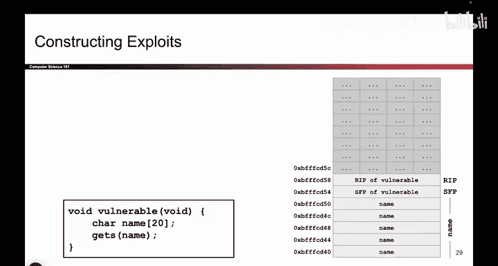
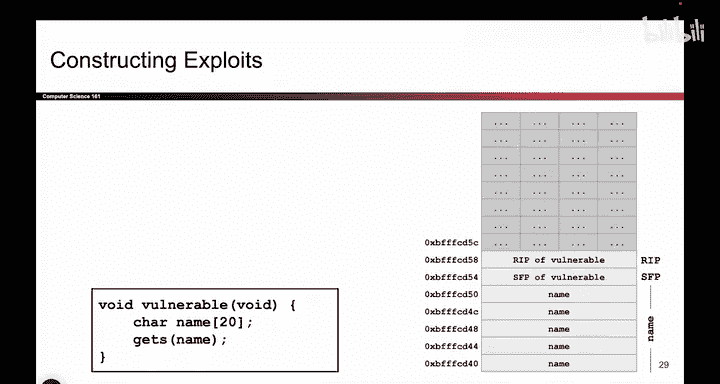
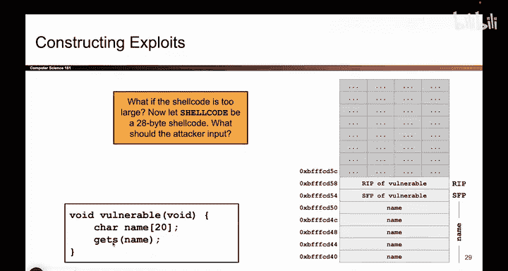

# UCB《计算机安全｜CS 161. Computer Security 2025》中英字幕 - P33：-MemSafety2, Video 8- Writing Longer Shellcode.zh_en - GPT中英字幕课程资源 - BV1VhEhzMEPL

Okay， so let's get a little bit trickier。 What if instead of the show code being 12 by。

 What if I said that the attacker wants to execute show code that's 28 by long。

 So the attacker wrote some code that they want this program to execute， compiled it into X 86。

 assembled it into ones and zeros， and the resulting machine code is 28 by long。 Well。

 now we have a problem because if you look at this name character array， it holds 20 Btes。

And then the SFP gives me four more bytes to write。 And that's not enough。

 I have 28 bys of instructions that I want to write。

So try to stare at this picture and think， where would I put She code if I can't put it down here？

The trick that I did from earlier where I put the shell code， followed by some garbage bites。

 followed by overriding the R IP， no longer works。 So if you're on the video。

 you can pause and think about it。 If you're in person， you can take a couple seconds and think。

 Where do I put the shell code， What does the exploit look like now。

Okay， so hopefully you had a little bit of time to think about it。 So I'm gonna spoil the answer。

 So it turns out， remember that gets doesn't have a limit to how much the user can write as long as the user continues to provide input。

 gets will happily continue to write to higher and higher addresses on the stack。 So the trick here。

 the realization is， actually， you know what， if the shell code doesn't fit down here。

 I'll just put it up here。 above the RIP。 So now my exploit looks like this。

 I now have 28 bys of garbage or 24 bytes， sorry， So that's 24 bys。

 that's 20 byte to overwrite the name character array and four more bytes to overwrite the SFP。

 So there's 24 by to write everything up until the RIP。 now I can write an address。

 And what address not too sure。 but some address。 And then after that， I will write the shell code。

And what address do I put over the R IP， that should be the address of shell code。

 And if I look at this picture， it seems like the show code now lives up here4 above the RP。

 that happens to the address B F， F， F F D5 C。 I guess B F FFC D5 C addresses are hard。

 So that's the address of shell code。 So I'll take that exact address write it in little Indian format。

 and I'll write B F F FD 5 C。 that goes into memory。

 And now when the program's ready to return from the vulnerable function。

 it looks at this part of memory and says this is the address that I should transfer control back to。

 And if I go to that address， there's the attacker show code。 and it runs。

 So it's the same pattern as before。 the only difference is the shell code didn't fit down here。

 So I put it up。 And that's totally fine because get us allowed me to write as much as I want。

