# UCB《计算机安全｜CS 161. Computer Security 2025》中英字幕 - P46：-MemSafety3, Video 7- The %n Formatter.zh_en - GPT中英字幕课程资源 - BV1VhEhzMEPL

O。So far， we've seen printf leaking secret values on the stack。

 If you provide a mismatch number of percent formatters， Prif will go on the stack。

 look for arguments， even though there aren't any， and that causes some secret values to get printed out。

 But it turns out printf can actually do something even more dangerous。 And to do that。

 we're going to use kind of an obscure format specifier， that's percent n。 Now before this class。

 I'd never seen percent n before， but it exists。 and it has this very strange behavior。

 which we now describe。 So what percent n does is it takes the next argument on the stack just like percent D or percent S or percent X it goes on the stack takes the next four bys and it thinks there's an argument there。

 it may or may not be an argument depending on whether or not there's a mismatch。

 basically percent S or percent N goes on the stack。

 takes the next four bytes and it reads those four bytes like a pointer。

 So it reads those4 bytes like an address and it goes to that address。

 but instead of printing out what's at that address。

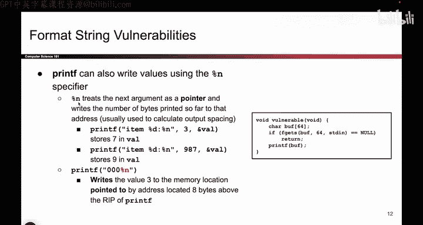

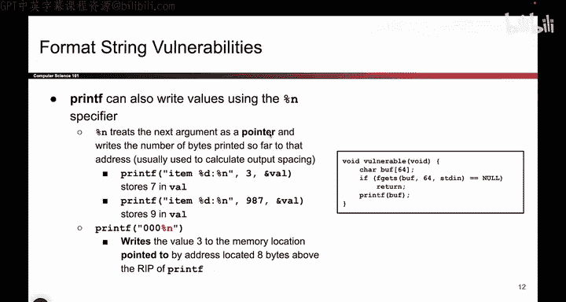

Like something like percents would do when we go to that address。

 we're actually going to write something。 So you heard me right Printf is going to write data。

 It's so weird。 And specifically， what will printf write。

 It's going to write the number of bytes that printf has output it so far。

 So to say that one more time。 Prif is going to think how many bytes have written out to the user so far。

 I'm going to take that number， and write it to memory。 Where do I write it。

 I take the next argument on the stack， read it like an address。

 go to that address and write down the number of bytes print so far。

 It's a very bizarre thing that exists in printf。 As far as I can tell the intended reason to do this is to make printf lineup nicely。

 So if you want to print for example， a nice looking table or something you can use this percent end to check how many more spaces you have to print or something like that It's kind of obscure no one really uses it except for attackers。

 I guess But that's what would happen。 So just to give you an example of what percent N would do in。

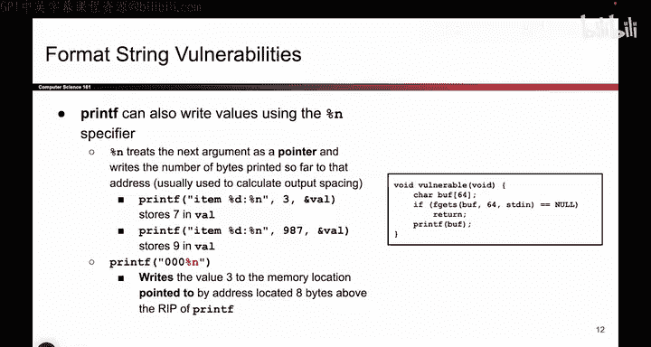

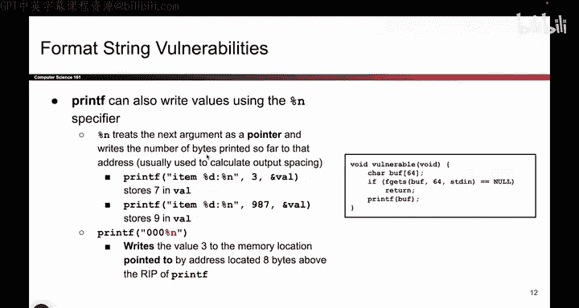

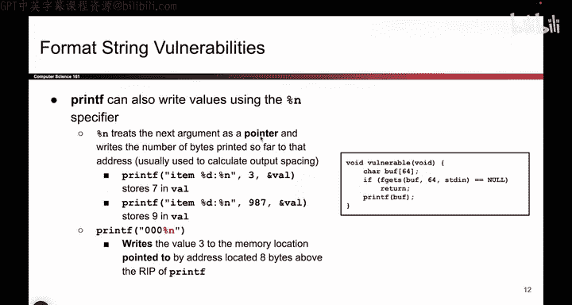

It's intended behavior Here we have a printf with the zeroth argument。

 the one where you put all the percent format matters， it says item percent D colon percent n。

 And here we pass in two arguments to match with the two percent format matters。 So this is good。

 This is intended behavior。 But what it will do is printf will print out I T E space。

 Then it see a percent D。 and it thinks percent D means decimal。

 So I'll take the next argument on the stack， which is three。 I'll plug that into the percent D。

 and I'll print out3。 So so far what I've printed out is ITE space 3。

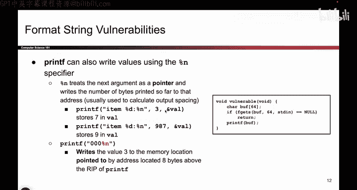

Then I'll print out a colon。 And for those of you keeping track home， that's seven characters so far。

 I TEM， space，3 colon， that's 7。Now we see the percent N and printf things that's a percent formater。

 So I will go on the stack。 Take the next argument， which is this argument。

 I'm going to treat it like an address。 I'm going to go to that address。 And if I go to that address。

 I'll find Val， which is some variable。 And I'm going write something to Val。

 What am I going to write， I'm going to write the number of bytes outputed so far。

 which happens to be 7。 So this very strange printf call has the behavior of writing something into memory。

 You call printf and something gets written into memory。 specifically here， the number written was 7。

 because I printed out item colon or item space 3 colon that's 7 characters。

 So Valal got the number 7。

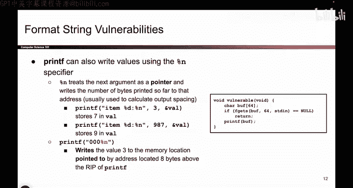

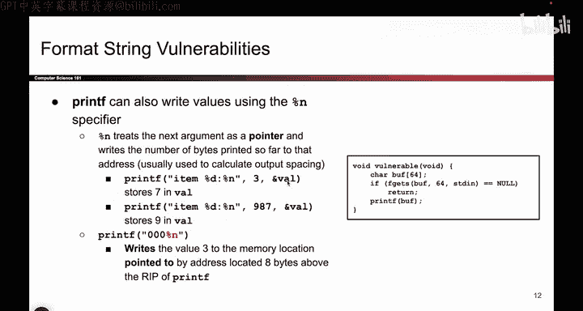

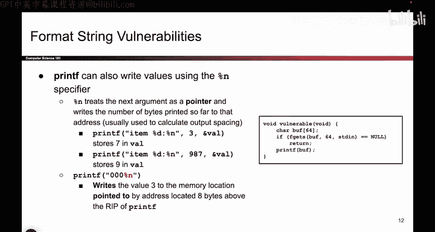

It's kind of weird， but that's something that happened。

And here's another example。 It's kind of the same as before。 But instead of printing 3。

 we now print 9，8，7。 So now what happens is we print I T E M space。 we see the percent D。

 we substitute it with the first argument 9，8，7。 So we print out 9，8，7。

 that's  three more characters， we print out a colon。 If you're keeping track at home。

 that's 9 characters in total。 And now when we see the percent n。 we take the next argument。

 we go to that address， which happens to be the variable vow。 And we write the number 9。

 So that's just two examples of printf writing values。 When you provide a percent n。😊。

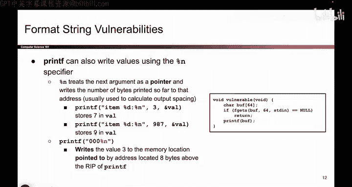

So what if I take this percent N idea and I combine it with the idea from earlier where we have mismatched arguments。

Well， if I have percent N， which lets me write to memory， and I have mismatched arguments。

 which causes me to read and write to weird parts of memory that weren't intended。

 I might be able to write the parts of memory using printf。 And that's what we do。

 So here's an example。 printf 0，0，0， percent n。 So what will printf do。 It will print out 0。

 print out 0， print out 0。 for keeping track。 That's three characters printed so far。

 And then it sees the percent N。 And it says， well， that's a placeholder。 I'm gonna go on the stack。

 Take the next argument doesn't actually exist。 So we'll take whatever the next argument on the stack is。

 It's probably not an actual argument。 Who knows what it is。 but we'll take that value off the stack。

 We'll treat it like an address， We'll go to that address and we'll write the number3。

 So this call to printf。 We'll actually go into memory somewhere。

 Who knows where and actually write the value 3。 where there used to be something else。

 This is dangerous。 as an attacker。 When I see this。

 I'm starting to think maybe I can use this to write。😊。

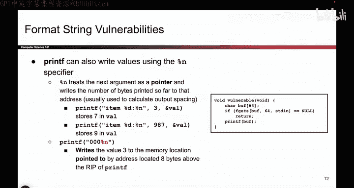

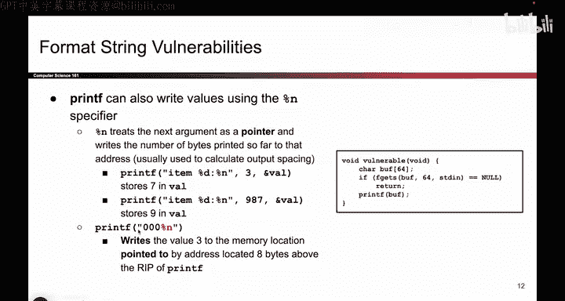

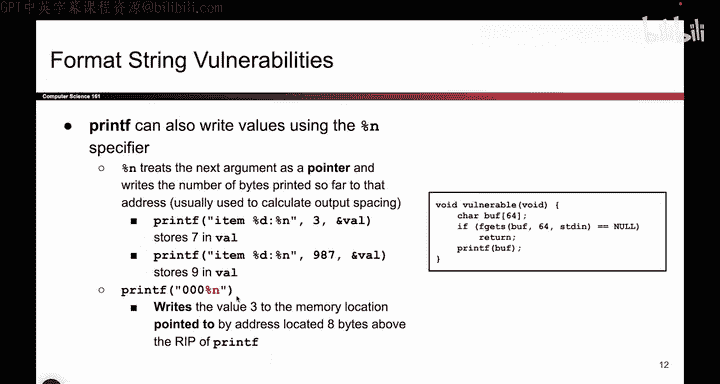

With values into memory that were not intended。 But that's what the percent and formatter does。

 It's kind of weird。 But in summary， it takes the next argument on the stack。

 treats it like a pointer， goes to that address and writes a value。 What value does it right。

 The number of bytes printed so far。

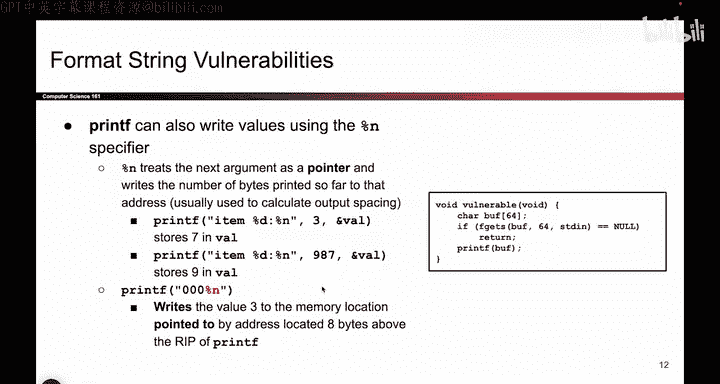

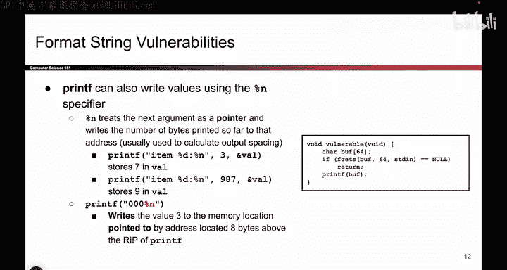

