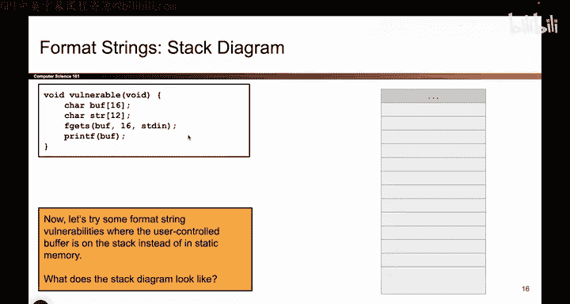
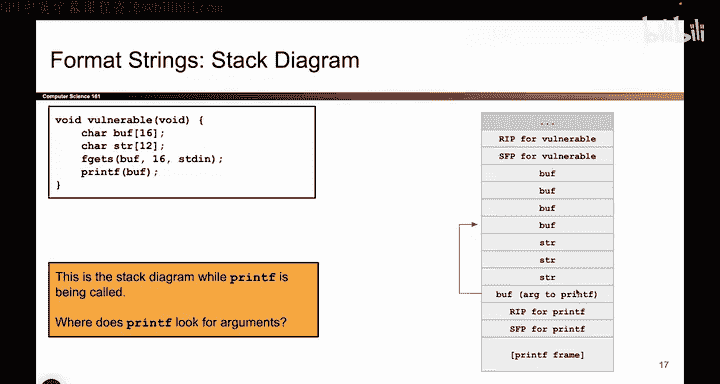

# UCB《计算机安全｜CS 161. Computer Security 2025》中英字幕 - P48：-MemSafety3, Video 9- Harder printf Vulnerability - Setup.zh_en - GPT中英字幕课程资源 - BV1VhEhzMEPL

Okay， I was do a more complicated one。 So this time，'s still kind of the same idea as before。

 we're still letting the attacker control the zeroth argument of printf。

 the one with all the format mattersters。 But this time I'm going to put the buffer on the stack instead of in the static part of memory。

 And that's just the show that I can make more complicated things happen。

 So let's draw the stack diagram。 So what has to go on the stack。 Well。

 whenever I open up a new stack frame， I have to have the R IP of vulnerable and the SFP of vulnerable。

 those are my two saved to register values then I'm going to have the local variables buff and string And then let's see。

 and then I'm going to open up a stack frame for printf and printf's going to have an argument that's buff R SP and then its own stack frame。

 So to make a long story short。 It looks like that when I open up vulnerable。 I have RP SFP。

 I define the local variables of buff and string or ST TR。 And then when。

Ca printntf that opens up its own stack frame。 So I pass in the argument buff。

 And remember arguments are passed in as pointers in C or rather arguments to character arrays or passed in as pointers。

 So I pass it in an address and the address points at buff。

 then I open up the printf stack frame has RP SFP and printf and usually when I show people this。

 the first thing they ask what happened to the F getS stack frame。

 remember when we execute this code， we execute it line by line。 So we execute F getS。

 And when F getS is running and opens up a stack frame does all the things that F getS needs to do。

 But then F getS returns。 And when F getS returns， its stack frame is totally cleared out。

 and then we get to the next line and we open up printf stack frame。

 So because F getS is called first and then it returns and then we call printf。

 there is no stack frame for F getS that's active right now， it was created earlier in time。

 but it has been destroyed now and I only care about the stack frame while printf is being called So just in case。

Someone was confused about that。 That's why FGS doesn't have a stack frame。

 not the most important detail here， but something that people ask。Anyway。

 now we're in Prif and Prif sees this buff and whatever goes in there if it has any percent formatters。

 Prie is going to have to match them up with arguments。 So where does printef look for arguments。

 remember we always push arguments on the stack So what that means is Prif is going to go on the stack and any time that sees a percent formater。

 it's going to match it up with some value on the stack So specifically it's going to match them up like this and I've numbered them for you。

 So the zeroth argument， the one that has all the percent formatters that's right here。

 And if there's a single percent formater， it will have to match up with this memory box right here。

 if there's a second percent format， it match up right here if it has a third one。

 it would match up with this one， if it has a fourth percent format。

 that format would match up with this box on the stack and so on and so forth。

 So each of these on the stack， Prif thinks there's an argument there even though it's not actually an argument。

 it's just stuff that was already there。

So this is where Prie is looking for arguments， and I've labeled them with these art numbers just for our convenience。

