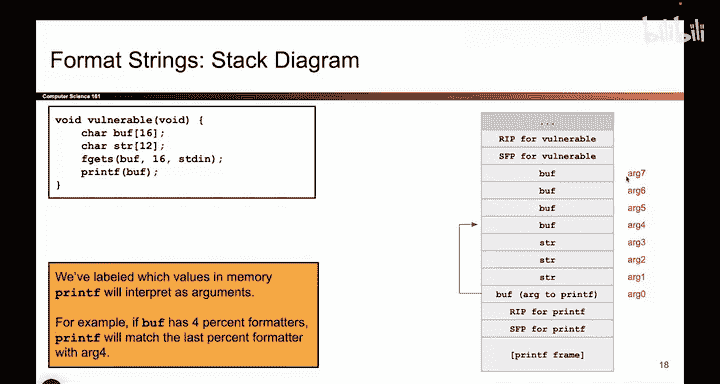

# UCB《计算机安全｜CS 161. Computer Security 2025》中英字幕 - P49：-MemSafety3, Video 10- Harder printf Vulnerability - Desired Goal.zh_en - GPT中英字幕课程资源 - BV1VhEhzMEPL

It's。

So here's our goal。 We're gonna do something a little bit more complicated than printing out secret values。

 I actually have a very targeted goal。 specifically， I want to write a target number。

 which I chosen to be 100 to a target address which I've chosen to be deadbe。

 That's what I chose you could choose something else。

 Maybe the thing you want to write is I don't know address of shell code。

 and maybe the address you want to write to is address of RIP who knows。

 but you can write any number you want to any target address you want using the attack that we're about to show you So I chose 100 and dead beef somewhat arbitrarily。

 but you can actually use this to write whatever value you want anywhere you want。

So that's the setup of this question。 We have this piece of code and we drew a stack diagram for it while we're executing printf。

 it keeps track of these arguments on the stack and it knows if I ever see a percent formater。

 I have to match it up with the next unused argument on the stack and print that value out or write to that address or something like that and my overall goal as the attacker is to provide something in Buff that will write 100。

 the number 100 to the address， deadadbe。That's the setup。Any thoughts on the setup？Okay。

So with our setup all ready to go， we are now ready to start thinking about how to write 100 to dead beef。

 So we already know there's going to be a percent n in there。

 percent n is what lets me right values to memory but this is the point where things get kind of tricky because a lot of different things have to be true at the same time for this attack to work。

 So I kind of think of this attack like juggling So in juggling。

 you have to get all the balls in the air at the same time or you have to put all these different things in the right place and sometimes getting them all in the right place at the same time can be tricky。

 And so when you craft these exploits， it's often the case that you make one thing correct and then something else is broken。

 So you go to fix that thing and it breaks two other things and you go fix those things and it breaks another thing and you fix that too and it breaks another thing So it can take a little bit of trial and error and sometimes when you break one thing you have to fix it and then it causes more things to break and after lots of breaking and fixing you need everything to line up in a very specific。

aySo that the target value gets written to the target address。

 So that's we're that's what we are about to see。 We're gonna try to get printf to line up everything in the right place。

 So we already know there's going to be a percent n because percent n is how you write things into memory my goal is to write something。

 And when the percent n occurs。 remember， printf reads the zeroth argument， letter by letter。

 and anytime it sees a percent。 it replaces it with something or write something into memory when printf goes letter by letter and it sees the percent n。

 I need two things to be true at the same time。 And this is where the juggling comes in because you might get one of these。

 but break the other。 when you fix that， you might break the other one。

 but we need both of these to be true at the same time。 When percent N appears in the printf output。

The next unused argument should be this address because what will printf do。

 Prif sees the percent N and it thinks it's a percent N。 I better go on the stack。

 take the next unused argument and use that as an address and go to that address and write stuff。

 So when the percent n occurs， whatever argument is the next unused one。

 it might be arc 4 might be a 6 might be a 7。 whichever one it is。

 I need to make sure that the value dead beef is sitting there in memory so that the percent n sees the value dead beef goes to that address and attempts to right there。

 So that's one thing that has to be true。 This is controlling where we write If I mess this up。

 Prif might write 100， but it might write it to the wrong place。

 So we have to get this right so that when printf goes on the stack takes the next unused argument happens to be dead beef。

 I go there and I write some data。And what data do I write， Hopefully the number 100 And remember。

 how does printf know what value to write， It thinks about the number of bytes printed so far。

 So the second thing that has to be true at the same time。

 and that's what makes these exploits so tricky is that the number of bytes printed so far has to be exactly 100。

 So printf will think how many bytes I've printed so far，100 bytes。 Okay great。

 then what I will do is I'll go to dead beef and I'll write the number 100。

 So at the same time I have to juggle the fact that I need 100 bytes printed and the fact that when Prif sees percent and the next unused argument on the stack wherever it is just so happens to contain the value dead beef。

 and all of this has to go into my printf。Input to buff。 So that's the juggling that has to happen。

 So we're going to make this happen。