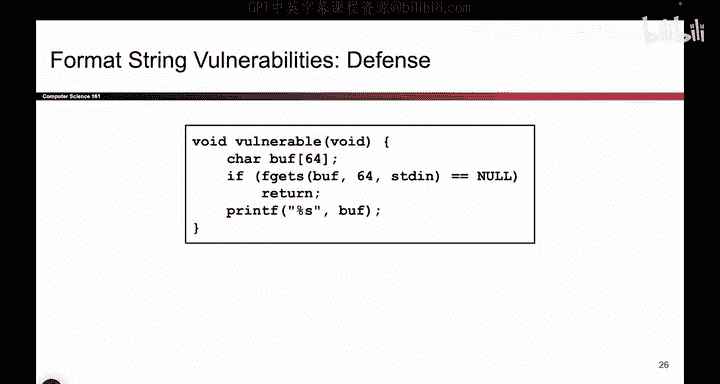
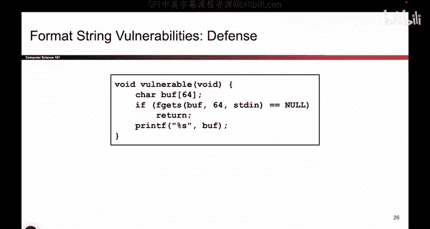
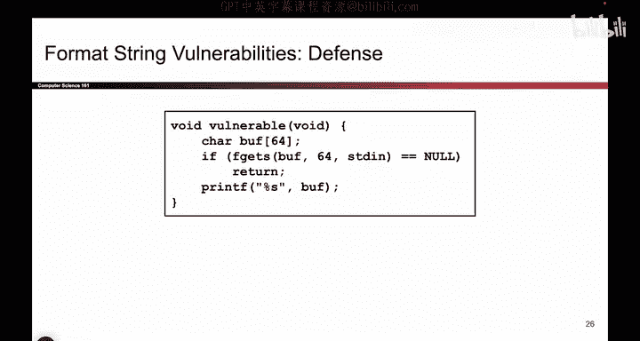
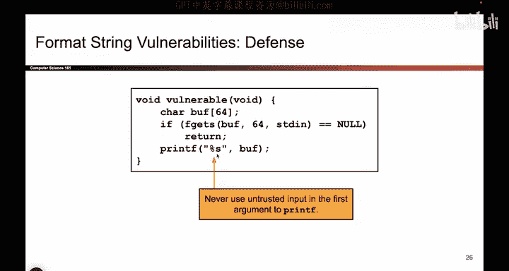
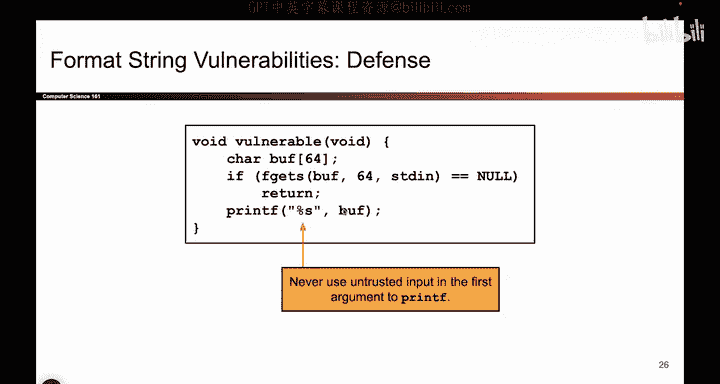
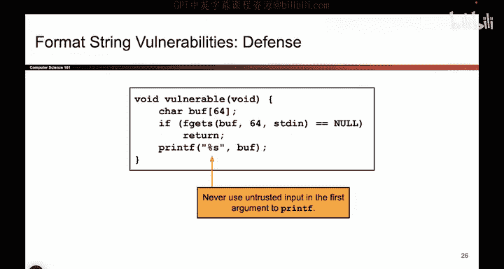

# UCB《计算机安全｜CS 161. Computer Security 2025》中英字幕 - P53：-MemSafety3, Video 14- printf Defenses.zh_en - GPT中英字幕课程资源 - BV1VhEhzMEPL

Okay so we just went on this long journey where we talked about format string vulnerabilities and we said that if you give the attacker control over that allimportant zeroth argument。

 they can cause a mismatch in the total number of arguments provided it to printf if the zeroth arguments there there are 5% formatters but you don't provide any arguments to correspond to them then printef will go on the stack and look for arguments anyway and possibly cause bad things to happen such as writing a target number to a target address and in fact you can write any value anywhere you want and dangerous things can happen So how do you stop these it turns out the answer is not as bad as everything we just talked about So because the exploit comes from the fact that arguments are mismatched and because arguments are mismatched by giving the attacker the control of all important zeroth argument the only thing you have to do to fix it is just to not give the attacker control over that zeroth argument So this is the only argument where Prif reads and interpret。

Pcent symbols and matches them with things on the stack。

 So don't let the attacker write whatever they want to the zeroth argument。

 If you want to print out buffer， you should manually specify percent S and then make the buffer one of the later inputs。

 And now even if the attacker puts a bunch of percent symbols in this buffer doesn't matter。

 It's not the zeroth argument so they will not be treated as percent format matters。

 only the zeroth argument is used to determine how many arguments come later。

 So if I do something like this， all of my problems are solved。

 So you always have to remember to not give the attacker control of the zeroth argument to printf。

 and if you do bad things will happen。 So the fix is so simple。

 the people often forget to do it and that causes a whole world of pain as we've just seen。

But that's good defense。

So now you can't mismatch the number of arguments and things are good again。

