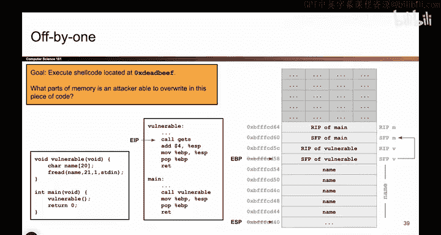
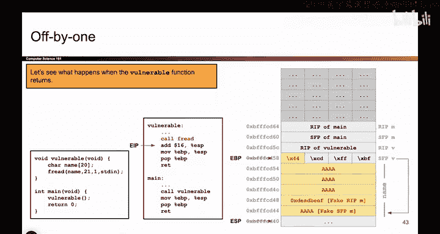

# UCB《计算机安全｜CS 161. Computer Security 2025》中英字幕 - P56：-MemSafety3, Video 17- Off-by-One - Creating Exploit.zh_en - GPT中英字幕课程资源 - BV1VhEhzMEPL

Okay， so this is the setup of the question。 We've drawn our stack diagram。

 We have reminded ourselves what parts of memory we can and cannot overwrite。 And crucially。

 theres only one byte we can overwrite， which is this lowest by of the SFP。

 So tiny little note if you remember back to indianness can go back and watch that video if that doesn't soundfamar the lowest bite of the SFP。

 the one living at the lowest memory address is the least significant byte。 So for example。

 this SFP holds the address B FF Fc D60。 and it is the 60， the lowest by。

 the least significant by that I can actually change。

 And the reason why this is the least significant byte is because of the indianness and the fact that X86 is little Indian。

 So just a little side note。 basically what this tells me is I can change this SFP to point somewhere else。

 So maybe the first thing I should ask myself is where is it currently pointing And what does the program do with。

This value that's stored on the stack and why is changing or going to help me execute shell code So I think back to my stack frame and the way that I call functions and I think what is this value actually represent remember this value represents the top of the previous stack frame because when the vulnerable function recurrence。

 this is the value that goes back in EBP and when I go back to main EBP should go back to the top of the main stack frame So in other words。

 this value should tell me the top of the previous stack frame and in particular we haven't been super precise about what it means to be top and bottom of a stack frame but if you go through all the steps of the function call you'll notice that the SFP has a kind of nice property that it's the top of the previous stack frame and in particular we define the top of the previous stack frame or any stack frame to be its SFP that's just how we design the stack frame So for example。

 right now when we're calling the vulnerable。Fun EBP points at the top of the stack frame。

 which just so happens to be the saved EVP or SFP value。 And this address。

 Well that happens to be the address of the previous SFP because that's the top of the previous stack frame。

 And if someone else called main， then this SFP would point appear to the previous stack frames top。

 So you can almost think of it as every SFP value holds the address of the previous stack frames SFP。

 And that's another way of saying this value holds an address。

 and that address is the address of the top of the previous stack frame。

 So to make a long story short， each SFP holds the address of the previous SFP。

 which is kind of convenient。So how is this useful， Like， who uses this address。

 Why don't I put it here？ Well， the reason why I put this here is because when this function returns。

 this is the value that's going to go back in EDP and。That's kind of useful。

 Maybe another way of putting it is when I put this value back in EBP and I restore the original main stack frame。

 well， I can now start thinking。What does the program do with this address？ Well。

 the program uses the base pointer， I guess this is something I haven't really said explicitly。

 but I'll say it now。 the program can use that base pointer to find other values on the stack。

 So when I put this value back and EBP it's useful because it allows me to orient myself on the stack and find other things。

 So for example， if the EBP is here and I asky where's the first argument。

 I can start from the EBP look4 bytes up that's the RP and look4 bytes up， if there was an argument。

 it would be right there I can ask， hey， where's the seventh argument while I started the EBP and count my way up to the seventh argument So the base pointer is kind of useful for orienting yourself on the stack something I probably should have mentioned a couple videos ago。

 but I didn't So here we are。So to make another long story short， the SFP。

 because it holds the value that's going to go in EBP。

 it's a convenient way to orient yourself on the stack and to help the program find other values on the stack and one value that I really care about finding is the RIP because that's the value where if I overrideite it。

 I can probably make bad things happen。So as an example let's。Pretend that。

We could ask this program some questions like if we walked up to this program and we said。

 hey program， where is the RIP of vulnerable， well how would the program find it。

 it would look at where its EBP is currently pointing， That's right here。

 and it would look for above that because it knows the EBP is always pointing at the SFP and if I look for above that。

 that's where the RIP is。Now， what if I walked up to this program and I said， hey。

 where's the R IP of your previous stack frame？ So， for example， if it's currently unvulnerable， Hey。

 what's the R IP of Maine， how would this program know， how to find the R IP of mainine。

 given all of the data and memory and all of the values in the registers。

 you can pause and think about that， if I went up to this program and programs can't talk。

 But if I asked this program， Hey， where's the R IP of Maine， How would it know where to find it。

And remember， we can use the base pointer or the save value of the base pointer as a。

Anchor to help us find things。So I think the way that the program would find the RIP of mainine is it would look at this address and say well this address is the SFP of main。

 the SFP of the previous function， so I should just follow this address and look for above that that's how I know that this is the RIP of main so the program doesn't label things in this pretty diagram but the program would say I'm going look at this value go to that address add for that's where the RIP of main is so all of this is to say the EBP and the SFP。

 which is just the save version of EBP from the previous stack frame is useful for finding things on the stack and in particular the way we can find the RIP of main is we can take this value。

 go to that address that's the SFP of main add for find the RIP。

So that's what this value does helps us find the RIP of main。

 So if this is the value we use to find the RIP of main。

And I control what this value is because I can change one of the bytes。What if I changed this value。

 What if I changed this by， Well then the program would start looking somewhere else for the RIP of Maine。

 So let's see what that looks like。 So let's say I'd take this value， which used to say 60。

And I change it to 44。 You could have change it to something else。

 I picked 44 for reasons we will see。 So now this address used to hold the address of SFP of main。

 Now it holds the address of something down here in Maine。

 But the program doesn't know that we changed it。 The program is not expecting someone to come along and change the SFP。

 that's not supposed to happen。 So if I now walk up to this program and ask the program the exact same question。

 Hey， where's the R IP of mainine。 What's the program going to do。

 It's going to do the exact same thing。 It's going to say， if I want the R IP of main。

 I'm going to take this address， I'm going to go through that address， this must be the SFP of main。

 And if I look for above that， I must get the R IP of main。

 So the program follows the exact same logic。Even though we messed up the address because the program has no idea that we just overilt something that we weren't supposed to。

So in other words， if we now ask the program hey， where's the RIP of Maine。

 it's still going to follow this address， go to what it thinks is the SFP， look for above that。

 this must be RIP of Maine， but in fact it's not the RIP of Maine， the program thinks that it is。

 but we the attacker know that we are actually somewhere in the name character array。

 which crucially is some part of memory that we control。

So this is the idea behind the off by one attack。 The idea is we can't really target the RP of the vulnerable function。

 but we can target this value and this value， the SFP of vulnerable is how we find the RIP of main。

 the previous function。 So remember to summarize it once again in normal function execution。

 If nothing went wrong。 And I went up to this program。 And I said， hey， where's the RP of main。

 what it would do is it would take this value。 SFP of vulnerable。 It's an address。

 go to that address， look for above it。 that's the RP of main。 That's what it would do。

 take this address， go through that address， look for above。

 That's just how you find things on the stack。 But if I take that address and I switch it up without the program really knowing that I switch it up。

 the program would still do the same thing。 If I ask， hey， where's the RP of main。

 it would take this address， go to that address， It thinks this is the SFP it's not。

 but the program thinks it is。 It would look for above that and say that must be the RP of mainine。

 but it's actually not。

So basically we've tricked the program into thinking the RIP lives down here。

 even though it really lives up here， and now that the RIP is thought to live down here。

 we've tricked the program into looking here for the RIP。

 we can now put the address of Shell code here。Because the program is going to look here for an RAP。

 So now we put the address of show code here and we write show code into memory somewhere and we're all set。

So the off by one attack crucially depends on the fact that I can change just this one byte and by changing this one byte。

 I cause SFP to point somewhere else， so this address instead of being the address of the real SFP of Maine。

 it's the address of some other thing that I control which I will now call the fake SFP and if you look for above that。

 the program thinks this must be the fake RIP， but it's actually not it's something that we control。

So now we just have to fill in everything else。 This is the key idea behind the exploit。

 but now we just fill in everything else。 So， for example。

We can fill in the address of shell code here。 So pretend that there's some malicious code at deadbe。

 Then I will just write the address deadadbe here。 If I was writing shell code into memory myself。

 I might have to write shell code myself。 and then make this the address of shell code that would also work fine。

 But basically， once I have this exploit all set up。

 I just need to know where is the fake R IP and write the address of shell code there as my normal buffer overflow exploits do。

 and I'm all done。 So that's the key idea behind this exploit。

And in the next video， I'll show you what it looks like when the functions actually returned。

