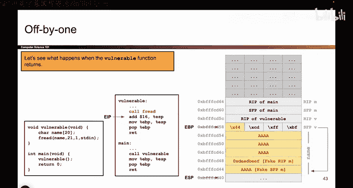
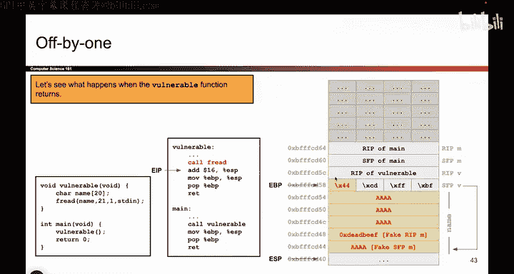
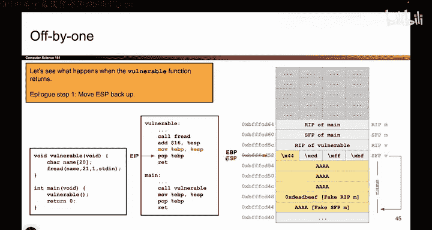

# UCB《计算机安全｜CS 161. Computer Security 2025》中英字幕 - P57：-MemSafety3, Video 18- Off-by-One - Using Exploit.zh_en - GPT中英字幕课程资源 - BV1VhEhzMEPL

Okay， so with this attack all set up， we are now ready to see what happens when vulnerable and main return in order to get this program to execute Ch code。

 So the first key idea that I think is really important that we talked about in the last video to cover the off by1 exploit is that the SFP always points at the previous stack frames SFP。

 So if you follow this address， you should find the previous stack frames SFP。

 but because we overrote one of the bytes。 if you follow this address。

 you not land down here and the program thinks this is an SFP it's not really an SFP but the program thinks it is and if you look for above that。

 the program thinks that's an RP。 That's the first big idea to understand why this exploit works。

 the second big idea to understand why this exploit works is that because we overrote the RP of main or at least what the program thinks is the RP of main。

 we overrote main not vulnerable。 So what that means is actually going to take not one but two。

Returns for this code to execute shell code。 We need to return from vulnerable。

 Then we need to return from main。 And the return from main is what triggers shell code because the program thinks this is the RP of main。

 But another way， if you look at the RP of vulnerable。 we didn't touch that at all。

 So when we return from vulnerable， that's not going to execute shell code。

 But when we return from main， that is going to execute shell code。

 So we're going to have to execute two sequences of function returns to cause this program to execute shell code。

 We have to return from vulnerable And we also have to return from main。

 So let's see those two returns in action to really understand why this is causing shell code to execute。

 So we've already set up the stack。 we've overwritten some values。

 And now we're ready to call the first set of。

The function epilogue instructions。So here we go。 So the first thing I do is I add 16 to ESP。

 That's just finishing up the call to Eri。 So Eriid， we push some arguments on the stack。

 we add 16 to delete those arguments。 we've now returned from Eri。

 not really the most important detail。 but that's what that instruction is。

 Now we are at the start of the first of two returns。 Remember there's two returns。

 We're not doing the first one。 So the first return。 It's three steps。

 The first step is I take ESP and I drag it up to wherever the EBP is。

 That's always what we do when we return from functions。 We take the ESP。

 We drag it up to where the EBP is。 and now they both point at the same place。 And in fact。

 what I've done is I've said I no longer need all this space for the vulnerable functions。

 So by dragging ESP up。 I've cleared that space out。 no longer needed。Okay， great。 Now。

 the second instruction in the epilogue。 It says I'm gonna put this EBP back in its original place。

 Well， what value was in EBP to begin with。 That's what the SFP is。 Remember。

 the SFP is the value that goes into EBP when the function returns。

 So this pop instruction will take the value on the stack copy these bits into EBP。

 and then pop this value off the stack by moving ESPM。 So that's what I'll do。 I'll take this value。

 which is busted it because I overwrote one of its bytes。 But the program doesn't know that。

 So I'll take this busted value。 I'll stick it in EBP。

 And now EBP points where It was supposed to point somewhere up here。 the previous stack frame。

 But because I overrote this value。 Where does EBP point。😊。

I sent it down here instead， and the program now thinks that this is the top of the previous stack frame。

 whatever that means。And then ESP goes up by4 so now the stack is totally busted it's not supposed to look like this。

 EBP is supposed to be up here at the top of the previous stack frame。

 but because we overwte this value， EBP is now in the wrong place and that's going to help us later。

😡，So that's what happened by popping this wrong value of SFP。

 we've now moved the EBP to some bogus place in particular， somewhere that we control。

And the final step is the return instruction， which kind of behaves like pop EIP。

 So what it does is it takes the next value on the stack， puts it in EIP， the instruction pointer。

 and then pops that value off the stack。 So that's what we'll do。 We'll take this value。

 which hasn't changed。 It's not in yellow， We didn't touch it at all。 So we'll take this value。

 we'll put it back in EIP and that's going to cause a normal function return to happen。

 because this value was not overwritten。 So this is one of the key ideas that people always mess up when we think about this exploit。

 The first return does not cause shell code to execute。 because this value wasn't touched。

 So when I take this value， put it in EIP EIP is going to just go back to the main instruction where it's supposed to go。

 So EIP was here。 I take this address， Shove it into EIP now is pointing at the instructions of main。

 That is the correct thing to do。 So by the end of the first function return。

 Everything is actually where it's supposed to be。 EIP is in the right。

It's in main pointing at the instructions of mainine ESP is in the right place。

 it's got the address of the top of or the bottom of the main stack frame the only thing that we messed up was EVP and that makes sense because the only thing that we changed was the SFP that value got copied into EBP and now EBP has got a busted value it's pointing at some busted location but at this point everything else is fine only EVP is busted。

Okay， so at this point， the first function return has totally finished。

 the only thing that's in the wrong place is the EBP because we changed the value of the SFP that got copied into the EBP。

 and now we are ready for the second function return to say it one more time it takes two function returns for this exploit to execute Ch code。

 So now we're doing the second function return。 and the only difference is that EBP is in this busted spot。

 So let's see what happens in the second function return。 it's the same three instructions。

 So let's run them。 The very first one says let's take ESP and drag it up to where the EBP is。

 So normally you're supposed to take this and drag it up to collapse the stack frame but EBP is in the wrong place。

 So you end up dragging it down。 but it's the same behavior。

 I take ESP and I drag it to where the EBP is。 So just like the first return or any return you'll ever see。

 The first step is to take ESP and drag it to where the EBP is now they both point at the same place。

Now here's the second instruction， the second instruction says I now need to put EBP back in its rightful place so how do I do that Well the next thing on the stack。

 this must be the SFP is it actually the SFP No， but the program thinks it is so we're going to take this value we're going to copy it into EBP and that should restore the original value of EBP so I take this value。

 I put it in EBP and I have restored the original value of EBP or maybe I haven't because I overrote this so now it's floating off into garbage。

Just like in our normal buffer overflow exploits， EVP was overwritten with garbage。

 so it flies off into somewhere else。Okay， so that was the second step。 What do we do。

 We take the next thing on the stack， which the program thinks is the SFP。 We copy it into EBP。

 and then we pop that value off the stack。 and this causes EBP to fly off and now it's pointing at the address A whatever that is doesn't really matter for our purposes And now here comes the money moment I don't know how say it。

 but this is the moment where all the interesting things happen。 So at this point。

 the EP is pointing right here。 It's right where we want it to be。 and we run the RE instruction。

 and the red instruction acts like pop EIP。 So what it does is it takes the next value on the stack puts it in the EIP and that causes the program to jump to that address and start executing show code So that's what we're going to do We're going to take this address because it's the next address on the stack。

 The program thinks it's looking at an RP even though it's not we're going to copy that value。ToEIP。

 and then that's gonna to cause EIP to jump to that address。 So I take this address deadadbe。

 I copy it into EIP and now EIP is pointing at the shell code And after two function returns。

 I have now caused the program to execute shell code So this is what the off by1x looks like it takes two function returns。

 The first one messes up EBP and drags it down here And then the second function return。

 what does it do to summarize one more time。 The first step it takes EP it drags it down here now the program thinks there's an SFP here So it pops that off EBP flies off to who knows where And then the program thinks this value is an RP So when it runs the third instruction R it takes this value。

 copies it into EIP that causes EIP to execute shell code and finally we are done is execute a shell code。

