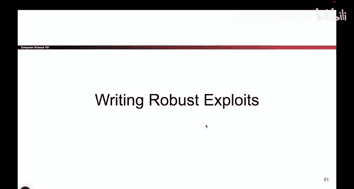
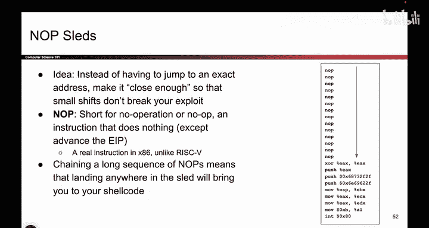
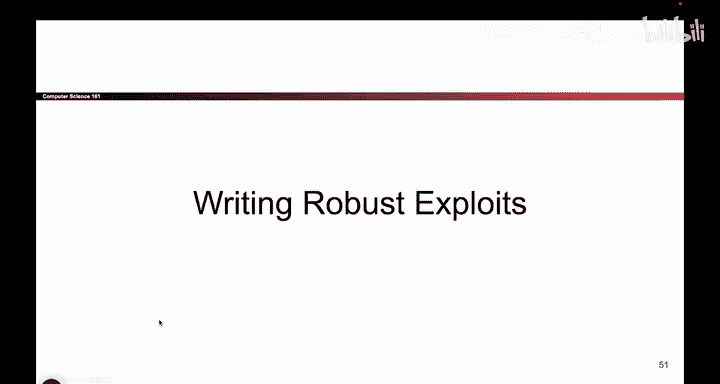

# UCB《计算机安全｜CS 161. Computer Security 2025》中英字幕 - P58：-MemSafety3, Video 19- NOP Sleds.zh_en - GPT中英字幕课程资源 - BV1VhEhzMEPL

Okay so the last topic for all of our memory safety exploits is a quick note on how you make these exploits more robust。

 So something that we haven't really talked about and I guess I don't have a slide about so I'll kind of wing it is that you might wonder well。

 okay I've seen all these complicated exploit So you showed me this off by one exploit you showed me the fancy printf exploit and I don't really believe you。

 I don't believe that an attacker can just get a copy of my code and learn where all the memory addresses are and draw a pretty stacked diagram and try as many times as they want to overwrite the code。

 So sometimes everyone asks me this question and they say， well， you're being kind of unrealistic。

 you're assuming that the attacker gets a copy of your code and that they know where all the addresses are and they can perfectly predict everything and you're right。

 we did make some assumptions but if you think back to the very first lecture that we ever did on the security of principles。

I think these are actually good assumptions to make。

 So if you think back to the very first memory safety or not even memory safety。

 the very first security principles lecture， we talked about something called security through obscurity and don't rely on security through obscurity。

 And what we said was。😊，Hiding something is not a good excuse for security so we can't really assume well。

 the attacker doesn't know exactly what my code looks like so they can't run this exploit or the attacker doesn't know exactly what these memory addresses are so they can't run my exploit remember we always have to assume the attacker has knowledge of our system and for example they could hack into our system and they can get a copy of our code maybe our code is open source so they get a copy of it。

 maybe our code leaks and they get a copy of it， so we can't just rely on something like well I hope the attacker doesn't know what my code looks like so they can't do all this stuff。

 we should really assume that the attacker does have a copy of our code and make sure that our code is robust and can be defended against and attackers cannot exploit it even if they have a copy of our code so hiding your code is not an excuse for having memory safety vulnerabilities in your code should always assume that the attacker has a copy of it because if Shannon's maxim or don't。

L securityity through obscurity。 So something that people always ask。 So I thought I'd bring it up。

So another kind of related topic is as mentioned， sometimes the attacker might not have perfect information about your code。

 you really should assume that they do have perfect information because you shouldn't rely on hiding things to make your code secure。

 but sometimes attackers might not know exactly where all the addresses are maybe they have a good guess as to where the addresses are。

 but they don't know exactly what the stack looks like。

 maybe they have a good guess as to what your code looks like。

 but they don't have it exactly right and so in cases like that。

 you can actually increase the chances of success as an attacker by using some clever tricks so let me just show you one as an example of something that an attacker can do to increase their chances of success if they perhaps don't have perfect information about your code and hopefully this convinces you that even attackers who are kind of flying blind。

 they don't have a perfect picture of what your system looks like。

 they can still make very dangerous things happen because of all sorts of fancy tricks like this。

So this one is called a no op sled， so to start， there is an instruction in X86 and basically I think every assembly language called a no op and aO op basically says do nothing so for example。

 add 0 plus0。Okay， that doesn't do anything and don't store it anywhere。

 so you can write an instruction that does nothing on purpose and it's called the no op and it has a bunch of different uses。

 but as an attacker， we can use it to construct something called a no op sled。

 So let's pretend we didn't have these no ops and we wanted to execute just the shell code down here So we wanted to execute this XO instruction and then this push instruction and then another push instruction and so forth。

If we were running， for example， our classic buffer overflow exploit。

 the one where we overwrite the RIP to point that shell code。

 there would be one and only one success condition。

 the success condition is you take the RIP and you overwrite it with this address。

 the address of the XOR instruction， because if you get it right。

 then you're going to execute the XOR， followed by the push。

 followed by the next push and all of these instructions execute one after the other。

 which is what you want。By contrast， if you mess up just a little bit you miss the correct address by four well then maybe you land somewhere up here and that's not an instruction。

 that's not the X instruction， so if you land up here the program might crash and I try to read this stuff up here as an instruction you missed and that's not so great so if we didn't have this no opsled and you wrote the wrong address you jumped somewhere up here。

Your exploit would probably not work， it would jump to the wrong place and try to interpret whatevers up as a memory instruction or as an X86 instruction and who knows what would happen and so that's a problem because now it makes the chance of success very narrow you as an attacker have to get the exact address of this XO instruction and that's not so great。

But what if instead of my shell code starting with this Xor instruction right away。

 I rewrote my shell code because remember， the shell code is what the attacker writes into memory。

 they take their x 86 instructions， make them into ones and zeros and write them into memory。

 So what if the attacker says actually my shell code is not just an Xor followed by a push followed by a push and so forth。

 My X is actually do nothing。 and then do nothing， and then do nothing again and then do nothing again and do this a lot of times and then do the Xor。

 Does this piece of shell code do the same thing as the original piece of shell code。Yes。

 it's the exact same piece of code。 I just did a lot of nothings before it。

 but what's great about this is I now have a lot more conditions for success as an attacker。

 if I get the RIP address to point right here at the address of Xor。

 I win because I execute all these instructions， but even if I miss that address by a little bit。

 let's say I accidentally write the address of this instruction Well then what happens the program goes through this address。

 it does nothing， does nothing， does nothing， does nothing。

 does nothing and then executes the XO instruction and the same explanations of working anyway。

 So by having this noopsled， it gives the attacker a lot more addresses that they can overwrite the RIP with it increases the chance of success if you don't know exactly where the shell code is。

😊，I can overwrite the RP with this address or this one or this one。

 and regardless of which of these addresses I overwrite with。

 when the program goes to that address and startss executing instructions。

 it's going to start here and basically slide along the sled doing nothing and nothing and nothing and nothing until it gets to the first useful instruction and it ends up executing my shell code in full anyway。

 So this is just a neat little trick for attackers who don't have perfect information about your code to increase the probability of success。

 and hopefully it convinces you that even having。The defense of， well。

 I hope that the attacker doesn't know what my code looks like is not enough。

 Aters who are flying blind with very little information about your code can still make bad things happen and increase their chances of success with tricks like the No opsled。

