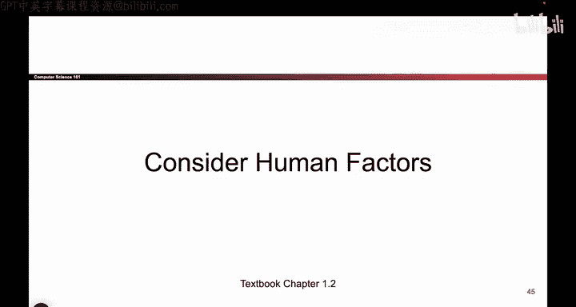
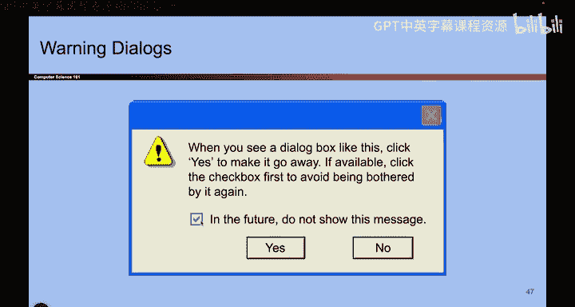
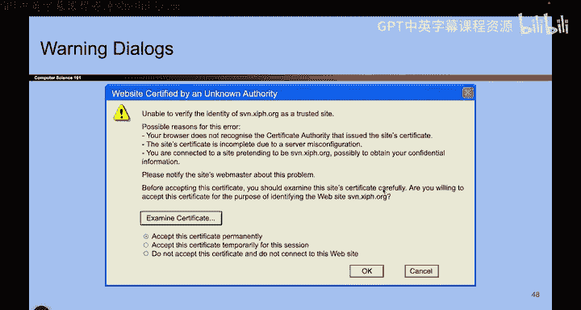
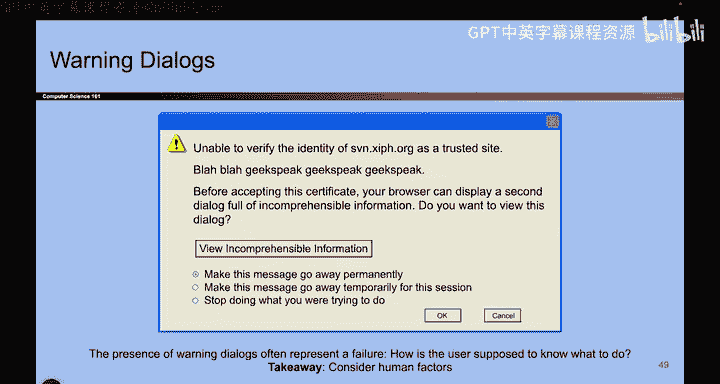
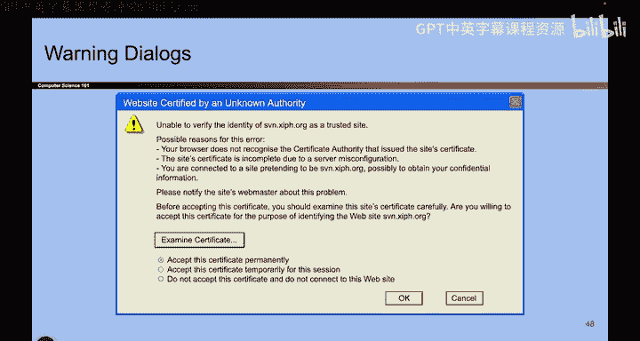

# UCB《计算机安全｜CS 161. Computer Security 2025》中英字幕 - P5：-Intro1, Video 5- Consider Human Factors.zh_en - GPT中英字幕课程资源 - BV1VhEhzMEPL

Okay。Let's do another one。 So here's the story for you。 So let's say you're browsing the Internet。

 It's a great day。 And you see this pop up。 And it says when you send information to the Internet might be possible for others to see that information。

 Do you want to continue。 So C S 1，61 users。😊，Who wants to click yes。Some people who wants to click。

 no。And stop browsing the Internet。 Okay， wasn't most of you。 But I think a lot of you said， yes。

 I would also click yes because I want to keep browsing the Internet。

 and I might even click this little checkbox to say。

 stop showing me this because I want to watch my cat video。😊，So really， when you read this。

 what did you actually read， Maybe you read something like this。 You saw this dialog box。

 you clicked yes to make it go away and you click the checkbox so that people stop bothering you in the future。

H。😊，Okay， what about this one。 So tell me what you want to do， Okay。

 unable to verify the identity of a trusted site。 possibleible reasons for this error。

 Your browser does not recognize the certificate authority that gives you the site certificate。

 blah blah， blah， blah， blah。 Okay， what do you want to do。Click that， click that。

 I have no idea what I want to click here。 So really， when I'm reading this， one am I reading。

 I'm reading blah， blah， blah， blah， blah， geekspe， incomprehensible information。

 How do I make this thing go away， So I can keep browsing the Internet。

 So when I see something like this。 You know， forgetget us， Think about the average Internet user。

 Like your really old， grandma， grandpa， who doesn't know how to use the Internet。

 How the heck are they going to navigate this message。

So the takeaway here is we have to consider human factors。

 and we have to make our systems usable for humans and not just people who can read whatever the heck this is。

So consider human factors。 Basically， what we're saying is ultimately。

 our security systems are being built for people to use。

 So we really have to think about people and what their use patterns are。 So for example。

 users like it when things are easy to use when they see something like if I click this box if I see this box。

 I want to make it go away。 Well， it doesn't matter how secure the system is if the user just clicks the box and makes it go away well then your system didn't provide any security。

 And so for example， as we saw earlier， users might actually disable security systems on purpose and make their life less secure just so things are easier or maybe they don't know how to read the message they just disable the thing by accident。

 And so often will even see attacks that are called social engineering attacks or we try to exploit other people's trust to attack them。

 So they don't know we' being malicious and we try to trick them So ultimately it comes down to people。

 And in fact， it also comes down to people on the other。And so we as programmers。

 we also have to program with users in mind。 We are also humans。 We're gonna make mistakes。

 and it's important that we use tools that catch us when we make mistakes。

 And there are certain tools like C that don't catch us when we make mistakes。

 And so if we use those tools well， then things are gonna be more dangerous。 So ultimately。

 we want to use tools that are foolproof that are easy for users to use。

 because it is not easy to use， Well then users are not going use them。

 So heres another example over here。 This thing is called the security key， Basically。

 what you do is you plug it in your computer and has a secret key on it。

More about this later in the class。 But do you know why they designed it like this。

 Why is it a piece of plastic that looks like this？ I made it could have been shaped like anything。

So what does it look like that？Does this look like a key to anyone。 kind of looks like a key to me。

 And when I see key， what do I think， I think keys are important。 I have to keep them。

 So what's kind of cool is when they designed this。

 they made it look like a key on purpose because all of us as humans。

 we already know that when someone hands me a key shaped object。

 I should probably keep that thing secure。 So that's another example of programmers making lives easier for the users。

😊。