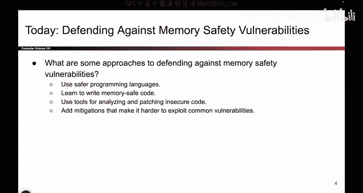
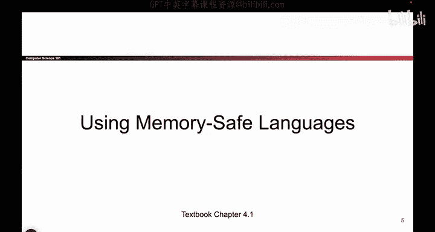
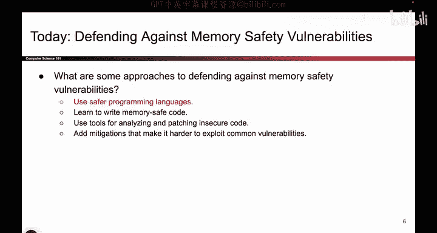
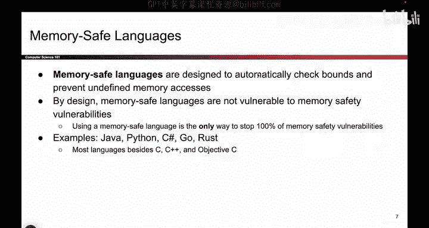
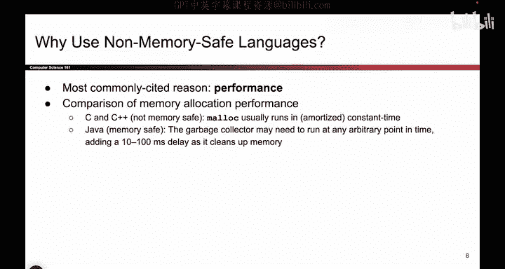
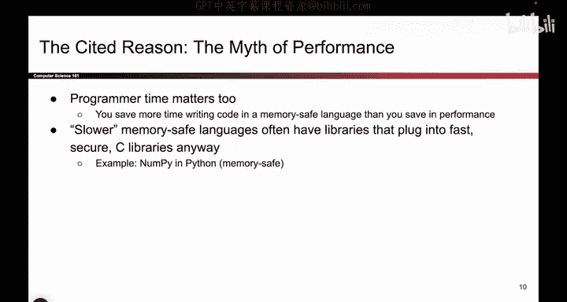

# UCB《计算机安全｜CS 161. Computer Security 2025》中英字幕 - P61：-MemSafety4, Video 2- Using Memory-Safe Languages.zh_en - GPT中英字幕课程资源 - BV1VhEhzMEPL

Okay， so the first category for ways to stop memory safety vulnerabilities is to use a language that doesn't have memory safety vulnerabilities。

 it's almost so silly when I say it out loud， but this is actually a very effective way to stop vulnerabilities。

 use a programming language that is safe。

So some programming languages by design。We'll check bounds for you。 So， for example。

 Java Python go these are languages that have built in bounce checkers when you define an array of size 5 and you try to access item number6。

 the program will simply say no， and it will not let you access item number 6。

 So some languages are designed like that。 C is not one of them。

 C is a language where if you define an array of size 5 and you ask for item number 6。

 C will gladly let you access that item even though it's out of bound。

 So memoryafe languages by design the people who built the language， added automatic bound checking。

 And so these languages do not have memory safety vulnerabilities。

 all the memory safety vulnerabilities we've talked about have to do with writing past the end of an array。

 And if your language simply doesn't let you write or read past the end of an array。

 then memory safety vulnerabilities just don't happen。

 So all you really have to do to stop memory safety。

abilities is to pick any one of these languages that actually check bounds for you and there's so many to pick from In fact。

 the majority of memory languages or programming languages out there are memory safe really the only ones that we can think of that are not memory safe are C C plus plus and derivatives like objective C So as long as you don't use one of those you don't have to worry about any of this stuff how nice is that you can just ignore all this stuff program all you want knowing that attackers will not be able to write out of bounds and this is the most robust defense against memory safety vulnerabilities because if you use a language that actually checks bounds these things just don't exist this vulnerability is not there and it's one of the only times in this class where I can tell you that there's a defense that works 100% of the time if you use a language like Java or Python or C sharp。

You are defending against 100% of vulnerabilities because this type of attack just doesn't exist。

 You actually went and solved the fundamental problem。So building off of this。

 the followup question you probably have is， well， then why the hell do people still use see。

 So one reason that people like to bring up， if you ask around is performance。

 So there's an argument that well， C is not safe。 but it's really fast。

 So we have to do a tradeoff between the fact that it's really slow really fast， sorry。

 And the fact that it's not secure。 And so， for example， Java， because it's a memory safe language。

 some people argue， well， it actually has to do some extra tracking of memory and bound checking。

 So it adds a little bit of a delay， whereas in C and C plus plus。

 which are not memory safe memory management is as fast as it can possibly be。

 So this is an argument that some people really abide by。 And if you believe in it。

 that's totally fine。 But nowadays， newer languages have started to challenge this notion so。

First， we call the performance。 but really， it's kind of a myth。

 So if you think about your everyday programming， this is kind of our argument for why performance is not really that big of a reason。

 If you think about your everyday programming experience writing code for assignments for work for I would say99% of applications。

 the difference between using something like Java and something like C is not really noticeable。 So。

 for example， if you're writing code for your projects and you write it in C or you write it in Java。

 Okay， one of them might be 10 milliseconds slower。

 are you really going to notice a 10 millisecond difference on the auto grader， I don't think so。

 And so maybe that 10 milliseconds is totally worth the extra security you get from。

Using a memorya language like C。 So there are some exceptions here， for example。

 operating systems have to be really fast。 If you work at a very low level。

 maybe you do have to work with something like C。 So there might be some exceptions。

 but maybe more fundamentally I don't think there is a tradeoff between security and speed So historically this might be true that to add extra bounce checking。

 you have to waste some extra time。 So the languages that are safer or slower。

 but nowadays there are a lot of alternative languages that are as good as it gets when it comes to performance。

 but also memory safe。 So the one that everyone like likes to ci nowadays is rust maybe if you watch this video like 50 years from now。

 there's a different language that's popped up。 but the fact is there are languages out there that are extremely fast basically as good as C。

 and also memory safe。 So if you can have both what is the reason between trying to do a tradeoff between security and performance。

You should really just pick the languages that give you both。 So while if you asked this question 10。

 20 years ago， people might have said there was a tradeoff。

 I think nowadays there really isn't that much of a tradeoff。

 you should just go pick one of those languages that is fast and also secure。Why not have both。

So maybe another kind of even more high level fundamental philosophical reasoning here is that if you waste your time programming in something like C。

 you're gonna have a lot of extra headaches trying to debug memory safety vulnerabilities。

 So if you're trying to improve performance in terms of how many lines of code you can churn out per day。

 maybe using a memory safe language is faster。 It saves you time from debugging and fixing bugs。

 but that's kind of a。Very opinionated point。 It's okay if you don't agree with it。

 Maybe one more thing that I would point out is that even if you use a language that is slower like say Python。

 those languages often have libraries that plug into faster languages。

 So you might say I don't want to use Python because it's so slow but Python has libraries like nupyy that actually plug into an underlying C library and so that's another way of using a memorya language but also getting performance。

 you just plug into libraries that are written in really fast languages like C and rust and。

One more reason I can identify for why memory safety vulnerability still exist。

 because if it's not for performance， we've just debunked the myth that there's a trade off between performance and。

Security， well， another reason why so many memory safety vulnerabilities still exist is legacy。

Turns out over the00 years or so that programming has been a thing because it been 100 years。

 I don't know， maybe it will be in the future， but turns out people have written a lot of code in C over the years。

 and if someone hands you a big project in C， you have two choices you can either rewrite the entire project in something safe like rust or you can just keep writing code on the existing codeb and guess what almost everyone does。

 they keep writing on the existing codeb because it's easier so if you join a company and all the code is in C。

 you are probably not going to rewrite all of the company's code in something like rust。

 you will probably just continue contributing in C。

