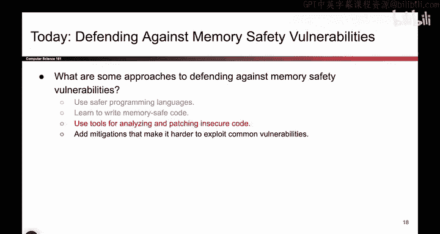
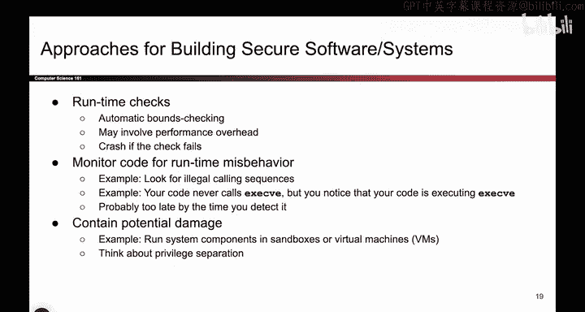
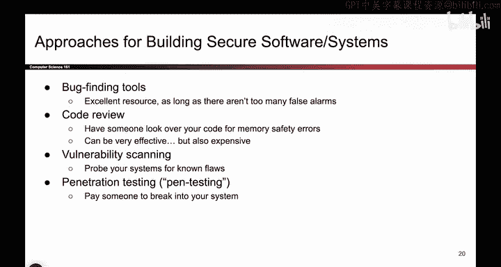
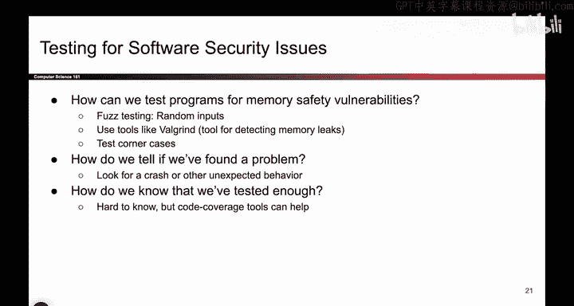
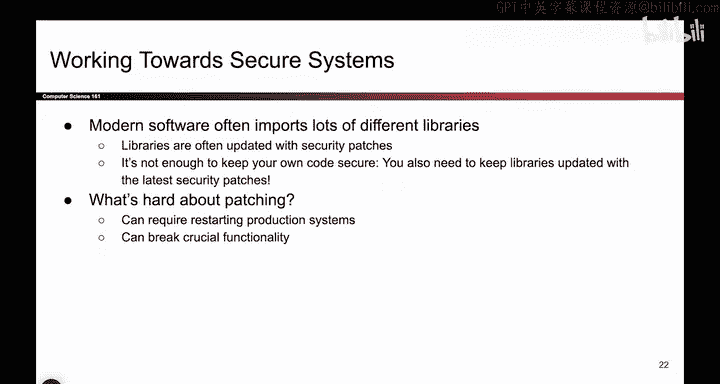

# UCB《计算机安全｜CS 161. Computer Security 2025》中英字幕 - P63：-MemSafety4, Video 4- Tools for Building Secure Systems.zh_en - GPT中英字幕课程资源 - BV1VhEhzMEPL

Okay， so far， we've seen two different philosophies for how to stop memory safety attacks。

 We said you can just switch to a language that doesn't have memory safety vulnerabilities to begin with。

 We said you can be very careful and program defensively。 but even those two aren't enough。

 say you're stuck writing a piece of C code because the code bases already in C。

 And the deadline is coming up So you can't be really defensive when youre programming or you make a mistake。

 So what do we do in those cases。 Well， it turns out over the years。

 people have also developed tools to help us with these problems。

 So memory safety vulnerabilities are really common and over the years。

 people have come up with different tools to try and help us automate or detect cases of insecure code。

 So that's the third approach that we are going to look at。

 So here are some different approaches to checking whether or not your code is secure using some automated tools。

 So there are some tools that run at runtime that is they run alongside your program。

And maybe they do some bounce checking for you and maybe if a check fails。

 they alert you or they crash the program。 So some tools do exist to help you with this。

 they will introduce some performance overhead。 So they're going to slow down your program if you're trying to run some extra checking code while your code is running。

 but maybe that's something you want to do if you want to make sure that your code is memory safe。

Something else you can do is you can monitor the code。

 so we could have some tool that's running alongside the program and it's looking at what the code is doing。

 So it's watching the code really carefully and checking if the code is behaving in any strange way。

 And if the code is behaving very strangely， that could be a sign that someone has exploited the code。

 So for example， let's say you write a piece of code and your code never calls the exact V library function。

 and what the exact V library function does is it takes in the name of a terminal command and it runs that terminal command at a high level。

 But basically the idea is if your code never calls this library function and our tool watches your code and notices that your code starts calling this function that you never wrote in your code that's probably a sign that something has gone wrong。

 you didn't put this in your code and it's still running， that's pretty weird。

 maybe someone has performed a buffer for overflow and redirected the program to call this function。

 One problem。😊，These tools is by the time you notice that something weird is happening。

 it might be too late， the attacker has already executed this malicious function and maybe your system is already damaged by the time you detect it。

 So these tools are useful， but sometimes they only catch the attack after it has happened as opposed to stopping it before it happens and。

Another approach is if we know that these attacks are going to happen。

 maybe something we can do is at least try and make it so that the potential damage isn't too bad。

 So， for example， if I'm running a piece of C code and I run it as the administrator user well that's pretty bad because if anyone exploits my program。

 they now have total admin control over my whole system So something we could do to protect ourselves if it's possible in your system is we could run the system in something called the sandbox or virtual machine and what these are are isolated environments where even if the attacker is able to take over the program。

 they can't really break out of the sandbox or break out of the virtual machine to affect other parts of your system。

 So you're basically isolating them in a very small subsection of your system。

 And yeah if they perform a buffer overflow， they might be able to take over this part of the system。

 but you can at least contain the damage so that they can't access other possibly。

More sensitive parts of your system。 So it's kind of like the privilege separation that we talked about when we talked about security principles。

 Don't give the program too many privileges。 Just give the program what it needs。 So this way。

 if the attacker performs a buffer overflow。 They can't just take over the whole system。

 So these are some automated tools or approaches to making your system more secure。

 It's not going to stop the attacks necessarily， but it can at least make the attacks less painful if they happen。

And some other tools that exist。 There are some automated tools out there to try and help you find bugs。

 As you can imagine， these are not perfect。 There might be false alarms。 It might make mistakes。

 but there might be some tools out there that just scan a piece of code and try to find common things like you called get us。

 That's a problem and it's going to complain。 So some tools like that exist out there。

 you could pay other people to do it for you。 So hire a company to read over your code carefully and reason about it for memory safety errors that might work because now you have a person scanning it for you。

 but maybe they charge you a lot of money So security is economics。

 Do you want to pay someone to read over your code that's up to your system。

There's something called vulnerability scanning， which means the system or the tool probes your system for known flaws。

 It's kind of related to something called penetration testing。 And in both of these approaches。

 the idea is before releasing your program to the world for other people to break why not try breaking the program yourself So provide some inputs that you think are malicious try and write some buffer overflows yourself。

 provide some random inputs and try and see what happens。 And if you break your own system。

 that's bad， but it's probably better than someone else breaking it。

 So if you break your system first， then you can fix it before releasing it to the world So vulnerability scanning and penetration testing rely on the fact that you try to break your own system with permission before you release it to the world and that might help you catch some buts and in penetration testing。

 you pay someone else to do it for you and they're generally working with you。

 So if they break into the system， they'll tell you and then you'll get a chance to fix it So those are also some approaches to protecting。

Against buffer overflow， memory safety attacks。

And a whole other approach that's kind of related to what we've been talking about so far is testing。

 So when you're writing code， it's really important to test the code， make sure that it works。

 But in addition to testing that the code works， which is probably something you've done in a previous class。

 we should also test that the code is secure。 So now we're writing tests to make sure that the program is secure against common memory safety vulnerabilities。

 And how do you write these tests， It's not like we know what the correct behavior is necessarily。

 we just want to make sure that it's secure。 So writing these tests might be kind of tricky。

 So some examples of ways you can write these tests is something called fuuzz testing。

 And the idea here is you shove in a bunch of random inputs totally randomly generated thousands of them millions of them。

 And if any one of them break to your program then you might have a memory safety vulnerability。

 So sometimes just trying random inputs is good enough。

 there are automated tools like Valgriin that help you detect memory leaks where you're writing past the end of。

You might want to intentionally test edge cases that you hadn't thought about earlier to make sure that none of these coronary cases crash your program。

 And when these tests fail， you might notice a crash or some other behavior that you didn't expect。

 and that could be a sign that something has gone wrong。

 You might have written past the end of an array or read a value that you weren't supposed to。

 And as with other testing， it might not be obvious when you're done testing。

 It's not like I can reach a goal and say， okay， things are secure now。

 it might be the case that you test a lot。 and it's still insecure。

 So it's not immediately obvious how much testing you need before you're confident that the code works。

 but there are， again， some tools out there like code coverage tools that tell you how much of the code has been tested。

 how much of the code has not been tested。 So they can give you an idea of how confident you can be。

 But already， we can see that even trying to test for memory safety vulnerabilities can be tricky。

 And it's not as easy as it first seemss。 But these are some tools and approaches you can use。

If you're forced to program in a memory， unsafe language。

OhI forgot I have one more slide，So one final point about secure systems and trying to build secure systems using insecure languages is the fact that when you're writing code。

 you import a lot of libraries。 So it's not the case that you write a piece of code yourself。

 usually you are importing library from other systems。

 you're importing the C standard library and we've already seen that these libraries often have vulnerable code in them。

 for example when you import the C standard library， it comes with getS。

 which is very insecure function。 So when you're using other people's libraries。

 it's really important to keep them updated。 So someone might update their library and say we found a bug and here's the fix。

 So please download this latest copy of the library when you're writing code with our library So this introduces an extra challenge because not only does your code have to be secure but when you're using other people's code。

 say you're importing a library you have to make sure that their code is secure to and in particular。

 if they release any security patches， you have to use them。updatedated version of their code。

 And even that is pretty tricky。 So if anyone has。Been browsing on their computer and suddenly。

 Windows wants to update and restart the system。 and you get really annoyed。 Well。

 that's a problem that we encounter when we're trying to update other libraries。

 So if you rely on other people's code and they push some update。

 you might have to restart your system to update the software when you update the software。

 it might break functionality somewhere else。 So even trying to patch systems can create a bit of a headache。

 But it's really important that you do patch your systems if an update occurs。 because， again。

 even if your code is totally secure， if you rely on someone else's code and their code is broken。

 well， then someone can still break into your system。 And that's bad。

So those are also the approaches you can take to try and protect yourself。

 even if you're using an insecure code base that is vulnerable to memory safety bugs。

