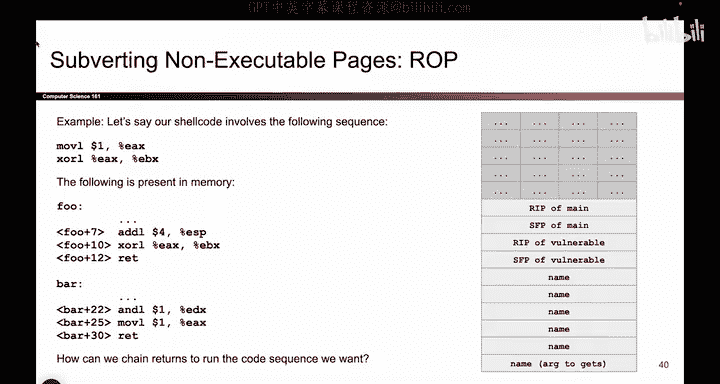
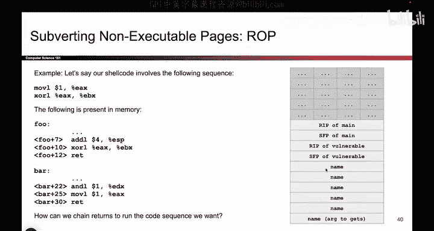
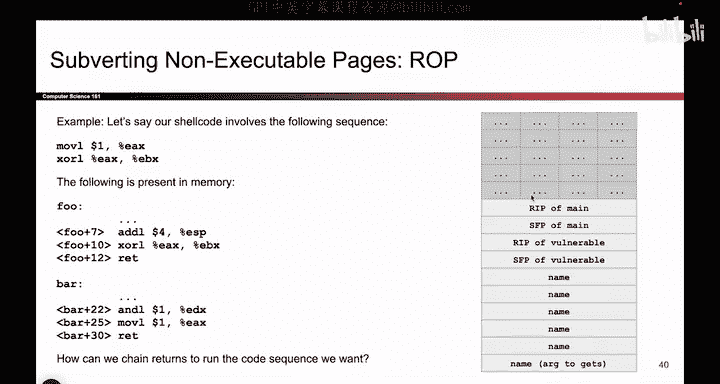
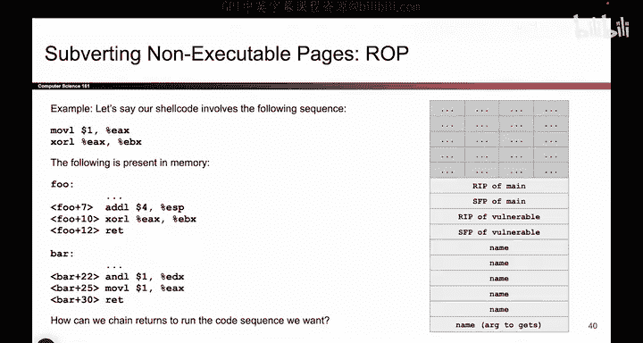
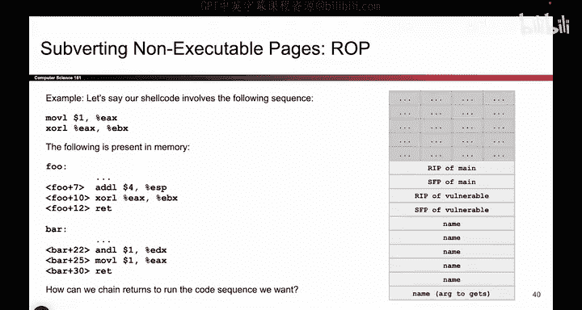
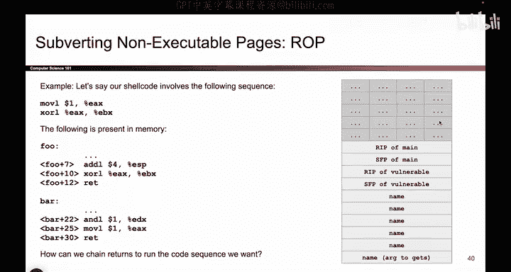
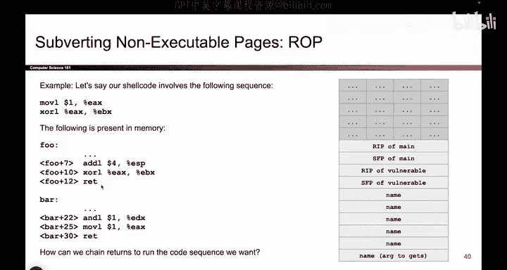

# UCB《计算机安全｜CS 161. Computer Security 2025》中英字幕 - P68：-MemSafety4, Video 9- Return-Oriented Programming Overview.zh_en - GPT中英字幕课程资源 - BV1VhEhzMEPL

Okay， so far， we have seen return to Li C。 that's a great way to subvert nonexecutable pages because return to Li C allows you to execute code that's already there。

 And if the code is already there， it's going to be executable so that allows you to solve the problem of writing code and executing it at the same time which nonexecutable pages does not allow you to do。

 but sometimes the shell code you want to execute is not any of the C library functions。

 So there are some C library functions that can be dangerous like system or exact V。

 but maybe the code that you want to execute is not any of those C library functions。

 So what if you want to execute some code， but it's not any of those C library functions。

 Well then you can use something called return oriented programming or ro And what this is is it's kind of an upgraded version of return to Li C。

 So we're still going to jump into the library and execute instructions in the library。

 but instead of just executing one instruction or。😊。

One set of instructions like the system function by itself。

 we are instead going to execute a lot of different instructions。 and in particular。

 we're going to try and chain together lots of little snippets of code to form the shell code that we want。

 So instead of just jumping to the beginning of system and allowing all of system to execute we are instead going to jump to this piece of code that I want。

 execute a couple of instructions that I want here。

 and then jump to a different part of the C library。

 execute a couple of instructions that I want and then jump to a different part of the C library。

 execute a few instructions that I care about And if I do this enough times jumping into the middle of random functions and pulling out a little pieces of instructions that I need。

 I can chain together the shell code that I want。 So instead of writing that shell code myself。

 I will go into the C library and pull little pieces of my desired shell code from any old C library functions。

 and those little pieces have a name they're called gadgets and you can think。😊。

A gadget as a little snippet of X 86 code。 It's just a small handful of instructions。

 But the key idea is they are already in memory so the user doesn't have to write them。

 They can jump to the gadget and cause the gadget to execute。

 And usually the gadget is somewhere in the middle of a function。

 So it's not like you're going to the start of system and executing all of system。

 It's more like you're jumping to the middle of system and executing a tiny little bit of system that you want and then going somewhere else。

 So these are not full functions。 They're just little pieces that I want。😊。

And something really useful about gadgets is that they usually end in a RE instruction。

 and we'll see why red instruction are really useful。

 The red instruction is going to unlock the ability to jump between all these different gadgets。

 So that's the high level idea。 We're going to go to random pieces of memory。

 pull little instructions that I want and try and execute them one after the other。

 And the red instruction is going to be the key to chaining all of those little gadgets together。

 So we're gonna write a lot of return addresses and take advantage of the red instruction to cause all of the little gadget pieces to execute。

 So because we are taking advantage of the red instruction now might be a good time to talk about what the red instruction does。

 So before we look at all this stuff， let's just remind ourselves of what the red instruction does。

 What does red do。 It acts like pop EIP。 And what does pop EIP do。

 It goes on the stack takes the next value goes to that address。😊。

And starts executing code。 That is what red does。 If you had a big red button and you pushed it and it did the red instruction。

 That's what it would do。 It would go on the stack， take the next address。

 go to that address and start executing code。 And if you press red button like a maniac and you press the red button over and over again。

 You would go on the address， take this value， go to that address， execute code。

 And then you press the button again， and we go to the next address。

 and we jump to that address and we start executing code。 And then we press the button again。

 and we go to this address。 and we start executing code。

 And then you press it again and you go to this address and you start executing code。

 So what's nice about using the red instruction is if we just read a lot of address on this stack。

 And then we started pushing the red button a lot。 we would go to each of these addresses one after the other and execute code。

 go to this address and execute code。 And go to this address and execute code now go to this address and so on。

 So that's kind of the idea behind return oriented programming and why the red instruction。

unlocks the ability to execute a lot of instructions and a lot of different gadgets。

 It's all going to be based on the red instruction and the fact that the red instruction takes the next address on the stack and executes。

Instructions there。

