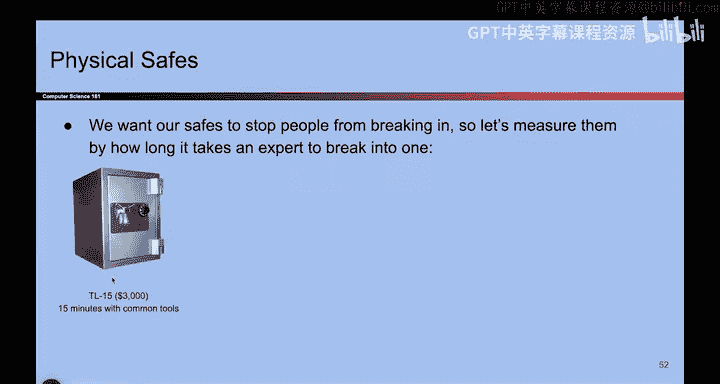
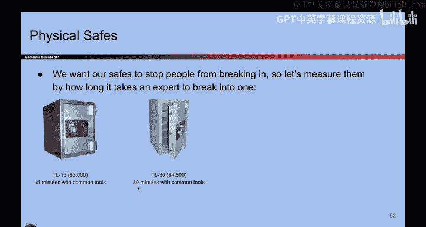
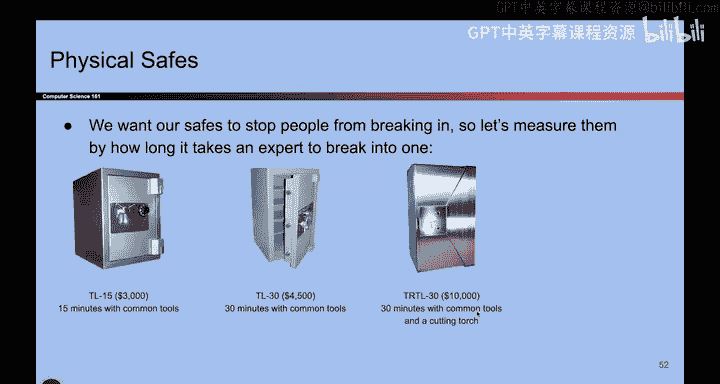

# UCB《计算机安全｜CS 161. Computer Security 2025》中英字幕 - P6：-Intro1, Video 6- Security is Economics.zh_en - GPT中英字幕课程资源 - BV1VhEhzMEPL

Okay。So here's another one。 So now in this story， we're going to go to the safe store。

 we're going to go buy some physical safes， So let's see which one you want。

 Okay so I can offer you the TL 15 for only $3000 and this safe will resist against attackers for 15 minutes if the attacker uses common tools。

Do you like it， want to buy it， or do you want a more expensive model？W to buy it。

 wants a more expensive model。 Okay， the more expensive model。 Okay， so here's the T L 30 for $4500。

 Now， this is going resist an attacker for 30 minutes。

Are you satisfied， You want to keep going。Okay， we'll keep going。 Here's the T R TL 30 for $10，000。

 If an attacker comes with a cutting torch， they will take 30 minutes to break in。

 so you get 30 minutes of protection。

Are you satisfied？Or do you want more？

Okay， what about the T X T L 60 for $50000。 The attacker can come with common tools。

 cutting torch and explosives， and this will resist them for 60 minutes。Okay。

 so what is the lesson here， Did you notice anything about the price tags on these things。😡。

They kind of started to go up。 And so what this is trying to show us is that if you want more security。

 you have to pay for it。 It's not free。So when we went to the safe store， we learned a lesson。

 we learned that security is economics， and there's a lot of cost benefit analysis， and ideally。

 when we think about attacks， we also have to think about the cost of the attack。

How much does it cost to defend against the attack， How much does it cost to recover from the attack。

 And in general， more security costs more。 Here is another example where security is economics。

 Let's say I have a $1 rock。 It a rock cost a dollar。Would I put a $10 lock on the $1 rock？

Probably not， because if someone steals the rock， I would just buy another one for $1。

 so as' an example of securities as economics doesn't make sense paying $10 to protect something that is only worth $1 unless that's somehow a top secret rock。

 I don't know。Okay， and here's another example。 let's say someone hands you a brand new attack that no one else in the world knows about。

 So in other words， I'm guaranteeing to you that this attack will work on anybody that you try it on。

 No one knows about it。 So if you try it， I guarantee that it works。

 So who are you gonna try to target。 You have this valuable attack that works on anybody on earth。

Are you just going turn to the person next to you and try it on them， Probably not。

 You're gonna go after， I don't know。 the president or something like that or a very wealthy person because it's a brand new attack。

 It's going to work So I'm going to try to target someone very important。

 So that's another example of security as economics。

 I would not take the $1 million new attack and spend it on someone who's only worth $10。

 It's not very valuable。