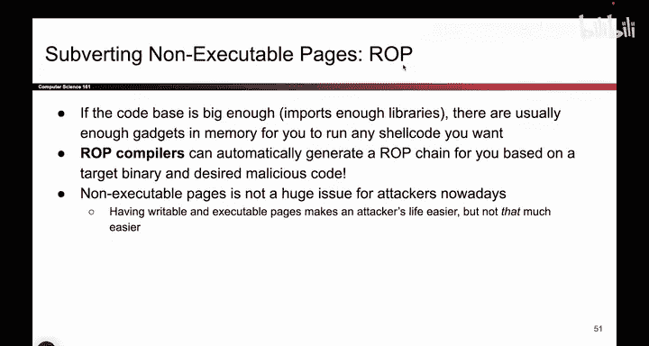

# UCB《计算机安全｜CS 161. Computer Security 2025》中英字幕 - P70：-MemSafety4, Video 11- ROP Implications.zh_en - GPT中英字幕课程资源 - BV1VhEhzMEPL

O。So to wrap up our talk on nonexecutable pages， let's go through the implications of rap。

 So what does it mean that attacks like this can happen what it means is if you have a large code base that is your code section of memory is really big because you've imported lots of libraries or you've just written a lot of code yourself then you've probably left enough gadgets lying around in memory for the attacker to piece together basically any shell code that they want。

 So attackers can get clever， they could maybe rewrite their shell code so that it matches the instructions that live in memory you can imagine taking a piece of code rewriting it so that it looks the same and does the same things but it matches the gadgets that live in memory so attackers can get clever and using some clever tricks。

 some of which we haven't talked about they can go into memory。

 pull out the gadgets that they want and execute basically any shell code that they want。

 And in fact， back in the day this was a really fancy research paper but over the years。

Started automating this。 And nowadays， you can even go online and search of ro compilers。

 And what those things do is they take a piece of code。

 they take your desired shell code and they build the ro chain for you。 So they tell you。

 here are the addresses you want to jump to， this will match the code that you want to run。

 So nowadays， this stuff can even be automated。 So what all of this means is that nonexecutable pages。

 they can be subverted。 even if you turn this defense on attackers can still cause shell code to execute using tricks like return oriented programming。

 So keeping in line of our theme of all these memory safety mitigations。 this attack or this defense。

 Sorry， it will stop the most common attacks。 if the attacker is really lazy and they just do one of those classic buffer overflows where they overrite the RP with their own shell code。

 This will successfully stop them。 but it's not going to stop an attacker。

 That's clever enough to try attacks like Rob。 So it makes the attackers life hard。

But it doesn't make the attack impossible。 It just stops some of the common attacks。

 And that's a pretty common thing we'll see as we see all of the other defenses。

 It's pretty cheap to enable， as we saw earlier， and it stops some common attacks。

 but it's not perfect。 So you can't rely on this for perfect defense。

 It just makes some of the common exploits a little bit trickier。

