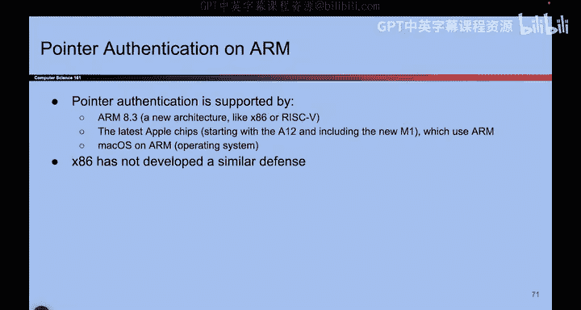

# UCB《计算机安全｜CS 161. Computer Security 2025》中英字幕 - P74：-MemSafety4, Video 15- Pointer Authentication.zh_en - GPT中英字幕课程资源 - BV1VhEhzMEPL

Okay， so we finished two of our exploits defenses。 Now we'll do a third one。

 So this one's called pointer authentication。 And it's actually going to do something very similar to sta canaries。

 but we're going to make it even better。 So this is like stack canaries on steroids。

 It's a really muscular bird。 So what we'll do is we're still going to stop the attacker from overriding the R IP。

 But we're going to do so using something even more clever called pointer authentication。

 So we're going to take advantage of the fact that modern systems are usually on 64 B systems。

 So let's take a step back and remind ourselves what that means。 And you're on a 32 B system。

 What that means is that addresses are 32 bit long。 You can address everything from0 to F FF FFFF。

 which is 321s。 So your addresses are 32 Bs long。 And as a result。

 you have roughly 4 GB of memory that you can access。😊，By contrast， modern systems are often 64 bits。

 That means that addresses are now 64 bits long。 You can address anything from 0 to Fff Fff F FffFF。

 which is 641s and any address in this range is accessible to the 64 bit processor。

 So if you have 64 bits in your address。 you can access 18 billion gigab of memory。

 Now I don't know about you。 My computer does not have 18 billion gigab of working memory and neither does yours。

 I don't think any computer has 18 billion gig of memory。 So what that means is that in practice。

 even though you can address all 18 billion gigabys of memory。

 most of it is totally invalid and you're never going to be able to touch it。

 even if you write the highest address that your computer can possibly address it's still going to be an address that looks like 000。

00，00 followed by your actual address。So in other words， we really only need 40 bits or so。

 we'll say 42 B to address all of memory and the top 22 bits are always0。

 even if you go to the highest possible memory address that your supercomputer can access It will be 22 zeros followed by 42 ones。

 Those top 22 bits are just not used in a 64 B system。

 So we're going to take advantage of those bits。 But as a reminder。

 this is what it means to have a 64 B system， and at least for now， maybe in the future。

 they'll build an 18 billion gig computer， but for now， the top 22 Bs are basically never used。

So if they're not used。Why don't we use them。 They're sitting there in every address。

 Let's do something with them。 So remember what we do with staaries。 We put a secret value in memory。

 And if it changed， we detect an attack， we crash the program。

So if we have those 22 bits that are sitting there doing nothing。

 why don't we just stick a secret value in those 22 bits？That's an idea we could do。

 And that's what pointer authentication does。 So anytime you put an address on the stack。

 you're going to take those 22 zeros that no one else is using anyway。

 you're gonna put a secret value there。 It's like a canary that's living with the address。

 which is kind of cool。 So when you put that address in memory。

 you will put a secret canary value with the address。😊，Using those 22 bits that no one else is using。

 And if you ever use that address， for example， the program tries to dereference that address and go to that address and do something。

 well then the operating system will check if the canary value。

 which one now called the pointer authentication code is still valid。 if it's valid。

 then go to that address。 So replace the canary bits with all zeros， read that as an address。

 go there。 But if the pointer authentication code is invalid， someone changed it crash the program。

 And what's great about pointer authentication is you can do it for every single pointer on the stack。

 So anytime you put an address in memory on the stack in the heap in static memory anywhere there's an address that's 64 bits long。

 you can replace those 22 bits with a canary and anytime someone tries to use that address。

 check those 22 bits。 So it basically is just stack canaries again。

 But instead of doing it once per function， you're going to do it once per pointer that you put。

Meory。That's what pointer authentication does。 It's pretty cool。

And here are some properties of the pack just like we talked about properties of the stackary。

 so something cool is that you can actually give different packs to different addresses so for example。

 if you push this address on the stack you can replace these zeros with one pointer authentication code one secret value and later when you push this address on the stack which is a different address you can take these zeros and swap them with a different code so each address can have its own unique code which is pretty useful and what that means is you can't play tricks like going to one part of memory pulling a code and dropping it somewhere else。

 that's no longer going to work if every address has its own unique code so we could put one code here。

 a different code here and those codes are not interchangeable attackers cannot take code from one place and use it in a different place。

And in fact， this will make probably more sense when we talk about cryptography and we talk about message authentication codes。

 But it turns out you can actually generate new secrets for every single address uniquely。

 And someone without access to the operating system， will not be able to do so。

 So once you've learned what Max or， you can come back and see the slide again。

 It will probably make more sense。 But what we can do is we can generate unique secrets for every single address。

 If that doesn't make sense for now， it's okay。 It's a bit of a preview for later。 But basically。

 what this slide is telling you is that you can have different secrets per address。

 And that makes the attacker's life even harder。 There's no way for them to take secrets from one address and apply them to a different address that you're storing in memory。

😊，So as before， pointer authentication is still not perfect。

 It is very strong because you use it to defend every single address on the stack in the heap anywhere in memory。

 but unfortunately， it is still not perfect。 For example。

 you might be able to trick the program into generating codes。

 So you might somehow be able to tell the program hey。

 can you tell me what the secret is for this address and maybe the program gets confused and it tells you the secret。

 Now you've leaked the secret。 maybe you can learn something about the master secret that the operating system is using to generate all the other secrets。

 if you learn that maybe you can generate other secrets as before some brute forcing might be possible。

 it's going to be pretty hard because the pack is 22 bits long， maybe even larger。

 depending on your system。 but again， depending on your threat model， it might be possible。

 if you have the same address that appears twice on the stack you might be able to copy the code from one address and put it in a different address。

 So there are。😊，Some ways to get around it。 but hopefully it starts to feel like these are pretty hard subversions compared to some of the other ones we've talked about。

 So pointer authentication is a very strong defense。 It is not perfect。

 but it gets us a really long way there to making the attacker's life really hard if they want to try and perform buffer overflow attacks。

 So this is the newest and fanciest of the defenses that we'll see。 And it's pretty powerful。

I won't talk through these slides out loud， but if you're really curious about how it works。

 there's even white paper links that you can read all about。

 but basically there's all these different ways you can strengthen pointer authentication。

 you can even make it so that addresses have different codes depending on where they're located。

 So if you push an address on the stack it as one secret。

 but if you push that same address on the heap it gets a different secret。

 you can get even more clever with the way that you generate secrets。

 And now they can't even copy pointer authentication codes for the same address。

 not the most important thing that's why the slide is all blue background。

 but just know that if you're interested， there's a whole paper about this that you can read。

 It's a pretty cool thing that you can do。 one thing that I do want to mention though is that in real life pointer authentication is really only supported on arm。

 which is a new architecture that Apple has developed and that they use on their newer devices and it turns out that X86 actually doesn't have pointer authentication。

 at least as of when this slide was made。If you want to use something like pointer authentication。

 you have to use a assembly language that supports it。 So if you write code in X 86。

 it doesn't have pointer authentication instructions。

 It doesn't know how to substitute zeros into the addresses if you use risk 5。

 risk 5 does not know how to substitute zeros into the pointer that you put on the stack。

 but arm the architecture from Apple， it does。 So as of the writing of this slide。 This is true。

 maybe in the future， it won't be。 But in case you're wondering。

 this does have to be implemented at the assembly language level。 some languages have done so。

 some languages have not。 So it's a new shiny tool that we've been using to stop memory safety vulnerabilities。

