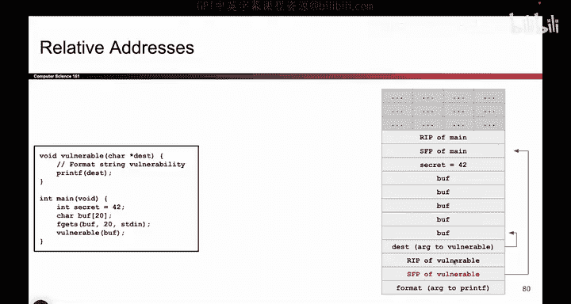
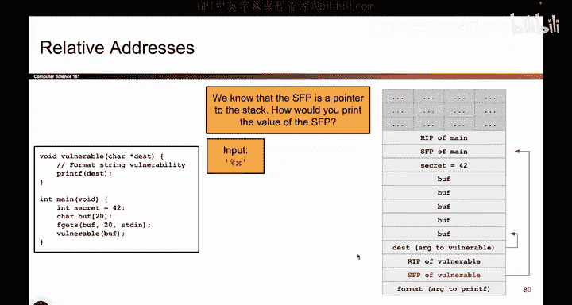
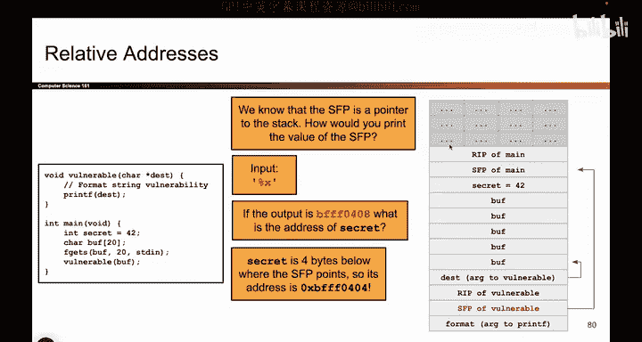
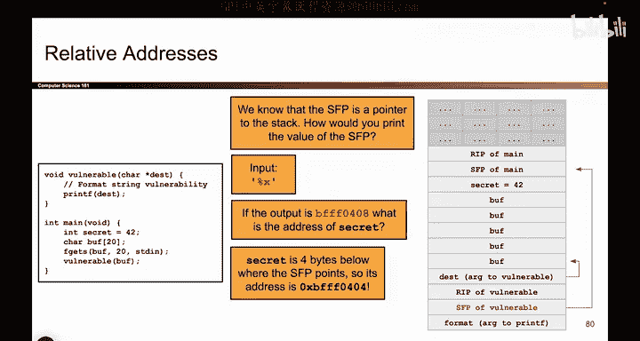

# UCB《计算机安全｜CS 161. Computer Security 2025》中英字幕 - P76：-MemSafety4, Video 17- Subverting ASLR.zh_en - GPT中英字幕课程资源 - BV1VhEhzMEPL

Okay so in the last video we talked about ASLR ASLR was wonderful。

 it allows us to move the segments of memory around such that their absolute addresses change。

 although their relative addresses do not and this makes it harder for the attacker to guess where on the stack their shell code is so when they write the shell code it's somewhere in memory but they no longer know the absolute address but just like all the other memory safety mitigations there are some ways to subvert ASLR so the two ways that we will talk about are leaking addresses and guessing addresses so let me start with guessing because that's kind of the easy one just like how you could guess the value of the canary。

 you can also guess the addresses of your shell code so when you write show code into memory you don't know exactly the address of where you put it but you can just try a bunch of times and guess until you get it right and something that actually helps a little bit here is the fact that they rent。

ization usually happens on nice boundaries。 So it's not going to be the case that， for example。

 the addresses are not on multiples of4 bys。 So for example。

 in all the addresses that we've seen and that you'll see in the project the RP will be at an address that's a multiple of four。

 It's kind of nice it means that the addresses weren aligned So that reduces the amount of guessing you have to do you know that the address is going to be multiple of four more generally if you remember something called virtual pages from CS61C you'll know that there are also these things called page boundaries and usually the addresses will also be page aligned So there are some things you can do to improve your chances of success but ultimately you are still guessing and so even under certain assumptions that we won't talk about here。

 there are roughly 20 bits that need to be guessed and whether or not 20 bits is possible and you can guess two to the 20 times depends on your threat model like we talked about last time and on a 64 bit system under certain。

Not covered here。 You might have to guess roughly 2 to the 36 times。 And again。

 whether or not that's possible depends on your threat model。

And the other thing you can do to subvert ASLR is you can try to leak addresses because remember。

 the relative locations are not randomized。 So it's always going to be the case that RIP is above the SFP。

 which is above the local variables。 So once you have a single address of something on the stack。

 For example， someone tells you the R IP is right here。 Well。

 then you can fill in all the other addresses。 If the R IP is that address 30。

 then the SFP must be at address 26。And then the first local variable at address 22 and so on and so forth。

 just to give an example。Or for example， if you have an address on the stack and you can print out that value that might give you a clue as to what all the other addresses are。

 For example， if you leak an address and it starts with an eight。

 that might be a good sign that all the other addresses on the stack also start with8 to just give an example。

 So those are the two ways we can think of the server ASLR， either reveal an address。

 which might allow you to find where everything else is on the stack or just try and guess the address and hope you get lucky after a bunch of tries。

So to give a concrete example of what leaking addresses looks like。

 let's say we have a piece of code like this， we'll not talk about it in too much detail。

 but we have some character array called Buff， there it is。

 we let the attacker fill it in and then we call vulnerable which then calls printf on Buff。

So what's the problem here we're calling Prif， we're giving the attacker control over that very critical zeroth argument and if the attacker can control the zeroth argument。

 they can perform a format string vulnerability So if you think back to format string vulnerabilities you might remember they allow you to print arbitrary things on the stack so for example if I provided an input like percent X what does that do well then printf's going to think well here's printf and the zeroth argument was this one so the first argument must be the one directly above so I should match percent X with this value even though we didn't actually provide an argument。

 Prif will think that this is an argument and print this value out。

And so to make a long story short， printf will allow the attacker to learn this value and what is this value it's an address。

 what is it the address of it's the address of the previous stack frames SFP so by leaking this address you might be able to say something like I know this address so this address must be the thing I leaked plus4 and the address of secret must be the value I leaked-4 and the address of Buff must be 24 and so on and so forth so just by getting a single address that allows you to find the address of everything else on the stack。

And so， for example， if the percent X printed out the output D FFF 0408。

 that tells me that the address， this value is BFFF0408。

 which tells me that this address must be BFFF0408 according to my diagram。

 So then the address of secret must be BFFF 0404 and I can find other addresses on the stack because I leaked one of them。

 and this again relies on the fact that even though this entire stack could move up and down So maybe right now it's B FFF。

 but the next time around the top it's our CFFF or something completely different。

 the relative locations will still be the same So that's what this slide is showing。

