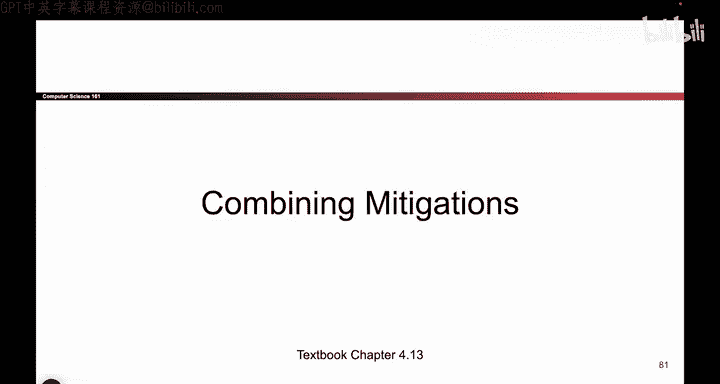

# UCB《计算机安全｜CS 161. Computer Security 2025》中英字幕 - P77：-MemSafety4, Video 18- Combining Mitigations.zh_en - GPT中英字幕课程资源 - BV1VhEhzMEPL

Okay， to wrap up our discussion on mitigating memory safety vulnerabilities。

 we've shown you four different ways that you can make the attackers' life harder。

 nonexecutable pages， sta canaries pointer authentication and ASLR and something you can do in real life is you can turn multiple of these defenses on So it's not like you just have to pick one。

 and in fact， a lot of modern systems will turn some or even all of them on。

 and that's actually a great thing。 So you can actually combine these mitigations。

 and what you get is you get a synergistic effect。 that's a fancy word and it basically means that using multiple mitigations。

Makes each one stronger。 The overall effect is greater than the sum of its parts。

 So having one is great， Having the other one is great。 If you combine them， it's even better。

 It's like peanut butter and jelly or anything that goes well together。 when you put them together。

 it's even better。 And the reason why putting multiple mitigations together is so great is because now the attacker has to break through not one。

 but all of the mitigations in order to exploit your program。

 So if you think back to your security principles， we are employing defense in depth。

 turning on multiple defenses against the same attack。 So to give an example。

 we can combine asLR and nonexecutable pages。 if we turn both of these defenses on。

 the attacker' life is now really hard， because if you think about nonexecutable pages。

 those stop the attacker from writing their own shell code。

 You can't put shell code into memory and then execute it nonexecutable pages says it's writeable or executable。

 not both。 So the attacker trying to write their own shell code。😊，Is defeated。

 So then this attacker might say， okay， let me do a retalip C。 Let me find some code in memory。

 but the attacker can't do that either because they don't know the addresses of the C library functions。

 AR is shuffling them so they can't write their own shell code。 They can't use existing shell code。

 This attacker has to be even more clever to exploit and subvert both of these defenses at the same time。

So combining two mitigations is great， it makes the attacker's life even harder。 and so for example。

 if you wanted to defeat both of these mitigations at once。

 you would first have to defeat ASLR by somehow learning the address randomization and then you have to use an attack like realipy or return oriented programming to defeat nonexecutable pages So already you can see this attacker is going to have a much harder time compared to an attacker with no defenses enabled。

So that's what it looks like if you combine mitigations。

I'm not going to go through this in too much detail， but this slide just tells you that， for example。

 a modern system like Apple iOS turns on a lot of mitigations and an exploit that works on today's systems requires exploiting safari and then exploiting another vulnerability and then another one and so all this is showing is that when you combine mitigations。

 modern attacks have to be really sophisticated to get around all of them。

 it makes the attackers' life harder， but not impossible， exploits are still possible。

And one final thing before we are totally done with this section is if you have a lot of mitigations。

 you actually want to turn them on。 That's something that's so silly that it sounds stupid when I say it。

 But if you have all these great mitigations， don't forget to actually turn them on if you leave them off they are not going to do anything useful for you。

 And so， for example， there are sun systems or you have to manually go into the compiler and set a flag。

 So when you're running GCC to compile C code， you have to set a flag to say turn on stackaries and turn on ASLR。

 So on sun systems， that's something you have to do。 And if you don't know about these mitigations。

 you might forget to turn them on。 and suddenly theyre of no use to you。

 So this is a case where we should consider human factors and in fact。

 a lot of modern systems turn these on by default。The argument is， well。

 maybe the programmer doesn't know about these things。

 An average programmer who's just starting out might not know what stackaries are。

 So let's turn them on by default so that the programmer can benefit from the security。

 even if they're not too familiar with what a stackary is。 So this line is just saying。

 please don't forget to actually turn the defenses on。 Otherwise。

 everything we talked about is not super useful。So to summarize all the memory safety mitigations we are finally done。

 we first talked about some philosophy and we said that the reason why memory safety vulnerabilities exist in the first place is because of legacy so there are memory safefe languages that exist today like Python and Java in which there are no memory safety vulnerabilities but because a lot of code has already been written in C and no one's going to go back and rewrite millions of lines of code a lot of C code still exist today and that's why a memory unsafe language is still around even though good alternatives like Java and rust have been developed over the years then we talked about how you might write memoryafe code if you're forced to use a memory unsafe language like C and we said you can reason through your code。

 you can program defensively， you can write little proofs to check if your code is memory safefe but those require a lot of programr discipline and if you slip up even once your program might be broken。

We talked about tools for building secure systems。 We said there are automatic tools out there for analyzing code。

 for patching code that's insecure， there are ways to test your code。

 and if you import external libraries， you have to update those too So these are some high level approaches for how you might work in a memory unsafe language like C。

And then we spent the rest of this section talking about various mitigations to make the attackers life harder but not impossible。

 we turned some of the common exploits into crashes which are safer than allowing the attacker to do whatever they want so nonexecutable pages has said every part of memory is executable or writeriable but not both so you can't write the shell code and also execute it as instructions。

 but we saw two ways to subvert this return to Liy and return oriented programming which take advantage of existing code that's already in memory and already marked as executable then we talked about stack canaries。

 those are sacrificial values we don't care what the value is， it's some random set of bytes。

 but if the canary value gets changed before the function returns that's a sign that someone is probably attacking your system or you have a bug and the program should crash right there。

And we talked about various subversions， we said you can write around the canary。

 so if you're not writing consecutively from lower addresses up。

 you might be able to write around the canary， you might be able to leak the canary and then write the original value back。

 or you might be able to guess the canary， depending on your threat model， for example。

 are there timeouts。Then we talked about pointer authentication。

 which is like stackn area on steroids is an even stronger version where we set every pointer in a 64 bit system。

The top bits are always0。 So replace them with a unique code。 And before you use the address。

 check the code to see if it's been changed。 So it's basically stack canaries again。

 but adding a canary before every single address using those unused bits in a 64 B system。

 And finally， we talked about ASLR where you put each segment in a different location。

 So sometimes the stack is 8000 to 9000， Another time it might be 2000 to 3000。

 And by shuffling around the segments of memory， the attacker is not able to reliably predict the address of shell code。

 which is what they normally overwrite the RP with。

 But this can be subverted if you leak an address or if you guess an address。 And at the very end。

 we said that combining mitigations is great。 Its defense and depth。

 So that's the end of this set and actually the end of all of memory safety。

 So if you are not a fan of C programming， you are finally done and coming up next。

 we will start jumping into cryptography。