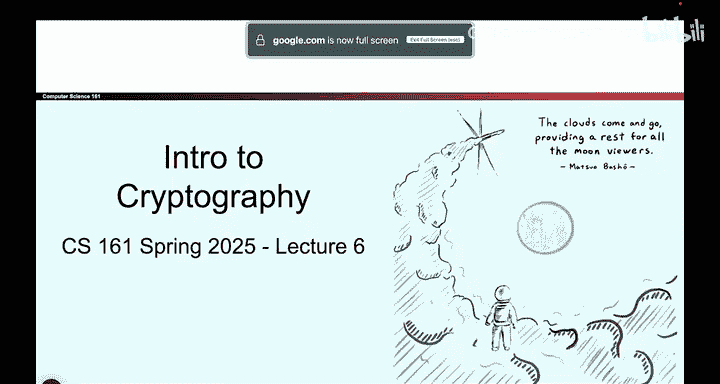
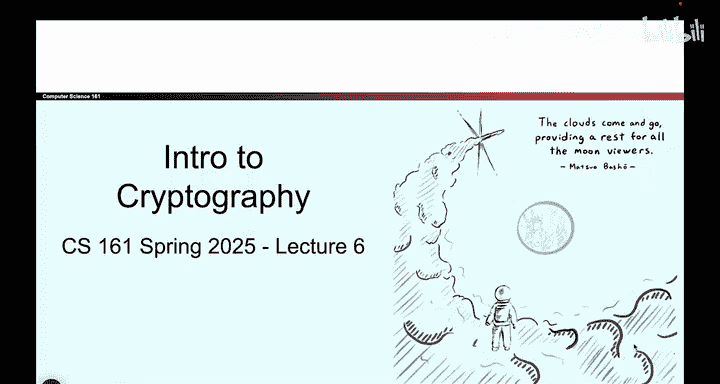
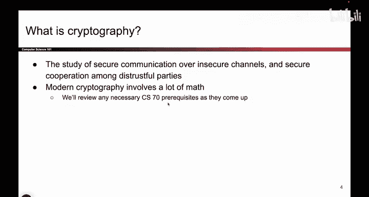

# UCB《计算机安全｜CS 161. Computer Security 2025》中英字幕 - P78：-Cryptography1, Video 1- Dont Try This at Home.zh_en - GPT中英字幕课程资源 - BV1VhEhzMEPL

Okay， in this set of videos， we are going to start our journey into cryptography。

 which is the second major unit of this class。The student was not really in it， but it's very nice。

I like it。Alright， so this is our second major unit of the class。

 We are done with memory safety and we are now going to dive into cryptography。

 This set of videos is all about introduction to cryptography。

 So we're going to start with a lot of definitions。

 So we all know what we are talking about and then we'll give you a brief history so that you know where we are today and what we're going to be looking at。

 So that's kind of。😊，This set of videos， lots of definitions is what I'm getting at。

So we'll start with the most basic question。 What is cryptography。 What does this word even mean？

 So if you look it up in a dictionary or a research paper。

 it says the study of secure communication over insecure channels。 So in other words。

 you have this channel where Alice and Bob want to talk， but the channel is not secure。

 Other people might be reading messages， So how do you secure messages between them。

 even if there are attackers in that channel。

That will probably make more sense once we talk about definitions。

 but at a very high level that's what we're trying to do。 By the way。

 this section is probably the most math involved section of the class so there's going to be some math here you warned but we will do our best to review any prerequisites as they appear so if you're really a big fan of math。

 this will probably be your section。

And one thing we should warn you before we even show you the first basics about cryptography is please don't try this at home。

 We are going to show you just enough cryptography so that you're able to understand what people are talking about so that you're able to evaluate existing tools to understand what they're doing what they're capable of and what they're not capable of but we are not going to teach you enough to write your own cryptographic protocols。

 So cryptography is a really sensitive subject it uses a lot of very fragile math and even a tiny little mistake could cause your entire system to come crumbling down and your code to be totally insecure So when you're thinking about cryptography because it's so maty and involves a lot of proofs there are a lot of tricky edge cases that you can discover as you are trying to implement one of these protocols and even one broken piece of code could cause the entire system to collapse。

 So when you go into real life it's not going to be your job。

To build these protocols unless you go into cryptography research。

 if you're programming at a company that's not doing cryptography research。

 you're not going to be writing these programs。 you should be using libraries that other people have built because they've built it。

 they've done all the thinking about all the edge cases so we should trust their libraries instead of building our own So we're going to make you a good consumer of cryptography so that you know what systems to use and what systems to not use。

 We are not going to make you good cryptography protocol writers that's far beyond the scope of what we will show We just don't have that time because of how complicated it is。

So to tell you a bit of a story about why you don't want to try this at home。

 a couple of years ago during the pandemic， one of our classes tried to write a program with their own for online exams or something。

 and they wrote a bunch of code。In cryptography， which you're not supposed to do at home。

 So when they wrote their own cryptographic code， they introduced a tiny little bug。

 And apparently it was possible to look at the exam questions ahead of time。

 I don't know if anyone actually did it。 But the fact that it was even possible is not so great。

 even worse is that they saw this slide before you。 And they still went and wrote this thing anyway。

 And now they are on here as a warning for everyone else in the future。

 So if you don't want to have a slide of your own and they come an example。

 please don't write your own cryptography code。Use well vetted existing libraries instead。

Because we are not going to teach you enough to write your own code。

