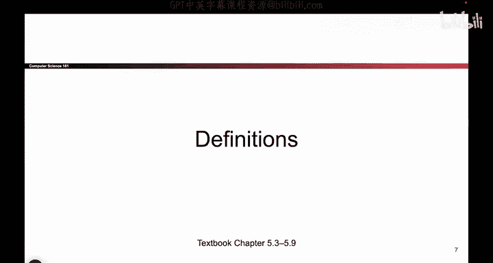
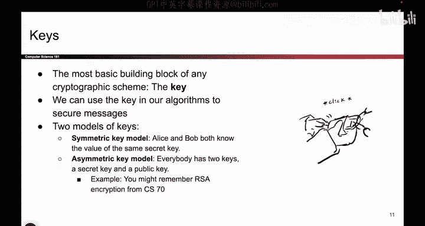

# UCB《计算机安全｜CS 161. Computer Security 2025》中英字幕 - P79：-Cryptography1, Video 2- Definitions, Kerckhoffs Principle.zh_en - GPT中英字幕课程资源 - BV1VhEhzMEPL

Okay， let's do some definitions just so we can all be talking about the same things。

So in cryptography， there's a cast of characters if you open up any cryptographic paper。

 you will see these characters， there are placeholder names for scenarios that we want to build between the various characters and when we're talking about cryptography So Alice and Bob are our heroes。

 they are the main characters and usually their goal is to send messages to each other over an insecure communication channel and if you need more people you can also throw in Carol。

 Dave， etc， that's up to you。And then in terms of the villains， the adversaries。

 we have Eve and as her name implies she is an Eavesdper。

 which means she can read the data sent over the channel。

 so if Alice sends a secret message to Bob Eve can intercept that message and read it and that might be bad for Alice and Bob are heroes Mallory is also a villain and her power is that she can not only read the data but also modify the data。

 so it could be the case that Alice sends a message。

 Mallory takes the message intercepts it and changes it up and then sends it to Bob and Bob receives the wrong message So ultimately the goal is for Alice and Bob to achieve secure communications in the face of Eve or Mallory or possibly both。

So when you see these characters， we usually assume that these are the powers that they have unless otherwise stated。

But you will see these characters quite a bit。So here are some example scenarios to give you an idea of the stories that we like to tell with these characters。

 so one story might be Alice wants to send a message to Bob， but Eve。

 the Eavesdpper is going to read the messages that they send and the goal is for Alice and Bob to use some sort of protocol。

 some sort of math that we'll talk about so that they can exchange messages without Eve learning what they're trying to see。

And another scenario might be that Bob and Alice want to exchange messages。

 but Mallory is going to tamper with the messages， she's going to change what they say while they're being sent and the question is how do you get the message to Alice while preventing Mallory from changing the message or at least changing the message without being detected so these are the kinds of stories that you're going to see and we'll see them in a lot more detail but I just wanted to show you that these are the scenarios that people build with Alice Bob Eve Mallory and their friends。

Allright， more definitions in cryptography， there are three goals that we can achieve on our data and they're listed here。

 One is called confidentiality， which means adversaries like Eve and Mallory cannot read our messages。

 integrityteity means the adversary cannot change our messages without being detected if they do change our message。

 there should be something about the message that alerts us to the fact that the message has been changed and finally there's authenticity。

 which says the original sender should be able to prove that the message came from them So if I send you a message there should somehow be a way for you to check that I sent it and not some imposster claiming to be me and at first you might say integrity and authenticity they kind of feel like they're the same thing if you can prove that it's from me。

 you can also prove that it wasn't changed and you might be right in some threat models in other threat models there might be various subtle differences。

 but for now it's okay if you want to think of integrity。

And authenticity as kind of two sides of the same coin。 confidentiality is totally different。

 It's all about reading secret messages， whereas integrity and authenticity are all about checking if the message from its original sender or that it has not been tampered with and along the way。

 we'll see lots of protocols to achieve some or all of these goals。Okay， more definitions。

 it's kind of a definition heavy set of videos。So the most basic building block in any scheme you'll ever see is something called a key。

 and all that a key is it's a piece of data could be a bunch of ones and zeros。

 and it's a secret value that we use to secure our messages。

And there's actually two ways that you can build keys and we'll look at both of them in lots of detail。

 One of them is the symmetric key model and what this means is that Alice and Bob both have a secret key that nobody else knows so there's a sequence of ones and zeros。

 Alice knows it， Bob knows it， Nobody else in the world knows it。

 that's a symmetric key model and by contrast there's something called an asymmetric key model where everyone has a private key and a public key and they form a pair and that's something we'll talk about in a lot more detail later if you want a bit of a preview you might remember something called RSA encryption that uses the asymmetric key model but for now just note that if you see something called a key it is a secret value that we use to secure our messages。

Okay， more definitions。So this is a security principle that you've actually already seen。

 but I'll give it a slightly different name because cryptographers like to give things names。

 So we've already seen something called Shannon's Maxim or don't rely through don't rely on security through obscurity。

 And what that means is assume the attacker knows the system。

 hiding something is not an excuse for making it insecure。 you actually have to make it secure。

 even if the attacker has full details about your system。 So Krkov's principle is。

Very closely related， but it's more focused on cryptography， so the definition reads like this。

 A cryptographic system should be secure， even if the attacker knows exactly how the system works。

 the only thing that should be secret is that secret key and even if the attacker knows everything else。

 they should still not be able to break into this program if they don't know the key and the reasoning behind this is let's say you've written a big piece of code and you're relying on the attacker not knowing how the code works so you're hoping。

 okay I hope that the attacker doesn't read this code because if they read it， it'll break my system。

Well the problem now is if your code gets leaked。Now you're in trouble。

 you have to go and rewrite all of the code and come up with a brand new way to secure your secrets。

😡，Because the attacker has leaked your original cryptographic scheme。

 so you have to go in and rebuild your system， which is really annoying and it's going to take a lot of work。

By contrast， if you build your system according to Kirkoff's principle。

 you're saying that you can tell the attacker everything there is to know about your system。

 it runs this piece of code to secure messages， take a look at it， you can read it。

 you can play with it， whatever you want， as long as the attacker doesn't know that secret key。

 they can't do anything。Now you're in much better shape because even if the attacker ends up leaking the key。

 they steal your secret key， all you have to do to fix your system is change the key。

 That's not so hard go and generate some ones and zeros。 That's your new key。

 the attacker doesn't know it， you're back to secure so following Kovs principles is the difference between generating a key to resure your system or rewriting all of the code from scratch to secure your system。

I think the first one is better， so we will follow Krkkoff's principle。

 assume the attacker knows everything there is to know， except the secret key。

 all of the security should come from only the secret key or keys if you have multiple。

