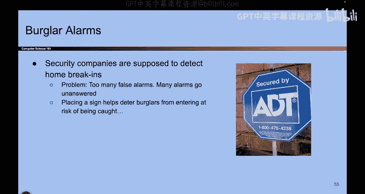
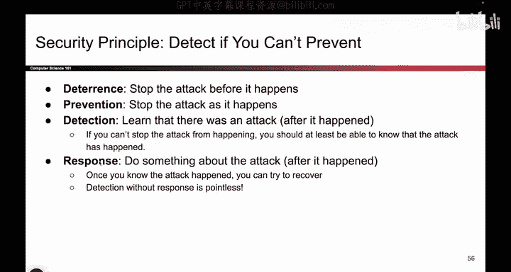

# UCB《计算机安全｜CS 161. Computer Security 2025》中英字幕 - P7：-Intro1, Video 7- Detect If You Cant Prevent.zh_en - GPT中英字幕课程资源 - BV1VhEhzMEPL

O。So here's another one， detect if you can't prevent。 So here's the story。 you ever see these things。

 you walk around the neighborhood and you see these signs。 And so what are these signs， Well。

 it's basically saying this house is protected by a security company and the alarm's going to go off if you try to break in。

 so it's a burglar alarm。So there's already some problems with this。

 so one problem is if you just accidentally open the door or something， the alarm goes off。

 that could be a false alarm， but another interesting thing that you might think about is， well。

 what if I put this sign in the front and attacker see and and they think， okay？

This house has a burglar alarm。 I'm gonna to try somewhere else。 So what if。

 instead of paying all the money to go and install the burglar alarm。

 what if I just got one of these signs and just stuck it in my front yard。

 And I didn't actually bother to install the system。

That might still make attackers look somewhere else。 So what's the lesson of this story。

 the lesson is not to go steal yard signs from your neighbors， but the lesson is。

 well sometimes we're preventing attacks and sometimes we're deterring them。

 sometimes we're detecting them So there's different ways in which we can stop attacks。

 we can use the actual burglar alarm that goes off when the attacker tries to break into our house or we can just stick the sign in front and make them go somewhere else。

 like trick them。So here are some different ways in which attacks can be stopped。

 We could deter the attack。 That is we stop it before it even happens。 We could prevent the attack。

 which means the attack is in progress， but we successfully defeat it and stop it。 We could detect。

 And that means that the attack has already happened。

 someone's already broken into our house or our system。 But at least we noticed that it happened。

 So even if we can't stop the attack from happening。

 it's pretty good to be able to detect that it happened。 And finally， if the attack happens。

 we should do something about it。 We should respond。 Like we should recover the data that we lost。

 we should。Call the police， something like that， so these are all different ways to stop attacks or respond to attacks。

And we'll sometimes see the difference between these。 So， for example。

 there might be a case where it's actually impossible to deter the attack。

 The attack is going to happen。 You know， it's going to happen。 We can't deter it。

 but maybe we can prevent it。Or maybe there's a case where I cannot prevent the attack。

 It's going to happen。 It's going to succeed。 Well， in that case。

 I should at least be able to detect it and respond to it。

 So all of these are important things that we have to think about when we're trying to stop attacks。

So here's another example from real life。 Let's think about earthquakes。 Can you deter earthquakes。

 Can you stop earthquakes from happening， I don't know about you。

 but I don't have the power to stop earthquakes。 Can I prevent earthquakes。

 Can I stop the shaking when it starts happening。 Probably not。

 But I can detect that an earthquake is happening。 and I can also respond to the earthquake。

 So I can prepare a food supply a big tub of food so that if the earthquake happens。

 I have some food， I have some gas travel somewhere far away， or think about ransomware。

 What's ransomware。 That's the case where someone takes your computer and encrypts all the data on it and says。

 give me a lot of money or else I'll delete the data forever。 how do you stop that。 Well。

 you can try to prevent it。 but you can also try to respond to it by keeping backups。

 So someone steals all your data and says give me money or else I'll give it back。 Well。

 maybe you can have some backups。 or I guess give me money or else I'll delete it。

 You can have some backups so that even。If your computer breaks， it's no big deal。Okay。

So here's another example of detection， but no response。 So we'll talk about Bitcoin。

 maybe at the end if we have time。 but basically， all you have to know here is Bitcoin transactions are irreversible。

 In other words， if you give some Bitcoin to someone else， that's it。

You are never going to see that Bitcoin again。 unless they give it back to you， it's gone forever。

 So what that means is if someone steals your Bitcoin， you might be able to detect it。 That's great。

 But can you recover from it， Not really， unless they want to give it back to。

 which they probably don't。 You've lost the Bitcoin forever。 So you detected the attack。

 but you did not respond to it。 So yeah， you notice the money was gone。

 but we're not getting the money back。 that's an example where。We detect， but we don't respond。

 That's not so great。