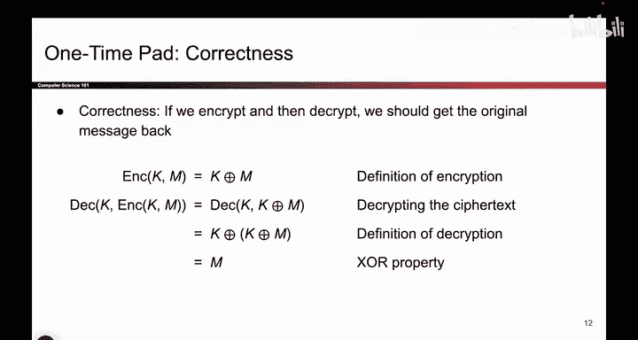
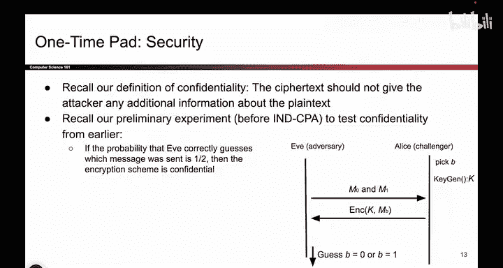
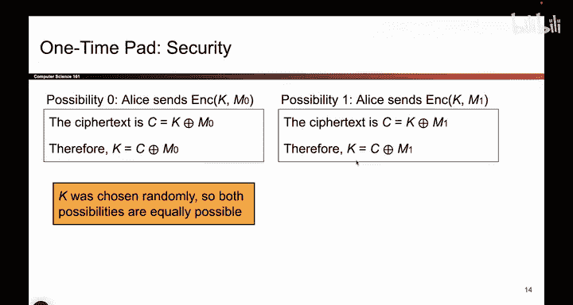

# UCB《计算机安全｜CS 161. Computer Security 2025》中英字幕 - P93：-Cryptography2, Video 2- One-Time Pad Correctness and Security.zh_en - GPT中英字幕课程资源 - BV1VhEhzMEPL

So one question you might have is does this actually work if I take a message and encrypt it。

 and then I decrypt it， does it actually work a little bit of algebra。

 it help us convince that it works When you encrypt something。

 you take the key Xhort with a message when you decrypt it， you take the original ciphertex。

 which is K X or M there it is and you exhort it again with the key And remember that handy property from before where we said that if you xor something with itself it cancels out that happens right there So using our handy property。

 these two cases cancel out and you're left with the original message So this little algebra proof helps us convince ourselves that one time pad does the right thing。

Next question we should have is whether or not onetime pads provides security。

 So this one's a little bit fuzzy。 And the reason why is because the ID CPPA definition that we spent a lot of time coming up with last time。

 it doesn't fully work on one time pads for the reason that in ID CPPA。

 we usually use the same key through the whole game so that Eve can say encrypt this。

 And then Aliceice faithfully encrypt it with the key。 In this case。

 since we're changing keys every single time， the game has to be modified just a little bit to work out。

 but we can still show that onetime pads provides some level of security So let's try and do that。😊。

So this is how I'm going to prove that one time Pats offer security。

 It's a little bit different from the IMD CPPA game because of the fact that the keys change every time。

 So you don't have to think too hard about IMD CPPA right now。

 But here's a mathematical proof that shows you that this game is secure。

 no matter what Eve tries to do。 Eve can invent new things we've never heard of。

 this game will still be secure。

So the reason why it's secure is because we're going to consider the two different worlds that we can be in。

 So let's say Eve knows kind of similar to the NCPA game that either M0 or M1 was encrypted Alice either encrypted dog or should encrypted cat and we don't know which one she encrypted。

 So in other words， were in one of two possible universes in universe1 cat was encrypted and the message that was sent out was K X or cat in the other universe the message encrypted was dog So the Cyphertext that Eve Cs is K X or dog and Eve doesn't know which world that she is in。

 So let's go through and think what Eve should do in both worlds。

 let's say we're in world number0 if we're in world0 M0 must be cat So Eve knows that。

And so and she knows the cipher textex because that's sent over the channel。

 so if you does a little bit of algebraic manipulation。

 she can see that K is equal to C the thing that she received over the channel， X or M0。

 which is cat and that's the key。 So if we're in world zero and Eve knows that we're in World0。

 she can derive this key。On the other hand， if we are in world number one。

 using the exact same trick， Eve knows C， that's the cipher textex that was received。 Eve knows M1。

 That's dog in this world。 So she knows what the value of K is， It's the thing she got X or dog。

 So if Eve knows which world she is in， she can actually come up with the key for that world。

 Unfortunately， Eve doesn't know which world we are currently in。 So it turns out Eve has to guess。

 am I in this world where K is this value or am I in this world where K is this value。

 and she doesn't know K。 So both of these possible keys are they're both possible and Eve has no way of knowing which key was used。

 Both of these keys are plausible keys and because we generated the key randomly we could have the key from world0。

 or we can have the key from world1， We don't know So in this case。

 Eve's strategy was to take the cipher textex， which is one of these two values。

Exorate with cat， get one possible key。 Xorate with dog。 get the other possible key。 And she's stuck。

 Both of these keys seem plausible。 There's no way to tell which one is more likely than the other。

 So in other words， Eve has no idea which one was encrypted。 was a cat was a dog。 We have no idea。

 Try to figure out the key doesn't help us whatsoever because both of these keys are equally plausible。

 So this cute little security proof basically shows us that this scheme does not leak information。

 If Eve doesn't know the key， and she receives either the encryption of cat or dog。

 she is no better at learning which one was encrypted。

 She gets no extra information about the key or which message was encrypted。

 Both of these worlds are equally plausible。 So this is the little security proof that shows why one time Pats provide perfect security。

Under certain constraints that we will see。

