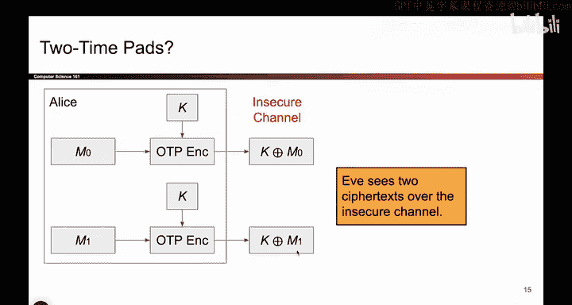
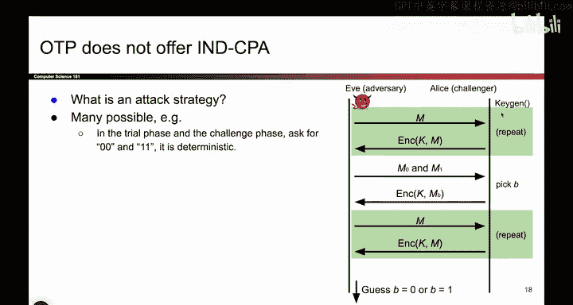

# UCB《计算机安全｜CS 161. Computer Security 2025》中英字幕 - P94：-Cryptography2, Video 3- Two-Time Pads Dont Work (and Other Issues).zh_en - GPT中英字幕课程资源 - BV1VhEhzMEPL

So we said that one- time pads are perfectly secure under certain constraints。

 So let's see what those constraints are。 Remember that if you're using the one-time pad scheme。

 you have to use a different key for every message that you encrypt。 You encrypt one message。

 you generate a key for it。 If you later want to encrypt a different message。

 you have to generate a different key。So you might think， what if I'm lazy。

 What if I don't want to generate two separate keys to encrypt two separate messages。

 I'm going to be lazy and just reuse the same key that I was already using。If you do that。

 you run into something very dangerous。 So let's see it pop up。 So here's your first message。

 You encrypt it with the key using your Xor one time pad encryption algorithm。 and you get K。

 X or M 0。 This means the attacker can see K， X or M 0。And then later you take the message M1。

 you encrypt it with the same key because you're lazy and you get K，x or M1， and again。

 the attacker can see this value because this is the cipher text that you send。

Now we have a problem because if Eve sees this message and she also sees this message。

Our proof from before doesn't quite apply anymore。 if has two pieces of information。 And actually。

 if she has this piece of information and also this one。

 she can actually learn something about M0 and M1。

So it turns out what can she do， She could take this message and these bits and these bits and X or them together。

 And if you do that， you get this value， Xor， this value， the Ks cancel out。

 and Eve now knows M0 X or M1。 That's dangerous。 This is something that Eve previously didn't know。

 but now she knows the Xor of the two messages。 So this is a case where if you use the same key twice。

 This is not like before where we have two parallel universes。

 this is one universe where Alice encrypts M0 and later encrypts M1 with the same key。

 If Alice does this twice， we have a big problem because Eve has learned something about the two messages that she previously didn't know。

Originally， she knew nothing about M0 and M1。 Now， she knows the Xor of the two messages。

 That's dangerous。 We've given Eve information that she should not have note。 So here it is in text。

And it turns out this is partial information in English。

 What this tells you is that she knows which bits in M0 match the bits in M1。 So， for example。

 if the 15th bit of this bit string is 0， that means that the 15th bit in M0。

 and the 15th bit in M1 must be the same。 That is information that she learned。

 that she should not have learned。 Or if you find the 30th bit is one in this exor。

 that means that the 30th bit of M0 and the 30th bit of M1 must be different。😊。

And it turns out that's dangerous。 So that's information that she should not have known。

Something else she could do is maybe she knows M0 for some reason。

 Maybe you got leaked or she has some clue about what M0 is。 If you knows M0。

 she could just take this message Xora with M0， the M0s cancel。 And now she knows M1。

 So with this partial information， if Eve knows one value， she guesses the other one。

 that's also really bad。 So all of this is to say leaking any sort of information。

 even something like this is dangerous and we don't want to do it。

 So the takeaway from all this is that if you use one time pads。

 you have to generate a brand new key every single time。 If you get lazy and use the same key twice。

 you weren't leaking information to Eve。 and that's breaking the confidentiality of your scheme。

So one time pads are great if you follow the title and use each key one time。

 That's why it's in the title。 It's called one time pads。

 they're not called two time pads because that's not secure。Okay， so as mentioned before。

 it's not exactly true that 1-10 pads offer N CPPA security because you have to generate new keys every time。

 So I won't talk about this too much further。 if you want to。

 you can try it running through the game with the same key and you'll realize that lots of different attacks are possible。

O。Before we leave one time pads altogether， let's briefly talk about why they're not used in real life。

 because we did prove that they're secure。 We said that as long as you use the keys differently every single time。

 That is you regenerate a key for every encryption。 We did prove that they're secure。 We had a proof。

 So why don't people use one time pads in real life。

 Why don't we just stop here and stop designing more schemes。 Well。

 here are two big problems with one time pads。 One problem is you have to generate a new key every single time。

 And that actually is not free。 Alice or Bob， they have to go and flip some coins to generate the ones and zeros。

 And it turns out flipping the coins to generate ones and zeros is not as easy as it seems。

 So one problem is that generating the keys is expensive。 And you have to do it every single time。

Second problem is distributing the keys。 So if Alice and Bob both have a key。 for now。

 we have assumed that the cryptography gods have blessed them with the same key that no one else knows。

 But in real life， that's not going to happen。 In real life。

 you have to communicate that key to the other person。 If Alice generates a key。

 she has to securely give it to Bob and this opens up a kind of silly question。

 if Alice and Bob are already going through the trouble of communicating this secret key。

 and they have this way to securely communicate a key。

 why don't they just use that thing to communicate the actual message。 Its kind of a silly point。

 But if you're already generating a key and you're going through all this trouble of securely sending the key。

 Why not just securely send the message。 Who needs the onetime pad。

 So it turns out key distribution is expensive。 And in fact。

 it's so expensive that just sending the message using your key distributions key would have been exactly the same。

 So these are two problems。And they basically both come down to the fact that you have to generate a key every single time you encrypt a message。

 and that's just too expensive。That's it。 There are some limited uses of onetime pads。

 We're not going to see them again， but in real life。 you can imagine there are some uses。

 One use I could think of is maybe there's a case where you currently have the ability to exchange keys securely but later you're going to lose that secure channel。

 So then what you can do is right now while you have that secure channel exchange a lot of keys。

 Alice and Bob agree on 1000 keys and then later when the secure channel breaks。

 they no longer have the secure channel to send keys or messages but they have100 pregenerated keys。

 So now they can use onetime pad to exchange up to 1000 messages and you can actually do this by hand。

 So it's not very practical use of onetime pads but in real life you might see it I don't know how realistic this is anymore。

 but you can imagine like a spy， maybe what they do is while they're at home in their home country。

 they generate a book of keys。 and they have a copy of the book and。

People back at home have a copy of the book， and then once they're out in the field spying on the enemy。

 they can use their secret keys that they previously generated to encrypt messages。

This is not something you have to do unless you're a spy。

 but it's an example of maybe one time pads being useful。 So not the most practical for computers。

 but maybe if you're a spy encrypting things by hand in the jungle。

 perhaps one time pads are what you want to use。And I think apparently， this was used in World War I。

 but I guess you can look that up if you're curious。Okay so to summarize one time pads。

 it's a symmetric encryption scheme because Alice and Bob share a secret key。

 we saw the encryption and decryption schemes。 we said that if you use a different key every single time。

 no information leaks， however， if you reuse keys， you're leaking information to Eve。

 So you have to use different keys every single time。 So as a result。

 this is not practical for real world usage because you have to regenerate keys every single time you want to encrypt something。

 I guess unless you are a spy。😊。

