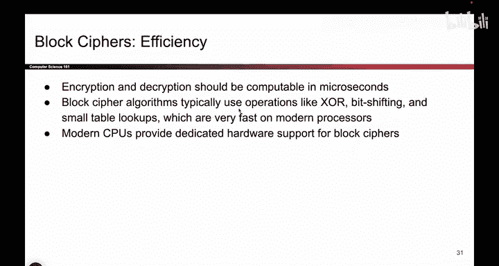
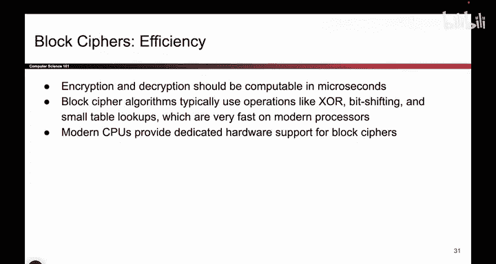
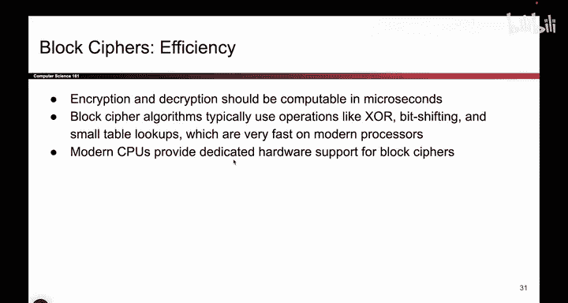
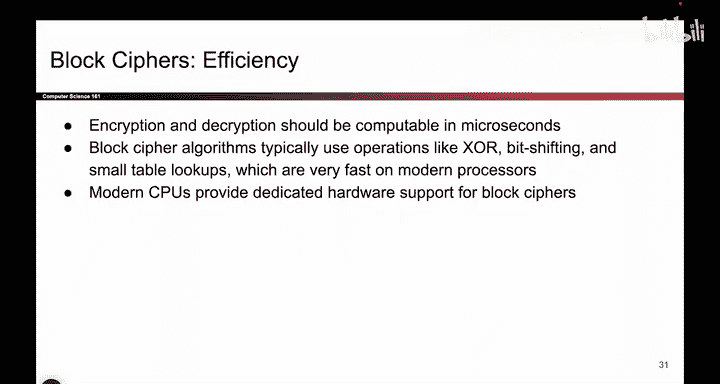

# UCB《计算机安全｜CS 161. Computer Security 2025》中英字幕 - P97：-Cryptography2, Video 6- Block Cipher Efficiency.zh_en - GPT中英字幕课程资源 - BV1VhEhzMEPL

So thats security。 Now we can talk a little bit about efficiency。 So remember。

 even though our intuitive picture is to draw those little arrows。

 and I think it's nice to think about what's in this box as a family of arrows from which you pick one。

 you pick your favorite one based on your key。 Do remember that ultimately this is a piece of code。

 and that the code is deciding where the arrows go。

 So it's taking n it's taking K and it's running code to determine what arrow maps to which arrows。

 So it's really a piece of code。 I just like thinking about the arrows because it allows us to play little security games like this。

 but in reality， it's a piece of code and hopefully the code is quite fast。

 So we're actually not going to tell you what the code looks like。

 You can look it up if you're curious。 but what I can tell you is that the code does operations that are very fast on modern computers。

 It does operations that modern computers like to do。😊。

Your computer loves doing things like Exor and shifting bits and looking at values on a table。

 These are operations that modern computers are really good at doing。 So as a result。

 blockypherers generally run really fast。 They don't do any really complicated math where you have to exponentiateiate something or divide anything。

 None of that stuff。 You just take bits and you shuffle them around and that creates the arrows that you saw earlier。

 and in fact， modern CPUs are actually built。😊。

To specifically be good at block ciphers， because we all know what a block cipher is。

 everyone uses a block cipher so modern CPUs are actually designed to be good at block ciphers。

 so not only are computers good at this stuff but we are actually building computers to be good at block ciphers on purpose because everyone uses them so much。

 So this is a case where we're encouraging users to use block ciphers because they're so fast。

 you'll never notice the time that it takes to encrypt something。😊。

In most cases。So what is the block cipher code Here's a little bit of a backstory on how it was built。

 So the block cipher code had to be designed by someone and actually in the 2000s and the late 1990s。

 they had a little competition to see who designed the block cipher。

 which is kind of cool a fun fact。 I forgot to change this slide from last semester。

 So I guess this arrow here forever。 I did not design one of the finalists。

 but David Wagner who taught this class last semester， he actually did design one of the finalists。

 So he was in one of the top five he unfortunately was not first place。

 but top five is still pretty good。 So that's good for him。

 but ultimately something called Rinel was the winner and what that meant was that now everyone agrees that the Rinel algorithm is the one that you use if you want to encrypt and decrypt messages So lots of different pieces of code to generatearrows could have gone in those boxes in a different world。

 David Wagner would have had the algorithm that we used but。😊，In reality， Rinel was used， but hey。

 top five is still pretty good。