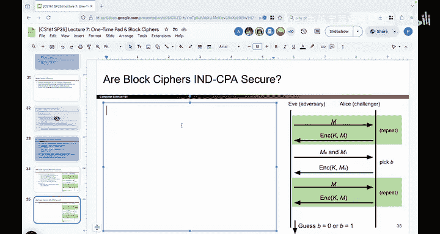
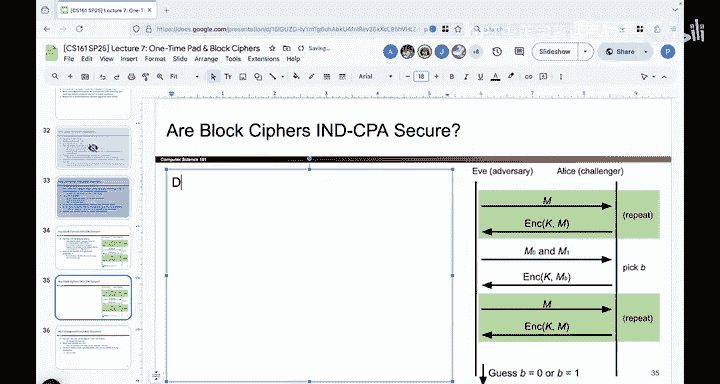

# UCB《计算机安全｜CS 161. Computer Security 2025》中英字幕 - P98：-Cryptography2, Video 7- Block Ciphers are Not IND-CPA Secure.zh_en - GPT中英字幕课程资源 - BV1VhEhzMEPL

Okay， now let's talk a little bit about whether block cphers are in CPPA secure。

 So we've gone through a proof that shows that they behave like random permutations。

 The proof did not show that block cphers are secure under our model with Eve and Mallory。

 It just showed that block cphers behave like random permutations。 In other words。

 the arrows were dropped in totally different places。

 but we actually haven't shown you if they're secure yet， So let's do that next。 So to do it。

 you can read this text if you want to， but I think it's actually more fun if we play the N CPPAA game together。

 So let's give it a try if I can pull up a blank slide going a little bit off script here。

 but it's okay。😊，All right， so we're going to play the NCPAA game together。

when we play this game， I will be Alice， so I'm learning this game and I want it to be secure you're going to play E if you're going to try to break my skin。

 so I'm going to use a block Cypher with a secret key that you don't know。 In other words。

 if you go back to the block Cyphers and I realize I'm going a little bit far off script here。

If you go back to the picture on block ciphers， there were all these different arrows and permutations。

 I have chosen one， there are two to the K different permutations out there， two to the 128。

 that's a gigantic number。 you can never list them all out。

 I have narrowed it down to choose just one so my code。

For the block cipher my Rineelll AES code is going to take one of these， for any input that I give。

 it's going to find the corresponding arrow and spit out the output。

 but you don't know what the arrows are， from your perspective。

 they basically might as well be random because of this little proof that we showed。So I have a key。

 you don't know it， and I'm going to use the key to apply my block cipher and I know all the arrows showing which input map to which outputs。

 but you don't。😡，But you're going to try to break my skin。 So let's give it a try。

So I'm going to skip this first step。 You can actually use it if you want to。

 It turns out you can win without this。 So I'm not gonna to let you use this step。

 although in theory， you could， if you wanted to， I'm going to make you start here。

 So you need to start the challenge right now。 Tell me two words of equal length that you want to see encrypted。

You want to do dog and cat again。 Okay， let's do it。 So your two words are dog and cat。

 So we'll say M0 equals dog and M1 equals cat。 You don't know which one I'm going to encrypt。

 So I'm now going to turn around。 You can't see me。 I'm going to go into my blog cipher。

 I'm going run the AE code。 It's going to tell me for whichever one I've chosen If I follow the arrow。

 What is the corresponding three letter output。 You don't know which one I chose。

 So now the encryption of K using K， which you don't know from my random message。

 which is dog or cat， but you don't know which one。 Okay， it's this。

Okay， you have no idea which one I encrypted。对。So now let's move on to the next step。

 you now have the power because you're Eve and we're doing a chosen plain textext attack model。

 you now have the power to ask me to encrypt anything you want。

 you can ask me to encrypt anything in the world， and I will faithfully use the key to encrypt it and return it to you So what would you like to encrypt using your newfound power in this step？

Anything you want。You want to encrypt dog， Are you sure you don't want to change your mind？

They don't want to them crimp。Horse， you don't want to encrypt。Donkey， you want to encrypt dog。 Okay。

 I guess I'll encrypt dog for you。 So I turn around。 You can't see me。

 I faithfully use the key to follow the arrow for dog because that's what you ask me to encrypt。

 Okay， here's what the encryption of dog is。 because you ask me。

 So the encryption of K of the message dog is。😊，That are you satisfied or do you want me to encrypt more？

You want to encrypt cat， are you sure。You don't want to include elephant or something。Okay。

 I'll encrypt cat for you。 So I turn around。 You can't see the key。

 and I follow the arrow using the code that's written。 And the encryption of K comma cat is that。

Now are you satisfied or do you want me to encrypt more？Or are you ready to make a guess？

I think you're ready to make a guess。 So here we go。

 You have to tell me whether or not this mysterious message， which was either dog or cat。😡。

Was dog or cat。 So you got to tell me it was this zero， which means dog or one， which means cat。

Who thinks dog？Who thinks cat。 Allright， So 100% of you think it's cat。 So this is one， which is cat。

 And turns out you're right。 It was cat。 So you have broken my scheme because you won with 100% probability。

 And if we did this over and over again with lots of different words。

 you would have won every single time。 So your Eve and you can declare victory because you won this every single time。

 So that means that block ciphers themselves are actually not in CPA secure。

 They do behave like random permutations。 You couldn't tell what arrows I was using。

But they're not in CPPA secure under the model of chosen plain text attack。

 That's what all these words say。 But we played it with a game to hopefully make it a little bit more intuitive。

 which you won， and thankfully you won， otherwise it would have been very bad if you lost。

 but you did win and you won with probability at 100% and what that tells us is that block ciphers are not I andD CP secure。

 because you， the attacker emerged victorious。 And in fact， we showed something even more general。

 which is that all schemes that are deterministic， which means that if you encrypt something twice。

 you get the same output twice， are not in CPPA secure because you can play the same trick that you just did。

 So if there's ever a scheme that you come up with， but it's deterministic。

 which means that encrypting the same thing twice results in the same output。

 it's always not in CPPA secure。😊，Because of the exact same trick that we just played。

 And that's actually a good thing。 You might wonder。

 why aret we giving Eve this power to reenrypt dog and cat。

 that's good because if we have a scheme that's deterministic， if someone encrypts something twice。

 we could tell that they're encrypting something twice and that's bad。

 So it's good that deterministic schemes fail this game because we don't want to let deterministic schemes be considered secure。

 kind of a digression because it's more general， but the thing you should know is that block cphers。

 the code that generates a permutation that I then secretly used is not in CP secure because it is deterministic。

😊。