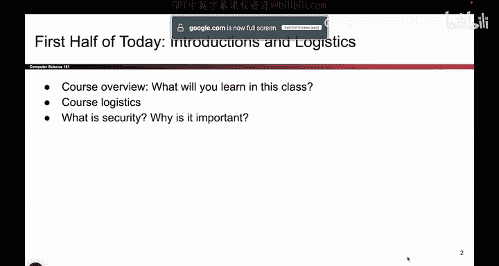
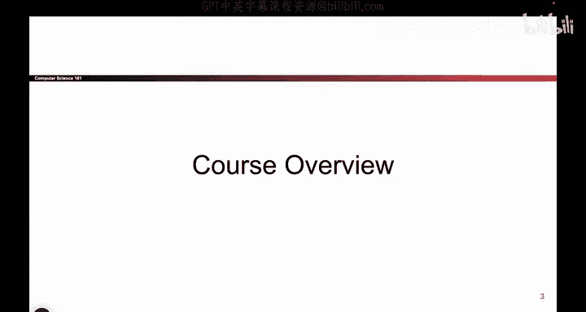

# 001：-Intro1, Video 1- Course Outline.zh_en - GPT中英字幕课程资源 - BV1VhEhzMEPL

Okay， if you can hear me clap once。They hearing me clap twice。The game clap three times。

We keep going until everyone quiets down， okay。

Okay， cool CS 161 hello so today's going to have a two part lecture。

 first part give you a bunch of introductions， kind of tell you about how the class runs。

 and then the second part talk a bit about security principles so I hope you enjoy。😊。

Okay， so this is what you will learn in this class。 I hope。

 So youll learn about how to think about computer systems adversarally。

 that might not be something you've done so far。 So so far if you've taken Csx0 and B or Csx and C。

 You've thought about can my code work。 That's my goal。 If the code works， It's good。

 But in this class， we're actually gonna think about code in the face of attackers。

 people who are intentionally trying to do bad things to your code。

 And we're going think about how do you assess threats and try to figure out which threats matter。

 which ones don't will think about how to build computer systems that are secure against attackers and we'll also try to think about what today's technology isnt isn't able to do。

 So hopefully that'll make you a better consumer。 When you go out and try to buy different security tools。

 And ultimately will'll show you some mistakes that people have made through the years in the hopes that you do not make the same mistakes。

 So fingers crossed。😊。

Okay， so this is how the class is structured。 There's four major units。 So first。

 there's this little info to security。 That's today。

 And we'll talk about some philosophy behind thinking about security。

 and then we'll get into the first unit， which is memory safety。

 This is the part that heavily relies on CS62 and C。 So you've been warned。

 This is the part where we'll think about insecure software C And then we'll think about how you defend against those attacks。

 And then after that， which is about three to four weeks。 will jump into cryptography。

 that people who love math。 This is their favorite section。

 This is the section where we think about how do you securely send information in the phase of attackers who want to read or modify your data。

 So that's gonna to take us through the next three or four weeks。

 then you have a midterm right there halfway through the class。 Then we'll do web security。

 where we'll think about attacks on the web and then we'll do network security where we think about attacks on the Internet。

 And if we have time at the end， we'll give you some random special topics。

 So that's kind of how the class is set up。😊。

O。So what I kind of like about 161， if I had to give it to you as a quick pitch。

 I think it's cool because not only do you learn about security。

 but even if you never go on to work into a security field and you go on and you do some other piece of software development that's totally fine we still give you a lot of really neat tools you can take and use in the real world。

 So for example， when we talk about memory safety， we're going to really heavily rely on GDP。

 which is used for debugging C code and it's gonna to make you hopefully a much better debugger than you are now。

 So that's pretty cool。 when we talk about the web。

 we'll also give you a quick speed run about how the web works before we can talk about how to break it。

 we have to show you how it works。 so that gives you a little bit of a preview of CS169 and if you're interested you can take that for more details and then when we talk about networking you get a networking speed run2 and that will give you a preview of how the internet works。

 So if you ever take CS168 the networking class will give you a bit of a preview on that。😊。

That's what I find call about 161， even if you' never working in security。

 you get all these fancy skills that you can take with you。

Okay， that's the overview。

Stop me if you have questions。