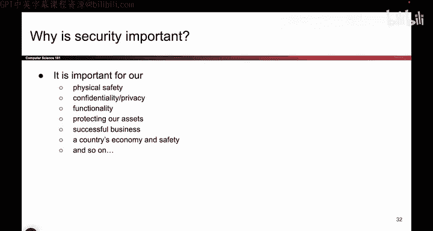
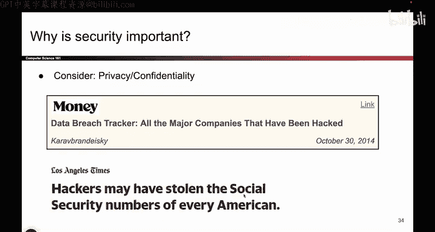

# 003：-Intro1, Video 3- What is Security_.zh_en - GPT中英字幕课程资源 - BV1VhEhzMEPL

Okay。So let me give you a quick intro on what security is。 This is the word in the course title。

 might as well define it。 So what we want is we want certain properties in the presence of an attacker。

 As mentioned before， it's no longer good if your code just works。

 it actually has to work in the face of people who are intentionally trying to do bad things to your code。

 and we'll see all these different properties that we might want to enforce even when there's an attacker trying to break them。

And why is security important， hopefully not something I have to really convince you on。

 but security pops up all over the place， so pops up with safety， privacy， important for businesses。

 important for organizations， important for politics， and so on。

So here's a bunch of headlines that we've ripped that show you security in action。

 So here's a car that got hacked。 Here's a pacemaker。 That's the thing that they put in your body。

 Apparently that can also kill you。 So that's pretty grim。 planes can be hacked。

 So basically the takeaway here is security has physical implications can actually hurt you if you don't do it right。

 So it's very important that we do it properly。 Smart refrigerators with the death beams。 Okay。

 so it's very scary。Okay but else well privacy is important。

 so there's tons of companies that get hacked， they can steal your Social Security number。

 they can steal your bank information， so those are also things we have to watch out for。

 national security， politics， maybe countries will try to attack each other for political reasons。

 that's also something that we have to watch out for。

So what is hackable， What things do we have to protect。

 I think basically anything that's a computer has to be protected。 Nowadays。

 we put computers in damn near everything。 So there's a lot of things that we have to protect our computers。

 our phones， our fish tanks， our refrigerators。 All sorts of things have computers embedded in them。

 And those are all things where we have to think about security。

 We don't want someone hacking the fish tank to break into the casino。 It sounds like a movie plot。

 but maybe that's real。I don't know。 And here's the refrigerator story for you again。Okay。

 so hopefully I've convinced you that security is important and that things are hackable。

So now that we know what security is and we know why it's important。

 I'm going to give you a list of 10 or 11。 I always forget to count this。

 but let's say it's 10 or 11 security principles。 So they're not super technical。

 I not gonna go into too many technical details today。

 But what these are are a set of principles that you'll think about as we go through the class。

 So they're kind of ways to think about security and I would call them the overarching theme of this class。

 And as we show you lots of specific examples with cryptographic math or programming and see these principles will come up over and over again。

 So it's good to have them in the back of our minds as we go through the whole class。

 So the way this will work is I'll go through all of them。

 I'll tell you a little story and then we'll reflect on the story and think about the principles that the story is trying to teach us。

 So that's the goal for the rest of today。😊。

