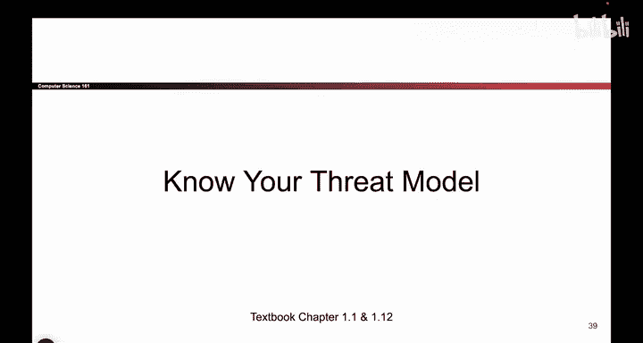

# 004：-Intro1, Video 4- Know Your Threat Model.zh_en - GPT中英字幕课程资源 - BV1VhEhzMEPL

Okay， so here we go。 This is the first one's called no year threat model。

 So I'm going to tell you a story。 I don't need you to memorize this。

 and I'm going to test you on what kind of bear this is。 but this is the story。

 So we have two hikers。 They're camping in the woods。 And one day a bear pops up。 bear。Very scary。

 So the bear pops up。 And the two hikers， Well， they jump up。 It's a bear。 It's gonna eat us。

 So one of the hikers， they get up and they start tying their shoes and they start racing away。

 And then the other hiker， they're pretty leisurely。 They go first a stretch。 they check their phone。

 They grab a bite to eat， And the first hiker says， well， what are you doing is a bear。

 It's gonna eat us。 Why are you so casual。 And the second hiker says， Well。

 I don't have to outrun the bear。 I just have to outrun you。So what is the story trying to teach us。

 while teaching us that if we have an attacker， like this big， scary bear。

Maybe it's enough to just make the bear look somewhere else。 So instead of trying to defeat the bear。

 I really just have to make the bear the other guy。 So that's the story。

So what is this story trying to tell us And again， I'm not going to test you on this。

 but I will test you on what the story is trying to teach us。

 So the story is trying to teach us that when we think about attackers。

 we have to build a model of who the attacker is， what are they able to do and what are they not able to do so we really have to reason about who the attacker is so that we know what we're up against and how to defend against them。

 So， for example， if we have an attacker， we might want to think about why are they trying to attack us like this bear。

 why is the bear trying to attack us。 And in real life。

 there's all these different reasons why people might want to attack us。

 So they might want to steal our money， there might be political reasons they want to attack us。

 they might just want revenge， they might be doing it for fun。

 So there's all these different reasons why people might want to attack us and being able to think about the reason people are attacking us that can be helpful because maybe we can make them go away by trying to remove the reason that they want to attack us。

And so， for example， let's think about you。 So you're a person。

 someone might want to attack you and your computers。 So， for example。

 someone might want to attack you for your money if you're playing a game online and someone gets really pised at you。

 they might try to hack you for revenge， maybe you're a top secret spy and governments might want to steal your intelligence maybe you broke up recently and you have an ex who's not super happy with you。

 they might try to take things away from you or try to hack you。 So as person with a computer， well。

 you also have to think about your threat model who are the attackers who might want to attack you for example。

 I don't know about you， but I'm not a top secret spy。

 So maybe it's the case that governments are not going to try to steal private information from me or I don't know。

 maybe you're filthy rich and we don't know。 And if you're filthy rich。

 maybe someone's gonna to try to attack you for money。

 So thinking about your own threat model can be helpful in real life。

Okay， so it's kind of philosophical。 Let me give you some examples of attackers that we will see in this class。

 So in this class， we're gonna think about attackers who know what they're doing。

 So it's not enough to say， I'm going to assume all my attackers are really dumb。

 And then I don't have to worry about them。 So when we think about attacks。

 we have to think about attackers who are smart who are willing to put in the work。

 We have to think about attackers who know about our system。

 That one will dig into more in a later security principle。 But for example。

 you have to assume the attacker knows what kind of software you're using， what version you're using。

 Here's an interesting one。 attackers can get lucky。 So what does that mean， Well。

 maybe you have an attack that only works one out of every million times。

 And you think that's totally fine who' is gonna get so lucky that they succeed one in a million times。

 What if your attacker just shows up and tries1 million times。 Well。

 then they're probably going to get lucky。 So we can't rely on attackers getting lucky。

 they actually might get lucky。So those are all things that we might assume。

 And as we go through the classroom and show you different attacks。

 we'll always keep in the back of our head what type of attacker we're facing。

 So that's the threat model。One more thing we'll think about when we think about Bt models is something called the trusted computing base。

 This is basically a fancy word that says when I'm building a system。

 some parts of my system are security sensitive and some parts of my system are not security sensitive。

 So， for example， if I'm building a big website application。

 it could be the case that a lot of things， they're not really security sensitive。

 Like the code that serves the cat videos， that's probably not super security sensitive。

 But the code that lets a user log in and type in their password。

 we really have to protect that against attackers。 So when I'm building a system。

 it's useful to think about what parts of my system。

Provide the security that everyone else relies on。 For example， the code that lets people log in。

 And we call that the trusted computing base。 And it's important that our trusted computing base is correct。

 that there's no way to get around it and bypass it and that no one can break it。And in general。

 it's good to keep the trusted computing base small because if I have a small piece of code。

 it's easier to audit it and make sure that it is secure。

 whereasas if I have thousands and thousands of lines of secure code。

 Well then I don't really know how secure it is because there's so much code to write and debug and keep track of。

 So having a small simple TCB can be useful。It's kind of a philosophical point。

 but something we keep in mind。Okay， that was the first security principle。Questions。

