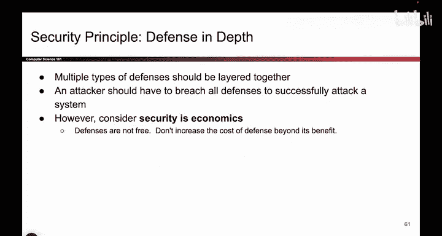

# 008：-Intro1, Video 8- Defense in Depth.zh_en - GPT中英字幕课程资源 - BV1VhEhzMEPL

Nope。Okay。Making good time。 So here's another story for you。

 So we're going travel back in time to Constantinople。 It's an old city。

 They're renamed it at some point。 And if in this city。

 what you will see if you travel there is there's a wall to keep attackers from entering。

 And if you cross over the wall， there's a moat ring of water。😊，And then if you cross over that。

 there's another wall。 And then if you cross over that， there's another moat with alligators。

 and then you cross over that， there's even bigger wall。

 There's towers that will rain fire on you if you try to enter。 So what are we showing here。

 What we're showing is the first wall was pretty good。 But then we built the second wall。

 And then we built a moat。 And then we built another wall。 And we built the alligators。

 And so what we're showing is something called defense in depth。

 We're adding multiple defenses against the same attack。 that is people trying to enter the city。

So what did the wall show us， The wall show us that we can actually layer defenses together so that if an attacker wants to get into our system。

 they have to break all of the defenses。 they have to break the wall and the moat and the alligators and the towers that rain fire on them。

 So defense and depth is something we can think about。

 we can add multiple layers of defense to stop attackers。 But why not just build hundreds of walls。

 remember， we also have to think about economics，  building walls are not free。

 So every wall that you build cost you extra money。 And so for example。

 if I have one wall and I build a second one。 That's pretty good， maybe I'll build a second wall。

 But if I already have100 walls， do I really have to build the 100 and first wall is the extra cost of that going to be worth the benefit。

 I don't know。 You have to think about the tradeoffs。 So that's defense in depth。

 but it's limited by economics。

