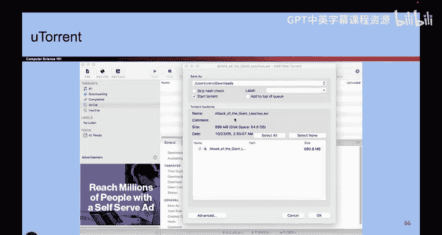

# 009：-Intro1, Video 9- Least Privilege.zh_en - GPT中英字幕课程资源 - BV1VhEhzMEPL

Okay， here's another one。 least privilege。 So we're gonna go watch a movie。

 So we's go watch a movie together。 So I'm going to my favorite streaming site and we'll watch some movies legally。

 So we'll click agree。 It's great。 And so here we are。 And we'll download a movie。

 What are we downloading。 We're watching attack of the giant leeches。 Sounds great。😊。

So when we downloaded the movie， what permissions did we give to this program？ Well。

 this program had to be able to write things to my disk。 to download the movie。

 It had to be able to receive the movie from the Internet。

 And so we had to give this program a lot of powers。

 This program had the ability to use the Internet， to read to my file system to write to my file system。

 So if this program were malicious。😊，What could it do， It could read my files。

 It could delete my files。 It could send emails pretending to be me， It could run other programs。

 So here's a case where。This is some application， and we're giving it a lot of powers。

 some of which it probably doesn't need。 So let's think about， if we're building a program like this。

 what permissions do I have to give it for it to properly function。

Well， it definitely has to display a window。 It has the right to the file system to download my movie。

 but maybe I don't have to give it access to all of my files。

 Maybe this program doesn't need access to my passwords file。

 it only needs access to some folder where I store all my movies。

 and maybe it needs to be able to make internet connections and download data。

 maybe it doesn't need to upload data， maybe it doesn't need to send email。

 So kind of the takeaway from this is we need to think about what permissions we're giving to this program and ideally。

 we want to give this program just enough to function and we don't want to give this program too many permissions。

 if we give it too many permissions and it's malicious。

 it's going to do a lot of unnecessary damage to our computer。

So we got to think about what does the program need to function correctly。

 and let's try not to give the program any unnecessary permissions because if it's malicious。

 they might try to use those unnecessary permissions against us。

 and that's an attack that we could have defeated just by considering our permissions carefully。

So that's another example。 think about R Ts。 So we're writing an exam。 It's top secret。

 You cannot see the midterm right now。 So what am I gonna to do。

 We could either give the exam to all of our staff And if any of them are evil。

 they can lead the exam to you。 or we could just give the exam to the Ts who are helping and writing and proofread proofreading the exam。

 So that way that's a smaller amount of people who have access to our top secretre exam。

 So that's an example of if R TA isn't working on the exam。 I don't have to give access to them。

 because they don't need it。 So that's another example of least privilege。No。

 the exam is not written yet， so you can't steal it， even if you wanted to。

