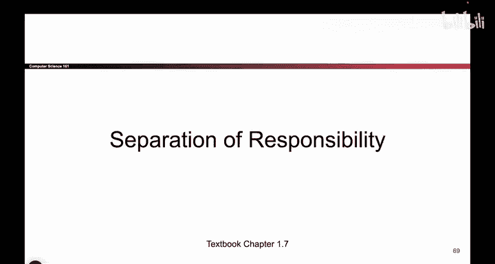
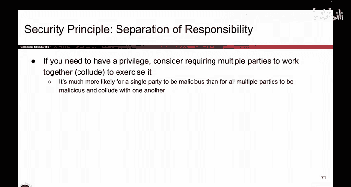

# 010：-Intro1, Video 10- Separation of Responsibility.zh_en - GPT中英字幕课程资源 - BV1VhEhzMEPL

O。So here's another story。 This one's about separation of responsibility。

 So if you go in these old school nuclear bunkers from like the Cold War。

 what you'll see is this is a very long table。 I guess the picture doesn't show how long it is。

 It's a very long table。 It goes from this side of the lecture hall to that side。

 And there's two keys that you have to turn to launch the nukes。 There's a key on this side。

 and there's a key on that side。 Why did they put the two keys so far away。

 And I guess one thing I should mention is you have to turn the keys at the same time。

 So why are the two keys so far away。 Why don't we just put them next to each other。

Audience participation。 Tell me why the keys are so far apart。Two people。

 exactly by putting the keys really far apart。 we need two people to agree to launch the nukes。

 And that's why it says two man policy。 So the idea here is if we have something really sensitive。

 like launching nukes。 consider requiring multiple people to agree to exercise that privilege。

 So for example， if I have nukes， I'm going to require two separate people to agree before the nukes can be launched And so this way。

 I'm protecting against a single attacker because if one person tries to be malicious。

 they cannot launch the nukes by themselves， it would actually take two people to be malicious and it's more likely for one person to be malicious than it is for two people。

 So by requiring multiple people to agree two keys， three keys，5 keys。

 I'm making it harder to exercise this dangerous task of launching nukes。

 That's called separation of responsibility， we're putting the job in multiple peoples hands so that a single attack。

Can't hurt us， takes multiple people to hurt us。

