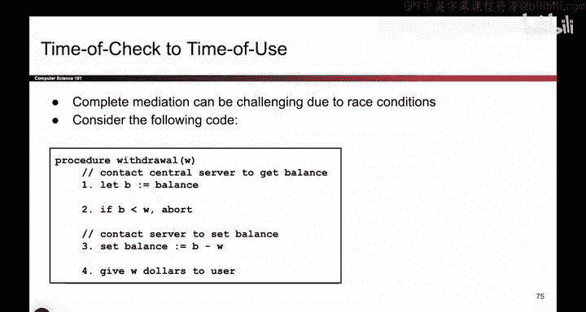
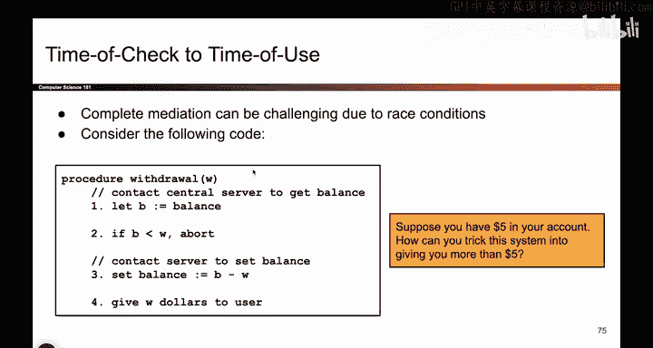
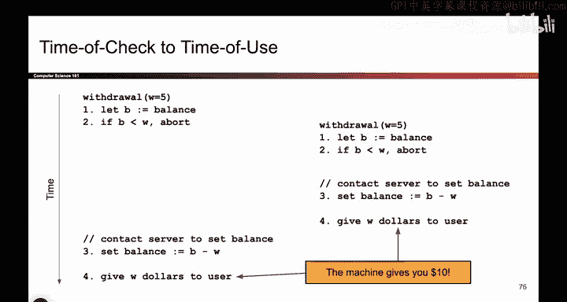

# 011：-Intro1, Video 11- Ensure Complete Mediation, Time-of-Check to Time-of-Use. - GPT中英字幕课程资源 - BV1VhEhzMEPL

Okay。We're making great time。 So here's a picture。 Tell me what's wrong with it。

 I realized it's kind of blurry。 But here we have this little security gate。

 Is this gate stopping cars from driving through。What do you think？No， what are the cars doing？

They're driving around。 So what is the problem here。 We had this barrier。

 but the cars are simply driving around it。 So what we really have to do is make sure that this checkpoint doesn't have a way for users to bypass it。

 So what we call this is ensure complete mediation。 All the access points should be protected。

 and there should not be a way for users to go around the access point。

 And sometimes people will use a fancy term reference monitor to refer to the point through which all access must occur。

 So， for example， when you go to the airport， you have to go through security。

 They have to go through the metal detector。 And so that's a single point through which all passengers have to pass them。

 they all have to go through the security， there's no way to go around the airport security that I know of。

 And another example， when you go to your dorms， there's a single entrance and everyone has to scan their key car to get inside。

 So that's a single point of access。 and everyone has to go through it。

 There's no way to go around it。 or。Examp later in the class we see firewalls。

 another example where everyone has to go through one point of access。 And this reference monitor。

 Well we have to make sure that the monitor itself is correct。 There's no way to bypass it。

 There's no way to break it。 And maybe another way of putting all this is the reference monitor should be part of my TCB。

 The trusted computing base。 So here's an example where complete mediation is not being insured。

 We have to make sure if someone wants to access our program。

 They have to access it through a single point of access。 And that point of access is secure。

So that's one example。 Let me give you a more exotic example of complete mediation。

 And we'll talk about it after I show you the example。

 So here's some code to withdraw money from the bank。 So here's what I'm going to do。

 If I want to withdraw money。 I'm gonna check how many dollars does the user have。 That's B。😊。

And if it is the case that the user has， say，$10， but they want to withdraw $20 as not allowed。

 You have $10。 I cannot give you $20， so I will abort and show the user an error message。 However。

 if the user does have enough money to withdraw， then what we will do is we'll go to the bank willll decrease the balance。

 So we'll subtract however much the user wants to take out。 and then we will give the user W for use。

So that's the code。 And you can imagine I have all these different ATM machines and they're running this code if the user wants to withdraw money。

So let me give you a clever way to exploit this。 So let's say the user has only $5。

 but they want more than $5。 How are they going to use this code to get them more than $5。

What if I have two machines， And I'm gonna draw a timeline of what I'm doing。

 So let's say I walk up to the first machine， and I hit the button to withdraw $5。 Remember。

 the user only has $5 in their bank in total。 So they hit the button to withdraw $5。 and we check。

 How much does the user have in the bank$5。 How much does the user want $5。 That's okay。

 the user has enough money。 So we will let this check pass。 And before this code can run further。

 I'm now going to quickly switch to the second machine and hit the withdraw button on the second machine。

 So here I am on the second machine。 The first machine is still running。

I run over to the second machine。 I hit the button and the code runs again。

 and I check how much money does the user have。 It's still 5 because this code hasn't finished learning it。

While the user has $5， can they withdraw 5， Yes， So what am I going to do， I'll go to the bank。

 I'll set the balance to0， and I'll give the user $5。Sometime later。

 the machine on the right continues running。 It says the balance to zero， and it also spits out $5。

 So here's a case where I only had $5。 but by hitting the withdraw buttons at very specific times。

 I was able to withdraw $10。

It's kind of dangerous。 So what actually happened here。 Well， if you squint at this really carefully。

 this actually is also a case of not ensuring complete mediation。

 but instead of the car example where we fail to ensure mediation in space here。

 we're failing to ensure mediation in time because there's this check right here to check if I have enough money But by the time the check succeeded。

 Well， I have not updated the balance yet。 and I go to this other machine and I hit the withdraw button and this withdraw a complete successfully as well。

 So this is a case where I have this check implemented。

 but because people can exploit race conditions， it's actually not the case that this is ensuring complete mediation。

 I'm not stopping everyone from。Withdrawing more money than they have。

 So that's another case of not ensuring complete mediation。

 We exploited a race condition to withdraw more money than we have。

 Sometimes we call this time of check to time of use。 because this is the time when we're checking。

 this is the time when we're using and spitting out the money to the user。

 And if these two things don't happen together， we could have these strange race conditions happening。

Any thoughts on this one， This one takes a little bit of staring at to get。

 So feel free to stare at it a little bit more。

