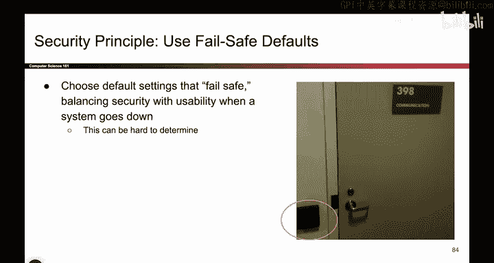

# 013：-Intro1, Video 13- Use Fail-Safe Defaults.zh_en - GPT中英字幕课程资源 - BV1VhEhzMEPL

ok。Almost done， I told you there's a lot of them， I think there's two more。

O。So if you ever go to Soda Hall， the room actually lock。

 these these little key cards scan the key card and lets you in the room。

 So I have a question for you。 What if the power goes out。

 Do you think these doors should lock by default or do you think they should unlock by default。

 Remember， the powers out so these key card scanners don't work。

 So should we throw all the doors open or should we throw all the doors closed and lock them。Well。

 it kind of depends。 So， for example， if I locked all the doors when the power goes out， well。

 then nobody can get in， nobody can get out。But what if I fail open， that is。

 I unlock all the doors when the power goes out。 Well that now anybody can open these doors and access whatever is behind them。

 So which one is better， it kind of depends on the door and what you're putting behind it。

 If the door has expensive equipment。 Maybe I want it to be locked by default。

 What about the doors that are emergency exit， those should probably be unlock by default。

 So the takeaway here is it's not always so obvious what to do when your system fails。

 You gotta think about what do you fall back on when the system fails。

 Sometimes it's better to fail closed， Sometimes it's better to fail open。

 And it really depends on your system， your threat model。

So the takeaway here is you have to choose a default setting that is safe for your system。

 And there's kind of a trade off。 So you have to trade off security that is failing closed and locking everything to protect it with usability。

 That is when the system goes down， Maybe you want some doors to be open So you can access whatever is behind it or so that you can escape out of the emergency exit。

 And sometimes choosing the right one is kind of hard。

 It's not always obvious Do you want a default to locking or default to unlocking。

 So picking failsafe defaults can be tricky。

