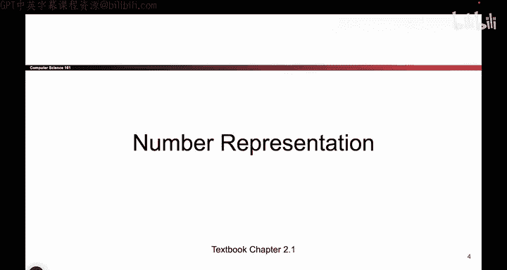
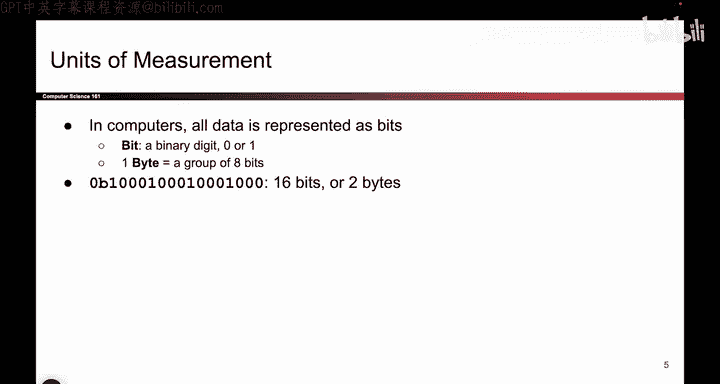

# 015：-MemSafety1, Video 1- Number Representation.zh_en - GPT中英字幕课程资源 - BV1VhEhzMEPL

Okay， today's topic is X86 assemblyly and call stack， I hope you're excited。

So these are the security principles from last time， I won't read them out loud。

 but remember that these are the things that we keep in mind as we go through the class。

So the first half of today is going to be mostly reviewed from CS61C。

 We'll think about how computers represent the code and the data that we're trying to store。

 and then in the second half， we'll cover some new content using an assembly language that you might not have seen before called X86。

 and in particular， we'll focus on how you call a function in X 86。 so that's the plan for today。

So the first thing we have to go through is number representation。

 So hopefully from C S6 and C or some other prerequisite class that you've taken。

 you remember that all data is ultimately represented as bits。

 It doesn't matter if you're representing a number or a picture or a string。

 Everything is ultimately represented as ones or zeros and。

Just like how when you're measuring， say， distance， there's different units of measurement。

 there's meter， there's kilometer， there's centimeter。 Well， just like that。

 there are also different ways to measure the number of bits。 So a single binary digit。

 we call that a bit。 And if you have a group of 8 Bs。 we call that a by。 So， for example。

 this particular bit string has 16 Bs。 and equivalently， we say it has two B。

 Those are just two different ways to measure the same number of bits。

Okay。So we could just go ahead and write out all of the bits with zeros and ones。

 But writing a lot of zeros and ones is going to get very ugly， very quickly。

 So we invented a shorthand， which is instead of writing four binary digits。

 We can actually condense them into a single hexadecimal digit。 And remember， hexadecimal is base 16。

 So there are 16 digits ranging from 0 all the way to F。

 So what we do is we take every four digit bit string and we map it to a unique hexadeadecimal digit。

 And the only reason we're doing this is just because I don't want to have to represent long binary strings as a bunch of ones in zeros by writing them in hex。

 I get slightly easier to read numbers。 And that's good for us。😊，So， for example。

 I could write out some piece of data that I'm trying to store。 It could be a number。

 It could be a character。 I could write it like this， but that's a lot of ones and zeros。

 and I don't want to read that。 So instead what I can do is I can take the first four bits。

 I look it up in my table1，1，0，0 is C and then 0，1，10 I look that up in my table， Where are you at 6。

 So this can be written as 0 x C 6， It's just shorthand for clarity if we're writing in base 2。

 we use 0 B。 if we're writing in base 16 or hexodadeimal， we use 0 x。

 but all that this is is shorthand。

