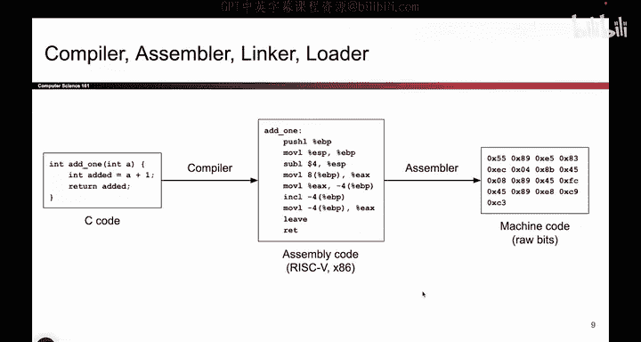
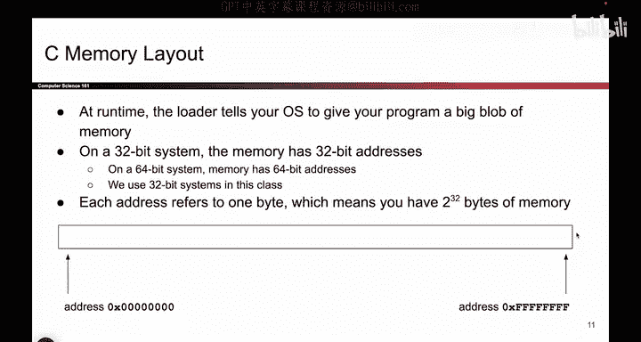

# 016：-MemSafety1, Video 2- Running C Programs (CALL).zh_en - GPT中英字幕课程资源 - BV1VhEhzMEPL

The way。Okay， so now that we know what numbers are and how they're represented in memory。

 we can now think about how do you actually run a C program。

 So let say you've written a nice little program in C what steps does your computer take to actually run that program。

 So this might be something familiar from C S62 and C。

 if it's not will give you a quick summary But basically the way that your computer is going to run a program is。

 You start with some C code。 There it is。 I wrote my C code。

 and the compiler will take your C code and translate it to a lower level language called assembly code。

 And there's different languages that you can use here。 So in Cs6 and C。

 you might have seen risk 5 that was an assembly language And this class will be using x 86。

 That's just another assembly language that you can also use。 But basically， this is lower level。

 So it's easier for computers to understand and run this。 And the final step is this code。

 it's almost there。 but we're gonna do one more thing to it。 The asr is going to take。😊。

This code and convert it into machine code。 A machine code is all raw bits， ones and zeros。

 which I've。Notated here in Hexa Eimmal with short can。 But this is just a bunch of ones and zeros。

 And they represent the same thing as this assembly code。

 So it's like taking my assembly code and rewriting it into a bunch of equivalent ones and zeros。

 And this is code that my computer understands and can execute on my CPU。

 So these are the steps to running a piece of C code。😊。

So maybe something you've seen seen in C S 61 C， The compiler translates C to assembly。

 The assemblyr then converts the assembly code into raw bits。

 There is something called a linker that you might have seen in a previous class that deals with dependencies for this class。

 We're not going to worry about it。 And at the very end。

 the loader is going to set up a bunch of memory that your program can use to store data store variables。

 And it's going to run the machine code。 The raw bits that you created。

 So that's kind of the workflow of how C programs get run。😊，So if I look at this。

 it says the loader sets up memory space。 What does this memory space look like If my program wants to store variables it wants to store code。

 what does that memory space look like， So that's what we're going dive into next。

Okay。So this is what it looks like when I'm going to run my program。

 It's time to start up the program， actually execute it。

 Your operating system is going to give you this big blob of memory。

 You can almost think of it like a giant array of bys。 and each memory box fits exactly1 B。

 And also in the array， every memory box has a unique index， which we'll call an address。

 So you can think of this as a really big array of bys。

 and the lowest byte at the lowest address has address all zeros。

 and the highest byte has address all once。 And every byte in this gigantic array has a unique memory address。

 And in this class will be using 32 B systems， which is a fancy way of saying this address is 32 B long。

 And if an address is 32 Bs long。 And I have。😊，A unique address for every single by。

 That means I have two to the 32 B of memory。 So each one of these bits can be a one or a 0。

 So I have been total2 to the 32 possibilities of addresses。

 That means there are two to the 32 bys going from all zeros to all ones。 There's a big array of bys。

O。So I could actually draw memory like I did before with that gigantic onedimensal array。

 But I think that's really gross to read。 So in this class。

 we're going to draw memory as a twodimenional grid。

 And this is just for us humans to look at it and say this is nicer to look at than the really weird onedial diagram from before。

 But remember， from the computer standpoint， It is just one big array from all zeros to all ones。

 That's it。 The computer doesn't know that there are rows or columns or anything like that。

 This is just for our convenience。 And the way that we'll draw it is that the lowest address is here at the bottom left。

 So you can put a by here and the highest address is up here。 So you could also store bytes here。

 you can store bytes anywhere in here that you want。 and addresses grow as you go from left to right。

 and bottom up and every row is four bys。 All of this is just for us humans to look at these diagrams and understand them easier。

😊。

