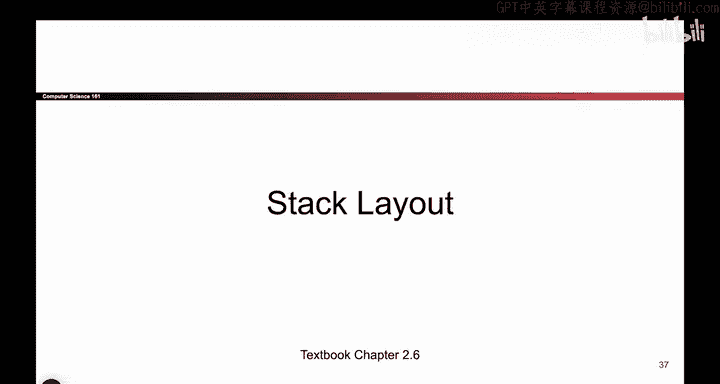
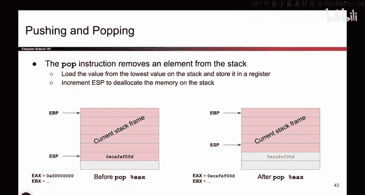
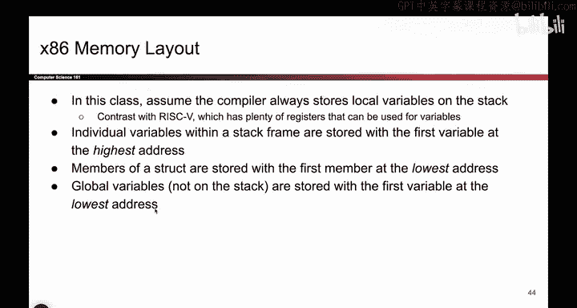

# 020：-MemSafety1, Video 6- Stack Layout.zh_en - GPT中英字幕课程资源 - BV1VhEhzMEPL

Okay。So。Now， let's focus in and talk about the stack some more。 So when your code calls a function。

 Remember， we said this earlier， we have to make space on the stack for local variables。

 And then when the function returns， that stack frame goes away。 So every time you call a function。

 It get some space on the stack when the function returns， the stack frame goes away。

 And as mentioned earlier， if you call a lot of functions。 say you have a really deep recursion。

 then your stack is going to get larger and larger。 and we make extra space by growing down。

 And this is where I want to call out that people often take growing down。

 and they suddenly think that the stack is opposite world。

 I'm just going to read the stack upside down。 and everything is bottom up because it's growing down。

 That is not the case。 when I say growing down， I am saying only one thing。

 It just means if I need more memory， I need more space to store things。

 I'm gonna use a lower address。 That's all that growing down means it doesn't mean anything else。

 So strings are still read from lowest address to highest address is still。😊。

Increase as you move up the stack。 Everything is still the same。 When I say growing down。

 it just means if I need more space， the extra space comes from lower addresses。

 So when you go into an exam or something， don't like。

 see the stack and like flip your exam upside down。

 That's not what growing down means it just means when I need more space。

 Look down in the stack and give me more space than lower addresses。

Okay。So how do you know what the current stack frame is？

 So remember that even though we are drawing this nicely and we've shaded this in red for you。

The program itself is not going to see that this is nicely shaded in red。

 There's nothing on my computer that says， oh here's the stack frame in red。

 So we are going to have to use registers to keep track of where the current stack frame is。

 Remember every function that you call has a stack frame associated with it。

 And I want to know what is the stack frame for the currently executing function。

 So what that means is I need registers to keep track of this in my computer。

 My computer doesn't like take a colored pencil and start coloring things red。

 I need registers to keep track of where the current stack frame begins and ends。

 So I'm going to use two of my registers and remember registers have names。

 These are going to tell me where the current stack frame is。 So EBP。

 that's the name that we've given to a register stands for base pointer。 don't really care。

 But this register with this special name。 It holds an address。

 and it's the address of the top of the current stack frame。 And the EP stack pointer。

 That's a register。If you open it up and look at the value inside， it's an address。

 and it just so happens to be the address of the lowest part of your current stack frame。

 So these two registers hold two addresses。 and they tell me where the current stack frame begins and ends。

 and everything in between， that's my current stack frame that I'm using。

 So these registers hold address。 By the way， if you see these arrows。

 might say what are these arrows actually， So this is the same picture as before EBP points up here。

 EP points down here。 What are these arrows actually mean when I draw these arrows。

 So if you don't like the arrows， you could actually also draw it like this。 EBP holds an address。

 This is the address。 And if I go to that address in memory。

 that address is the address of the top of my current stack frame。

 So EBP is holding an address and it's the address of this part of memory。 And likewise。

 EP is holding an address And if I go to that address， It's the bottom of my current stack frame。

 But I don't know。

YouThis is kind of hard to read。 I had to match up all these numbers。 and that's ugly。

 So instead of writing things like this， which is kind of hard to read， I drew the arrows。

 And the arrow just says EBP is an address。 If I go there top of current stack frame。

 But just remember that these arrows are basically the same thing as storing addresses。

I just don't want to draw them like this。

Because it's annoying。Okay。So now that I know what the current stack frame is。

 What if I want more space。 So say I have the stack frame， It's great。

 But I want to store some more data on the stack。 Well， if you want to do that。

 you can use the push and the pop instruction。 these will allow you to add things to the stack and remove things from the stack。

 So let's say you want to add something to the stack。

 you can use the push instruction and the push instruction does two things。

 The first thing it does is it writes data to the stack。 So for example， if I say push E X。

 I'll take the value in E X。 That's a register， I'll stick it on the stack。 but that's not enough。

 because if I put it down here， I should also decrease EP。

 so that it's now pointing at the bottom of my stack frame。

 So maybe another way of putting this is EBP points at the bottom of the stack。

 if I wrote this data here。 I should move EP down to say there's more things that you care about。

 So EP moves down and now I have more data on the stack。 So the push。Instruct does two things。

 puts the data on the stack and moves EP down as a reminder to myself that this data is also now part of the family。

 It's part of the stack frame。And here's the opposite。 It's pop。 So what does P do。

 It takes the value on the stack and deletes it。 And when I delete it。

 I move ESP up to say this thing that used to be part of the family。

 It's no longer part of the family。 It's been deleted。 So I move EP up to indicate that it's gone。

 And if you want to， you can also optionally take that value and put it in a register。

 So if I say pop EA X。 It just means take this value， remove it from the stack， move EP up。

 I don't care about it anymore。 And then take the value， stick it in the EA X register。

So pop is the opposite of push， and we'll use these two instructions。

O。Here are some assumptions。 X 86 is immensely complicated， and this is not a X 86 class。

 The X 86 manual is like 3000 pages。 we're not going to read it， although I guess you can。

 if you're very bored， but the X 86 like the way it works。 It's very complicated。

 So we'll make some assumptions just to simplify things。 I won't read them all out loud。

 but you'll see these as we go through the class。 So we'll assume local variables show up on the stack。

 you could put them in registers too， we will assume that they're on the stack。

 we'll see that when you declare variables， we're gonna order them with the first variable at the highest address。

 when we have a struct the first members of the lowest address and global variables。

 first variables of the lowest address。 So you're gonna see these as we go through the class。

 So you don't have to memorize them。 but they're just assumptions that we make so that when we draw X86 diagrams。

 we're all using the same assumptions。😊。

Okay， so if you want to test your understanding of the assumptions we just said。

 you can try out this little quiz。 So if you're on the video or something。

 you can pause it and think about it。 But basically。

 the punch line is if I have a function and let's say I want to declare A and then B and then C。

 A is gonna show up at the highest address。 and then we'll make some more space to store B。

 and then we'll make some more space to store C。 So as I declare more variables。

 subsequent variables show up in lower places on the stack。 And if I ever declare astruct。

 the first thing in thestruct F1 shows up at the lowest address and then F 2 and then F3。

 And F1 is 8 by。 So I gave it two rows。😊。

