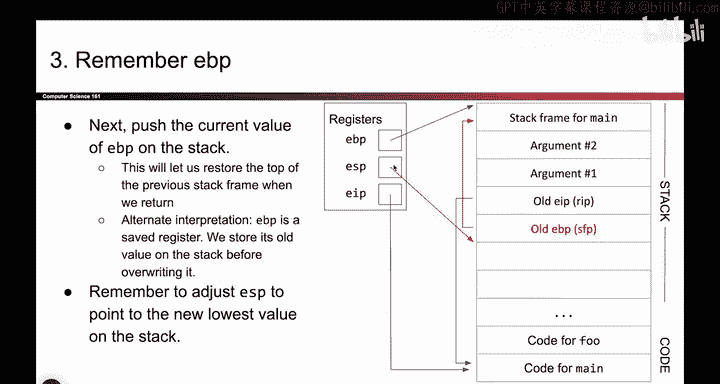
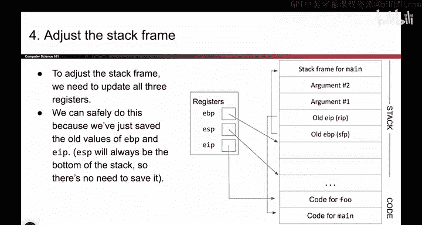
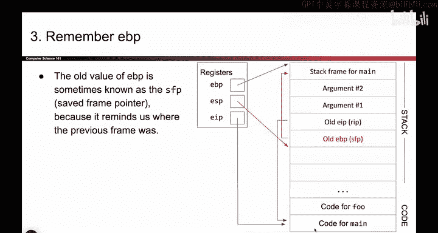
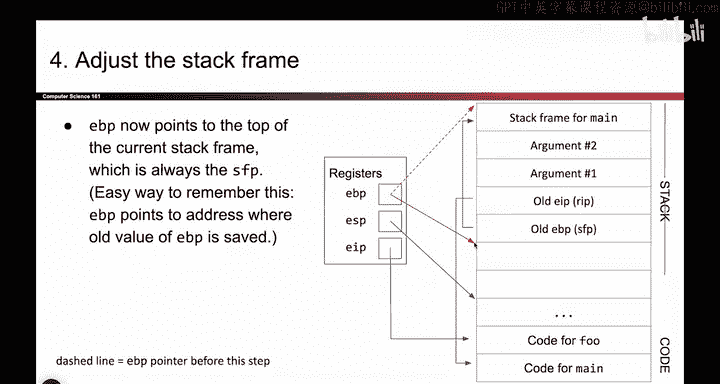
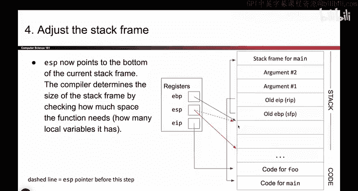
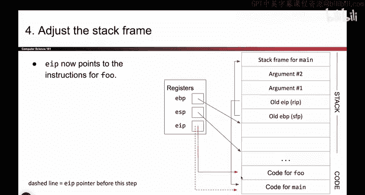
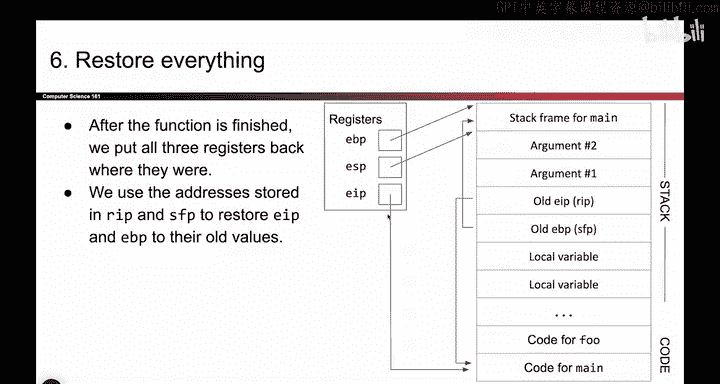
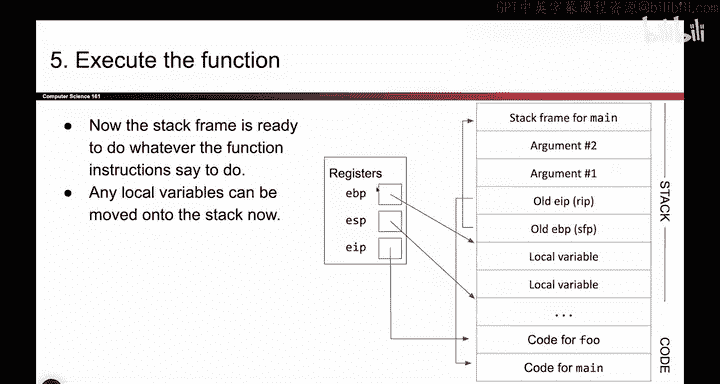
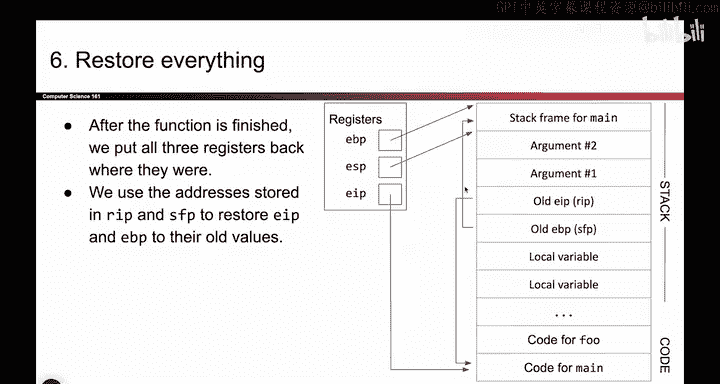

# 023：-MemSafety1, Video 9- Steps of Function Call (Overview).zh_en - GPT中英字幕课程资源 - BV1VhEhzMEPL

Okay。Here's what we're going to do。 So I'm going walk you through what it looks like when Maine calls fo。

 and it's six steps。 So the first step， we are going to push arguments onto the stack。

 So say Maine has some arguments that it wants to give to fo。

 It has to past those arguments to fo somehow。 And there's actually lots of different ways you can do this。

 You could use registers。 Maine could It pick up the phone and tell what the arguments are。

 But in X 86， the conventional way to pass arguments is to put them on the stack。

 So let's say Ma has two arguments for fo， what we're going to do is we're going to push those two arguments onto the stack。

 And remember， when you push things onto the stack。 EP goes down。

 If we didn't shift EP and change its address to be down here。

 These two values would have been below EP， they would have been in the abyss。

 They would have been in undefined parts of memory and we don't want that。 So when I push arguments。

 I push them on the stack。 EP goes down a very tiny little。

A piece of fine print is that arguments are pushed in reverse order， not too important。

 but that's what X86 does。So we have pushed our arguments onto the stack。Okay， next step。

 So now I want to start changing all these registers。 I want to move EBP down here。

 I want to move EP down here。 I want to change EIP to point at F。

 but I can't just start going and changing all these register values because if I do。

 I'm going to forget what used to be in those register values。 So before I can change anything。

 I always have to write down the old value。

That's the second time that I've said that。Let's see。 What's a value that I'm about to change。

 I would really like to change this EIP， because right now it pointing at main。

 I want to change this to the address of the instructions of fo。

 So I want this box to hold the address over here。 But I can't just go to E IP and overwrite what used to be there。

 because then I'll lose the old value， So what I have to do is first take this old value and write it down somewhere。

 Where do I write down the old value of EP。 If only there was some place where I could write down values。

What there's the stack。 So that's what I'm going to use。 So what I will do is this EIP value。

 whatever value used to be here。 I'm just gonna take those bits， the ones and zeros。

 I'm going to copy them onto the stack。 So here they are。 They're living on the stack down。

 This is me saving my work as I go。 so that later， if I change EIP。

 I can change it back when I'm done。 So here's E IP， I take these bits， I copy them on the stack。

 You'll see that this arrow now point to the same place as EIP。

 Both of these boxes hold addresses and they hold the address of the code for main。

 So what I have done here is I have pushed the old value of EIP onto the stack。

 So that later when I'm done， I can put this original value back in the EIP register。

 It's a very long winded way of saying， I saved my work as I went。 And as always。

 when you push something。 EP goes down。So that's step 2。 I wrote down the value。

And now that I've written down the value， I am clear to move EIP because I know the original value。

So what's something else I have to change。 I also want to change EBP。 So that's what I'm going to do。

 So I want to change EBP。 I don't want to point up here。 I want to make a new stack frame。

 like we saw from earlier。 but it's not okay to just take this value and clobber it out with a different value。

 I actually need to take this address and remember it。 so that I can put it back when I'm done。

 So this value right here， whatever bits it has， I'm going to take those bits。

 copy them onto the stack， push them onto the stack。 So I take these bits， I write them down here。

 This is a little note to myself that says， hey， when you're done， take these values。

 put them back in EBP， because you want to put everything back where it used to be。

 So I'm taking the old value of EBP pushing it onto the stack。

 That's why this arrow points the same place as this because this memory box and this memory box。

 They both have the address of the top of the main stack frame。

So that's another value that I saved on the stack so that when I change the registers。

 I have their original values。 And as always， when you push something， EP goes down。

That's just something that always happens。Okay。So now that EBP is safe and EIP is safe。

 Both of these values are safe。 I remember their old values。 Here's a reminder。 Here's a reminder。

 They tell me what the old values are。 Now I am clear to move the registers as I want。 So here we go。

 This is before。 this is after all the registers dropped down。

 So here's before we were pointing at the main stack frame and the instructions for main。

 now they all drop down。 Now E IP points of the code for EBP points at the top。

 EP points at the bottom of my new stack frame。 So to give you a before and after EBP used to be at the top of the main stack frame。

 Now it's at the top of the new stack frame for F。 EP used to be at the bottom of the main stack frame。

 Now it's at the bottom of the stack frame。 And finally， EIP used to points at main。

 Now it points at the code for。 So all three of my registers changed。

 And this is what they look like the for and after。 So。😊。

That's all the registers moving down。 And the question that people always have at this point is you forgot to save EP。

 and it's true。 You could save ESP if you wanted to。 but the specific design that we're doing。

 is actually going to allow us to skip saving EP。 EP is actually going to naturally move down and move back up as a consequence of our design。

 So if you wanted to save the EP。 you could， But I'm going to not save it， because in our design。

 EP is just going to naturally go down and naturally go back up as I pop everything off the stack。

 when I'm done。 So the punch line is， I saved everything as I went。 This is a save value。

 This is a save value。 Then I changed all the registers。 this used to point up here。

 Now points down here。 This used to point up here。 Now it points down here。 This used to point here。

 now it points here。 And I've created a new stack frame for food to use。

 And now can do whatever it wants to do。 It can put local variables here。

 it can vandalize this space， whatever it wants to do。 F can use this space。😊。

To do with computations。So local variables， scratch space， whatever it wants to do。 And at the end。

 when we're done， we need to put everything back where it used to be。

 So EBP is going to go back to where it used to be EP is going to go back where it used to be EIP is going to go back where it used to be。

 So all of the values are going to be restored these three memory boxes hold the original values before we called。

 And you might say， how did I do that。 How did I take this memory box。

 which currently holds this address， How did I put the original address back And how did I put the original address back here and back here。

 remember， we went through all the effort of saving the old value here and saving the old value here。

 So we're gonna take advantage of the fact that these two values got saved so that we can restore all the registers back So I basically just spend 20 minutes saying you should save your work as you go Anytime you change one of these memory boxes just save the value inside before you change。

That's the key。 That's what makes all this stuff work。

Okay。So as mentioned before， you might be a little bit suspicious that we didn't move ESP along with everything else。

 and the reason， or rather we didn't save it。 And the reason why you don't have to save ESP is because。

It's going to naturally move depth down and move back up as a consequence of the way we built this。

 So you could say VSP turns out it's unnecessary。 So we didn't bother。

 Another point that I'll call out is when you pop something off the stack。

 you could overrite it with all zeros。 but you'd also just be lazy and leave the old value there。

 It's below EP。 So all this stuff is in the abyss， It's undefined memory。

 So leaving the old values there doesn't really matter。 If you wanted to。

 you could clobber them out with all zeros or something。 but we're lazy。 So we don't bother。

 And one final note before I take a couple of questions is the E IP that I save on the stack。

 Sometimes people give it a fancy name。 They call it the return instruction pointer R IP。

 that's just a fancy way of saying this is the thing that's going to go back and E IP when I'm done calling the function。

 And likewise， this value also got a special name， saved frame pointer SFP。

 and it basically just says when you are done。 and you want to return from food， take this value。

 stick it back in EB。So if you want to， you can just call them the value that's going to go back in EIP and the value that's going to go back in EBP。

 But people are lazy。 So they call them R IP and SFP。 So those are the steps of the function call。

 kind of at a high level next time or in the next video。

 I guess I will show you how this works in much more gory detail。

 But this is kind of a high level picture of what has to happen。

