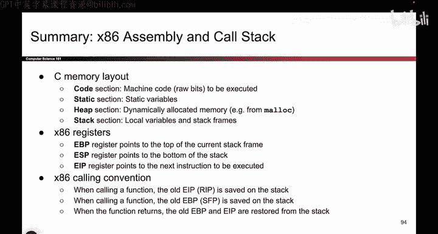
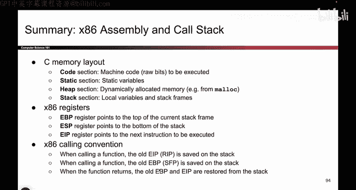

# 025：-MemSafety1, Video 11- x86 Assembly and Call Stack Summary.zh_en - GPT中英字幕课程资源 - BV1VhEhzMEPL

Okay， so to summarize from last time this time from all these videos。

 we talked about the C memory layout。 there are four sections of memory that we care about the instructions themselves converted into ones and zeros are in the code section。

 static variables go in the static section like global variables。

 the heap section is where we put things that we mallic and the stack section is where we put the local variables。

 and we just spent a lot of time thinking about the stack section。

 There were three registers that we care about。 EIP is the instruction pointer。

 It tells us what instruction is being executed。 EP points at the bottom of the stack frame and EBP points at the top of the stack frame。

 People always forget about EBP， but it's important。

 It tells us where the top of the stack frame is and we can use it to find other things on the stack。

 which is useful。 And remember the calling convention， it was a lot of steps。

 you can watch as many times as you want to get the hang of it。

 But the important thing is whenever you change or register， whether it's EIP or EBP。

You have to put the old value on the stack first so that when the function returns。

 you can take those values on the stack， put them back in EBP and EIP。

 I hope you're really sick of hearing me say that， but that is probably the biggest takeaway from this set of videos。

