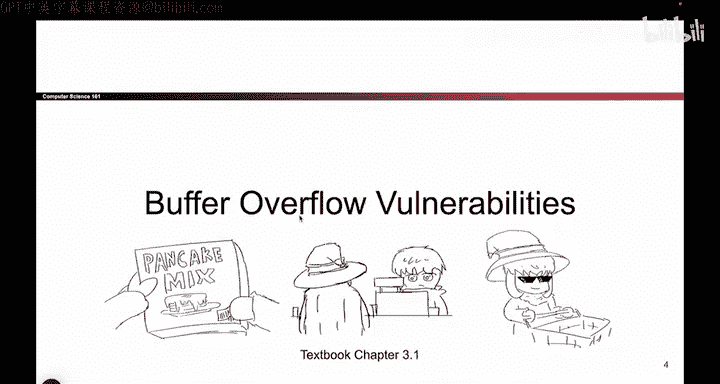
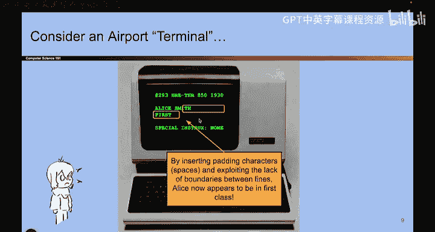

# 026：-MemSafety2, Video 1- Airport Analogy.zh_en - GPT中英字幕课程资源 - BV1VhEhzMEPL

O， action， O。Okay hello， this is a brand new video。 and none of you have been here previously。

 So remember last time we talked about X86 assembly and the call stack。

 we talked about the four sections of memory code static keep and stack we talked about the three registers that X86 uses to keep track of the stack frame。

 EBP at the top EP at the bottom of the current stack frame and EIP is the instruction pointer and we talked about what it looks like to call a function and return from a function and the really important thing you have to know for today's videos is that when you call a function and you want to change registers like the instruction pointer or the base pointer at the top of the stack。

 you need to put the old values on the stack first。

 So you write those old values on the stack and when the function returns。

 you take those old values on the stack and you copy them back into the EBP and EIP registers。

 That's going to be really useful for today。 So that's a summary of what happened last time。😊。

So today is all about memory safety， vulnerabilities。

 We are now going to go into C code now that we know how it works and think about different ways we can break it。

 And then if you come back next time， we'll talk about ways to defend against some of these attacks。

O。So let's start with just an analogy to get our minds thinking about what it looks like to have a buffer overflow in C code。

 So has anyone been to an airport lately， Did you know that airports use really old computers sometimes at their check encounters。

 like really old computers。 So what happens is if I go to one of these airport terminals and they have really。

 really old computer that looks like this。 Well， then what might happen is it loads a ticket that you submit So it loads your name and it loads the class that you're in economy class。

 first class and it loads any special instructions that you have， And it looks like this。

 very old school computer。😊。

Now， what if， let's say this Alice Smith character， when she was booking her plane ticket。

 What if she fell asleep on the keyboard or her cat walked on the keyboard。

 And instead of writing Alice Smith， she wrote Alice Smith， H， H， H， H， H， H， H， H， H。 Well。

 that's an interesting name。 So what happens if Alice Smith。

 now goes to the airport and tries to check in。 She goes to check in and the really old computer shows this。

 It says your name is Alice Smith， H， H， H， H， H。 and your class is H， H on me。😊。

Interesting， try to think about what happened here。And maybe a question for you is。

How do you want to exploit this？ So think about what name could Alice' give herself to cause something bad to happen。

 So pause the video， Think about it。And I'll wait。Okay。

 who has a name that they want to give to Alice Smith？

No one has a name that they want to give to Alice Smith。 Okay， give me a name。

So Alice's name is now Alice Smith， H， H， H H Hs business。 Okay。

 so let's see what happens if I put in the name Alice Smith， H H H， H， H， H H business。 Okay， well。

 maybe I put in the name first， but I get kind of the same effect。 Alice Smith， H H H H， H。

 H H first。 and maybe I can even be more clever。 And instead of putting H's。

 I could put space bars or something。 So Alice Smith and a bunch of space bars and first。

 now when you check in， it suddenly only looks like you're in first class。

 So that's good for you it bad for the airline。 but that's an attack that we can do。

 So Alice Smith now is in first class。 And if I wanted to be more creative。

 I could add more characters， I could change the instructions and say。

 give me champagne or don't lose my luggage， something like that。

 So what are the two ideas that I used to get Alice Smith followed by a bunch of space bars followed by first。

 Well， a couple things happened here。 one thing that happened is instead of putting all hs。

 I put all。😊。

Basebar to kind of trick the airline。Terminal counterperson into not thinking that something was strange here。

 but also what did I， what exactly happened here。 If you think about what this computer is doing。

 it seems like this computer as really old， doesn't seem to know where the name ends and where the class begins。

 There's these two lines。 And it seems like there's no boundary stopping someone from writing past the end of the first line and onto the second line。

 So if I had to summarize what's wrong with this computer。

 The problem is that there is no boundary between the two lines。

 And that allows Alice Smith to make her name really long writing past the end of the first line and writing into the second line。

 which is not supposed to happen。 Now， Alice Smith has champagne and her luggage won't be lost， so。

Bad things have happened。

O。So that's the analogy。 And the takeaway from this story。

 because I don't need you to memorize anything about airplane terminals is that there was a lack of boundaries in memory。

 So somewhere in memory， there was no notion of where things began and where things ended。

 And that allowed an attacker to right past the end of one thing and into something else like the class that they were not supposed to control。

 That's the takeaway of this story。