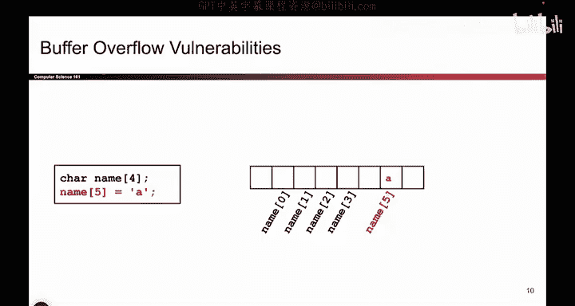
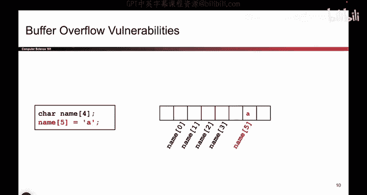
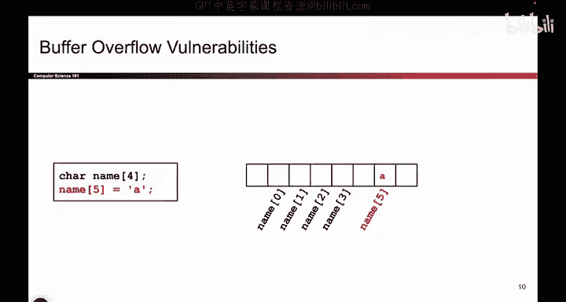
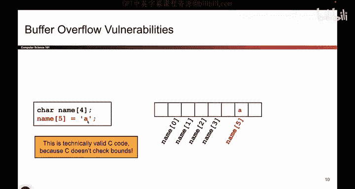
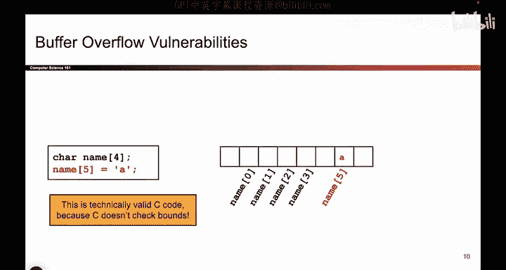
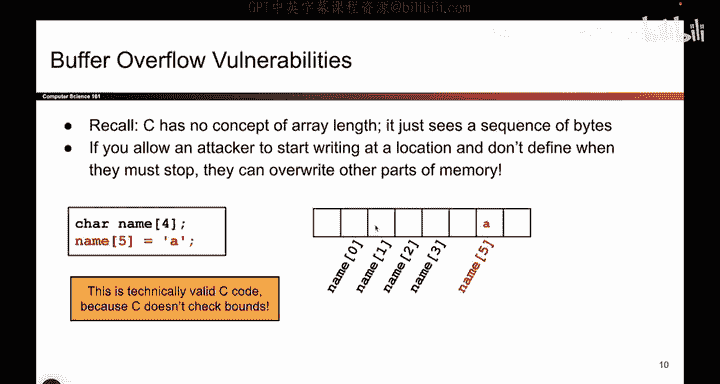

# 027：-MemSafety2, Video 2- Buffer Overflow Vulnerabilities.zh_en - GPT中英字幕课程资源 - BV1VhEhzMEPL

So it turns out the thing you just saw the exact same thing happens in C code。

 So take a look at these two lines of code。 If I ran these two lines of code in Java or Python。

 what do you think would happen。

Eir Joler or Python would say you can't do that。 name has four characters in it， 0，1，2，3。

 you cannot write to index number5， that's out of bounds。 the program will crash。

 It will yell at you and say that's not allowed。

What do you think C does here。What does C do， Well， C thinks， Remember from last time。

 what does C think of memory， C thinks of memory as this big blob of bytes from addressra 0 to address all Fs。

 C has no idea where things begin and end memory from C's perspective。

 is just a big blob of bytes from 0 to all Fs。 So if you say I want to write to the fifth element of name。

 All that C does is it goes into memory。 It says name starts here。 I'm going to count to5，1，2，3，4，5。

 Okay， that's a place in memory。 And I'll just drop the letter either。

 So C doesn't actually know where the array begins and ends。 In other words。

 it doesn't check balance。 kind of similar to the airline thing we were just seeing from before。

 So this is actually valid C code。 If you went and compile this， it would compile。

 And the reason why is because C doesn't know where arrays begin and end。

 It treats memory as a big array of bytes from all zeros to all Fs。 And it does not care。😊。

Where you define variables， if you tell it to go to name， count 5 and write the letter A。

 it will go to name， count 5 and write the letter A。

 That's what it's going to do because you told C to do that。 So that's the problem with C code。

 and it's going to create a whole world of pain for us and a whole bunch of attacks that can be possible from this core idea。

 But this is the fundamental idea for why C is broken and causes everyone so many headaches。

Okay。So again， C doesn't know where a race begin an end。 It just sees the blob of bites。

 So if you allow an attacker to write into memory and you don't tell them where to stop。

 they can do the same trick like they did on the airline terminal and they can overwrite parts of memory that they're not supposed to。

 And this is a whole class of attacks called buffer overflow attacks。

