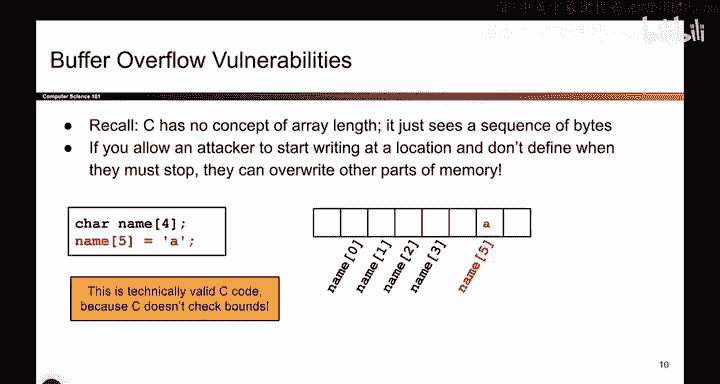
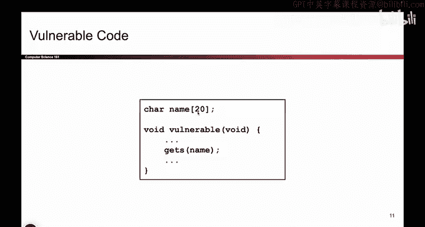
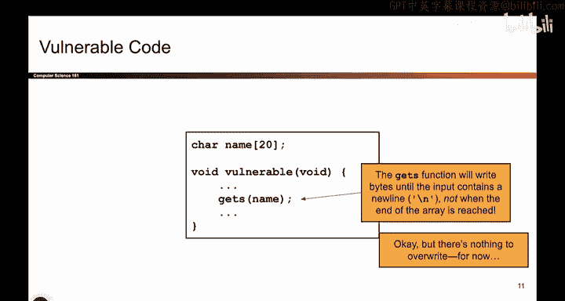
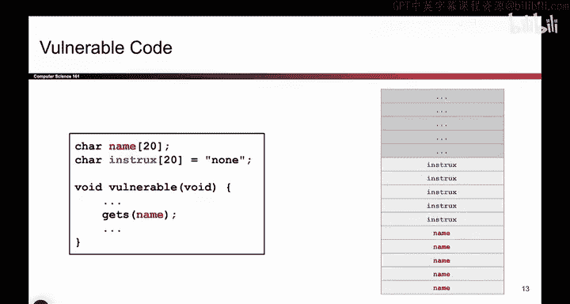
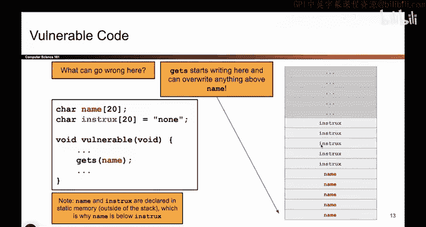
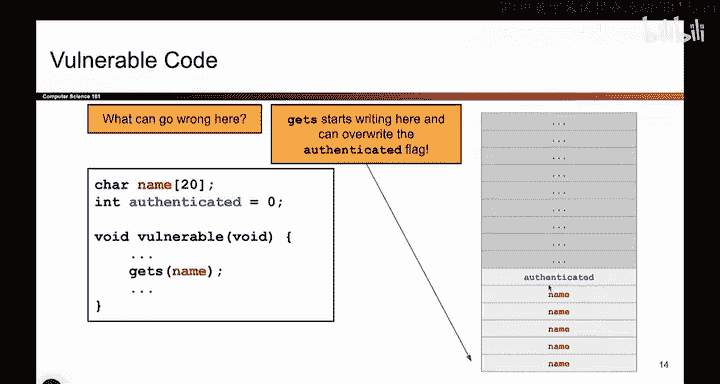

# 028：-MemSafety2, Video 3- Overwriting Data.zh_en - GPT中英字幕课程资源 - BV1VhEhzMEPL

Okay。So here's an example of a buffer overflow attack。

 This is kind of the most classic one that you'll ever see。

 So what's happening here is there is some character array called name。 Sometimes people say buffer。

 when they talk about a character array， just terminology。 but it's just the character array。

 if it's 20 character。 But again， as we've seen， C doesn't know where this thing begins or ends。

 doesn't know that it's length 20， it just knows that there's some variable called name and here it is in memory。

 And then we call the function getS。 So what does getS do。

 if you open up your C manual and look up the getS function or you go on Google and you search for getS。

 you'll find that what getS does is it asks the user for input。

 and it asks the user for input and it asks the user for input and it grabs as many bytes as the user wants to supply all the way until the user presses enter。

 that is they supply a new line character。 So when the user presses enter the input is finished。

 And then I write the input into the name character array。😊。

So in other words， there is no limit for how much the user wants to write。

 The user wants to supply 100 characters。 No problem。

 getss will take 100 characters and write 100 characters into memory。

 If The user provides 1000 characters， no problem。 Get us， we'll collect 1000 characters。

 The user presses enter。 We write those 1000 characters into memory。All without checking this bound。

 So that's the problem。 And that's something we can explain。

So that's kind of our characteristic example。 You might say， okay， well， that's great。

 but I don't really see an attack here。 But what if。

I had a piece of code like this。 So now I have two character arrays。 One of them says name。

 and one of them says instructions。 So this is where I'm storing maybe something like airplane instructions or instructions for the airplane passenger。

 So now I can draw a picture of memory and try to think about what with the attacker supply to maybe make something bad happen。

 So this is what memory would look like。 It's our old favorite memory layout。 I have 20 characters。

 which is five rows， each rows 4 Bs of name。 And then another five rows for the instruction character array。

 And here I put name below instruction， because they're in the static part of memory。

 not really important， but that's the memory layout that corresponds to this code。

 So what happens when someone says get us of name。 or're basically saying the user can go to name。

 which is right here。 And they can start writing whatever they want。

 as the user continues to enter characters。 We will write them onto the stack。😊。

And onto the stack， possibly pass the end of name， Who knows until the user presses enter。

 And then we're all done and get us returns。So basically， what happens here is， well。

 what could the user write， They could write Alice Smith， H， H， H， H， H or spacebar。

 spacebar spacebar。 And then when they get to instructions， they can say， you know。

 please serve me champagne or whatever it is that Alice wants。 So what might that look like。

 I start here。 I write whatever I want。 And the instructions get overwritten with。😊。

Give me champagne or something like that。O。So that's an example。

 It's kind of like the airline example of an attacker overriding out of bounds to things they're not supposed to write to。

What about this example。 So now， instead of an instruction character buffer。

 maybe I have a variable like authenticated。 and maybe my code says if this variable is 0。

 the attacker or the user of this code， they can't access the passwords or they can't change the way the website looks。

 They can't do privileged actions。 But maybe if this variable has the number one in it。

 then the attacker is able to read passwords or do something sensitive。

 So maybe this is a variable that controls what powers the user has。

 And what if I still had a function that said， get us name。

 what can the attacker do just like before， they can start writing here。

 And any bytes that the attacker inputs will get written onto the stack。 and there's no limit。

 the attacker can write as much as they want。 And when they get here， what should they write。

1 or something。 And if they write one， well， then now the authenticated variable has been replaced from 0 to 1。

 Was this code supposed to let the user change authenticated， No。

 this code was supposed to only let you write to name。 But because C doesn't check bounds。

 the user is going to get a chance to overwrite authenticated。 So if they're malicious。

 or if're an attacker， They could change authenticated and give themselves access to code。

 that's dangerous。

