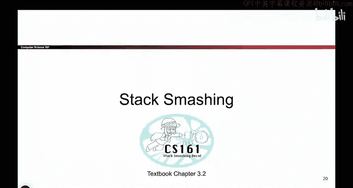

# 030：-MemSafety2, Video 5- Stack Smashing.zh_en - GPT中英字幕课程资源 - BV1VhEhzMEPL

Okay， so in the previous video， we saw that， well， there's all these different ways in which I can write past the end of one buffer and start writing malicious things into the next variable。

 But it doesn't seem really plausible that someone's going to put a function pointer lying around in memory right after a buffer like name。

 who would do something so silly like that。 But it turns out something like that happens all the time。

 even if you don't realize it。 And that's going to give us our first type of buffer overflow attack called stack smashing。

 So why did we just spend all that time talking about how functions get called and how functions return。

 Well， do you remember when we were talking about how when you call a function。

 you have to put some saved values on the stack。 And when the function returns。

 we put those values back in the register。 Well， one of the things that we put on the stack was the saved EIP。

 So that's a value that I put on the stack。 And that value says when I'm done， go to that。😊。

Add， put this value back in EIP， go to that address and start executing code。

 So if you really squint at it， that saved EIP that I put on the stack。

 Sometimes people call it a return instruction pointer or R IP that value that I put on the stack。

 It's basically a function pointer， it's an address。 And when I go to that address。

 I am going to execute the instructions at that address。

 So it turns out that example from before that seems so contrived。 It's not so contrived。

 Everyone has code like that。 when you write C code， you are putting function pointers on the stack。

 even if you don't know it。 because when you call a function。

 one of the things on the stack is here's an address。 when you're done， go there。

 And when the function returns， what do you do， you go there。

 you look at that address and go to that address。 So we are going to exploit the fact that functions have a saved EIP on the stack。

 and we're gonna change that value to cause the program to go to places。😊，It's not supposed to go。

 It's basically the function pointer attack from before。

 but on actual pieces of C code that you and I would write。

So here is the picture of what， of what the attack looks like。 We'll set it up。

 So we have some function called vulnerable。 And this time。

 I'm not going to put a contrived function pointer on the stack。 I'm just going to say。

 here's a buffer called name。 You might do that。 Anyone would do this。 I'll have a。

Character array called name。 And I'll ask the user， Hey， what's your name， Give it to me。

 I'll use the getas function， and I'll write it into memory。😊，What does the stack look like。

 Remember， when you call a function， you have to put the saved EIP on the stack and you have to put the saved EVP on the stack。

 These are the two values that used to be an EIP and EBP。 And when I'm done with this function。

 I'm going take this value， stick it back in the EBP register and crucially。

 I'm going take this value， put it back in EIP register。

 And another way of saying that is I'm going to take this value， which is an address。

 I'm going to go to that address。 So I can continue executing code from wherever I came from。

 whoever called vulnerable。 So this code， when it executes。

 will create a stack frame that looks like this。 It has these two saved register values。

 and the crucial one for us right now is this one because that holds an address of where we're going to after the function returns。

😊，So then we call get us of name。 What does that do， It says， allright， user。

 give me your input and whatever the user gives me gives to me。

 I will write here and here and here and here。 And if the user has a really long name。

 I'll keep writing and writing and writing。 And I'll overwrite other things on the stack。

 possiblyibly including this R IP address。 And that's dangerous。 So。How would this works。

 I'm gonna to give you a chance to try and put it together。

 So let's say the attacker has malicious instructions living at the address deadadbe， D E A D B， E。

 E F。 So what this means is if you go to this address and start executing instructions there。

 Something bad will happen。 You're the attacker， You want the bad thing to happen。

 So question for you is if you want this bad thing to happen。

 like you want to go to this address and start executing bad instructions。

 what name should you supply to this code。 So trying to think about what characters will you provide to this get us call to cause those bad instructions to execute。

 So take a minute and think about it， if you're on the video pause and I'll wait for you if you're in person。

Take a couple seconds。And ponder it。Okay， does anyone have an input that they want to try？

Anyone have a name that they want to try and enter？Okay， give me a name。Okay。

 so a random name that's 24 characters long。 that's gonna to clobber out this box， this box。

 this box， this box， this box in this box， That's 6 boxes，4 bys each，24 characters。 Okay， good。

 And then I'll enter the address deadad beef right there。 And then I'll add a new line。

 I'll hit enter to conclude by input。 Okay， that's great。 That's exactly what I have too， so。😊。

This is what input。 This is the input that we just talked about。

 We're gonna enter 24 garbage bites Here， I chose a。

 but you could have chosen Q or X or any letter you really liked。

 I'll enter 24 of those characters clobbering out all of name and the SFP。

 which we don't really care about in this case。 because I really care about changing this R IP address。

 And instead of having the address of whoever called vulnerable main or someone。

 I'm gonna change it to the address， Dead beef D， E， A D， B， E， E F， And then I'll enter。

 And then what happens now is now when this function is ready to return。 It's gonna say。

 who called me， I'm vulnerable。 Who called me。 like who do I go back to after this function returns。

 I'm gonna look at this R IP because this is the address of whoever called me。

 They put this address here。 So when I'm done， I should go to this address。 Well it says dead beef。

Alright， then I guess I will go to the address dead beef when I'm done。 And when that happens。

 you are now executing instructions at dead beef and bad things happen。 And what note here is。

 remember， we talked about N D N S。 when you have a4 B address。

 you have to start with the least significant。Bite， so we put the E， F first and the B， E。

 then the A D， then the D， E， Not a really important detail。 But if you want this exploit to work。

 we have to follow the Indiannness rules of X 86。 So there it is。

 That's your very first memory safety exploit。 Congratulations。 We have exploited this program。

 And now it's going to execute instructions at Deadbe。😊。

