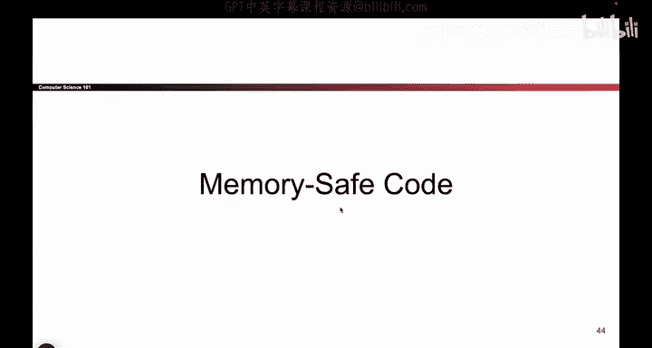
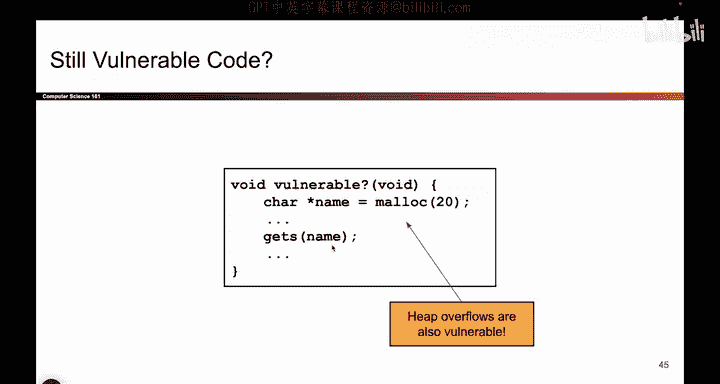
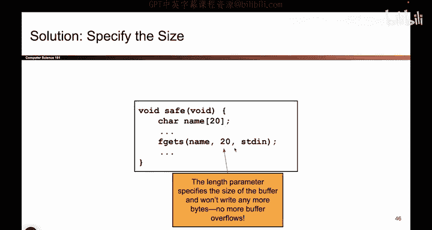
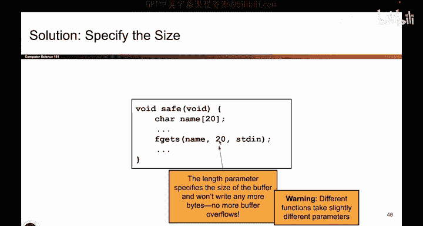
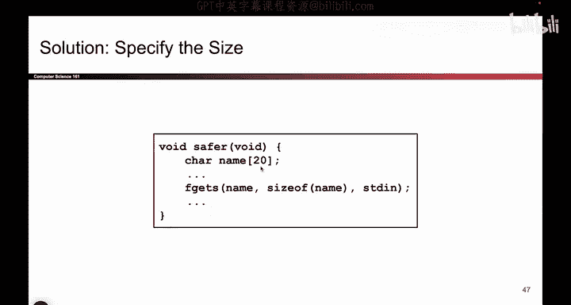
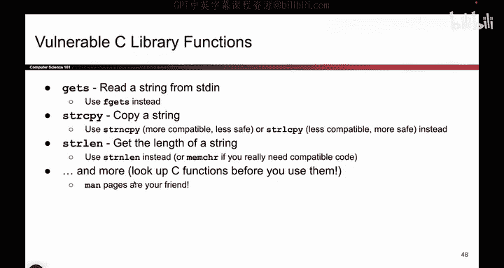

# 035：-MemSafety2, Video 10- Heap Overflows, Vulnerable C Library Functions.zh_en - GPT中英字幕课程资源 - BV1VhEhzMEPL

Okay， so now that we've seen our first buffer overflow and we saw how it works with the X 86 instructions。

 we're now going to start looking at other pieces of C code that might seem safe at first。

 but they're actually going to turn out to be dangerous because of the same fundamental flaw。

 which is that in C， There are no bounce checking。 There is no bounce checking。

 So what that means is C doesn't know where things begin and end。

 We can right past the end of arrays。 can do all sorts of dangerous things。

 So that's kind of our next topic。

So here's a piece of code。 And at first， it seem like。

This seems okay because I'm no longer overr something on the stack。

 So maybe I can't overwrite the RIP anymore。 And specifically in this case。

 name is an address and it points at some memory in the heap。 Remember when you call Malik。

 you get some data in the heap。 And so this time， at first， it seems maybe this is okay。

 I'm no longer overr things on the stack。 So maybe I can no longer target the RP and do the same stack smashing attack from earlier。

 So you might say， well， maybe this is okay。 But it turns out there's still some danger here because again。

 I can write past the end of the 20 character array。 So for example。

 maybe I have lots of different things on the heap。 I have a name。 I have an authenticated variable。

 I have the airline instructions that we saw from last time。

 So there could be all sorts of sensitive things on the heap。

 And if you call get us on some piece of data in the heap。 The attacker could supply more than 20 Bs。

 And if the attacker supplied。more than 20 bytes， they're going to override past the end of name and start writing to other things that might be sensitive。

 For example， I don't know， the instructions character array that tells you the special instructions for the plane or the authenticated variable that checks if the user is an administrator all sorts of sensitive things could also be on the he。

 so we also have to watch out for overflows not just on the stack but also on the he。

So that's what this light says。So here's an example of how you might try to protect against these attacks and we'll do a whole set of videos later protecting against memory safety attacks。

 But turns out getS is a dangerous function。 It lets the user write as much as they want。

 and to defend against these attacks。 You have to use other C library functions。 For example。

 there's one called F getS and this one lets you specify a limit and say actually the user can only write 20 bys。

 And if they write more than 20 bytes， we will not accept any further input。

 So this is now a safer piece of code because the attacker can't write more than 20 bys。

 So you have to do something like this to protect against memory safety vulnerabilities。

 and we'll go into this in more detail。 but just to give you a hint。

 This is kind of the way that you'll stop memory safety attacks。

So as another example， you can even be more secure and say， actually。

 this is a little dangerous because if I change this to 15 and I don't forget to change this to 15。

 or I do forget to change this to 15。 well， then this would say 15。 This would say 20。

 they would no longer be synced up。 and that could be a problem。

 So maybe you want to be even more careful and use something like size of name。

 and this is going to evaluate to 20。 So this way I just have a single source of truth。

 And if I change the 20 to a 15。 this will also naturally change to 15。

 So there's different ways you can approach this。 but basically the punchline is something like get us as not safe and you have to go looking for the safe alternative。

And it turns out there's lots of different safe alternatives out there that you can use。

 So get us is dangerous。 Please use F get us instead。 St copy is dangerous。

 Please use stir N copy instead。 Stlin is dangerous， please use stir N L instead。

 And there's all these different ones that you have to keep track of。 And by the way。

 to give you a preview， This is why C is such a difficult language to work in。

 you have to remember all these specific functions。 And remember， okay。

 this is the dangerous version。 And this is the safe version and can be really tricky。

 And if you make even a single mistake。 Oops， suddenly， your code is all vulnerable。

 So you have to be really careful， you have to look up functions before you use them。

 And if you want to look them up。 There's something called man pages。 if you're ever curious。

 They give you the documentation for how these functions work。

