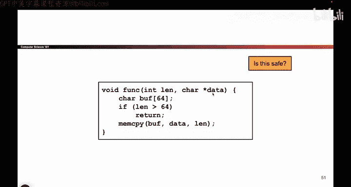
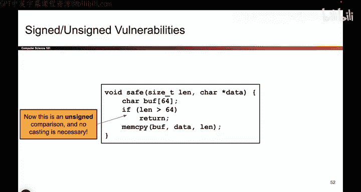

# 036：-MemSafety2, Video 11- Signed_Unsigned Vulnerabilities.zh_en - GPT中英字幕课程资源 - BV1VhEhzMEPL

Okay。So the next topic is something called integer memory safety vulnerabilities。

 We're going to look at another way where we can exploit dangerous C programs or vul C programs to execute code that the attacker wants to execute。

 So here's a piece of code。 Let me walk you through it。

 So it says I'm going pass in a character array。 And remember in C。

 the way that you pass in character arrays as an argument to functions is you pass in two things。

 First， you pass in a pointer that is the address of where the array starts。

 And then you pass in how many things are in the array。 So it's kind of annoying。

 But this is the way that you do arrays in C。 You always pass in a pointer for where the array starts。

 And then a second argument for how many elements are in the array。

 And the reason to do this is because remember C doesn't do bounce checking just by passing in the pointer。

 I have no idea where the array starts and ends。 So I pass in the start of the array and I pass in how many bytes or how many elements are in that array。

 And usually when you pass these two things in。

Usually we'll assume that they match up with each other。 So yeah。

 I guess there could be cases where the attacker lies about the length， but in general。

 we'll assume that these two things are linked to each other somehow。

 So when the attacker passes in an address， they also pass in the correct corresponding length。

 and that's something that differs in different pieces of code。

 I'm kind of going on a digression here。 But the punchline is these two arguments。

 Tell us the input array。 It's the data and the honestly reported length。Okay， so what comes next。

 Then I create a buffer of size 64 B。 And I say if the attacker wants to input more than 64 by。

 That is if length is greater than 64， I'm going return from the function。

 You cannot write to this character array， if you input more than 64 Bs。

 But if you input less than 64 B。 Then I'm gonna copy data from the argument data into the buffer。

 and I'm gonna copy length number of bys。 So whatever the attacker or the user inputs。

 I'm gonna copy it into buffer。 But only if it's less than 64 Bs。 So at first。

 it seems like this is totally fine。 We have a check and the check says if the attacker inputs more than 64 Bs。

 they're just going run into this if case and the function will return。

 and the attacker cannot overwrite past the end of buffer。 So this seems totally fine。

 as long as we assume that the attacker is honestly reporting the length and we'll assume that for this slide。

 then there's no problem。Or is there。 So if I stare at this more carefully。

 there's actually a really subtle bug。 And every time I show people this。

 it's something they haven't thought of。 So what if this array is actually really big， And I mean。

 really， really big， I'm talking something like， I don't know。 like F， F， F， F， F， F， F， F。

 that's a really big character array。 So then if I pass in something like F， F， F， F， F， F， F， F。😊。

Or rather， array of length， F， F， F， F， F， F， F， F， That's a really big character array。

 So I can pass in that array。 I'll pass in that really large length。

 And I'm still honestly reporting the length。 So I'm still， you know。😊，Matching my assumption。

 But take a look at this argument。 This argument says int。 And remember。

 integers can be positive or negative。 So if I pass in an array and I pass in the length and the length just so happens to be hex F。

 F， F， F， F， F， FF， that's a really big number。 But if I interpret that number as a signed number。

 that is an integer that could be positive or negative。 if you think back to Cs 6 and C。

 and how we represent things as two's complement， Well， then when I pass in something like F F， F， F。

 F F FF， that's actually gonna be interpreted as what negative one。 F F F F， F F FF。

 if you interpret it as unsigned， it's a really big number， it's the length of this big array。

 if I interpret that same sequence of ones and zeros as a s number， I get negative one。😊。

Well that's kind of weird。 What happens if I go through this code with negative1。

 That's not something I had thought of before。 If I go through this code with negative1。

 the code checks is negative 1 greater than 64。

No， that's not true。 So that means this if case doesn't run。

 And so I go to this mem copy and now I'm going copy from data into Buff。

 and I'm going to copy length bytes。 and again， I'm copying the bits F F FFF as length。

 So throughout this entire piece of code， length is always f F F。

 It's the exact same sequence of ones and zeros。 the only difference is how we're interpreting it do we interpret it as a s number in which case this sequence of bits means negative one。

 or am I interpreting it as an unsed number in which case this sequence of bits represents a really big number。

 So initially when the attacker passes in their array。

 they're interpreting those fs as a really big number。

 but once I enter this function because this argument was defined as int suddenly this function is thinking about s numbers。

 So when it sees all fs， it thinks negative one it's negative one greater than 64 nope。

 So I move on this。Mm copypy line and now I go into memcopy and if I open up my main pages and I look for the definition of mem copypy。

 Mem copypy takes in something called the size T， which is once again an unsigned type So what that means is when I take this FffFffFF sequence of ones and zeros and I call mem copy with it memcopy is going to read it as an unsigned number So suddenly memcopy is once again thinking unsigned and it says I want to copy a huge amount of bytes from source to destination and once again the attacker is able to overwride past the end of buffer this is a really tricky exploit to even notice but to summarize it once more the problem is that this sequence of bits that will be calledL is sometimes being interpreted as a signed number。

 sometimes being interpreted as an unsigned number so inside this code it's being interpreted as signed and that allows us to bypass this if check but once I get into this mem copy suddenly it's being interpreted as。

Unsigned again。 and that's a problem because now Memcopy is going to treat this unsigned number as a really big number and copy a lot of bytes from source to destination。

 So this exploit is appropriately named signed unsigned vulnerabilities so。

That's another really sneaky thing you can do to try and right past the end of a buffer。

 even if the programmer seems like they've patched the issue。The issue could still be there。

 So it's really tricky to catch bugs like this。 But again。

 the key problem is that we're taking the same sequence of ones and zeros and switching between interpreting those ones and zeros as a signed number or an unsigned number。

 And that could allow us to bypass some of these checks that the attacker。

我苦。Okay， so how do you fix it。 Well， here's a potential fix。

 So here the fix is I now have to read L as a size T。 That's an unsigned integer type。

 So because now this is an unsigned integer type， everyone is using the same interpretation。

 When I pass L into the safe function， it's interpreting L as an unsigned number。

 When I pass it to Mem copy， it's also thinking an unsigned terms。

 So everyone's sneaking in terms of unsigned。 So now the check is doing what it's supposed to do。

 But it's really sneaky bug that you can easily accidentally introduce into your code。😊。

